# 实验二超算集群搭建实验报告

小组成员：

- 官瑞琪
  - 学号：320220912420
  - 班级：超级计算前沿技术1班(课序号1)
- 徐美好
  - 学号：320230943700
  - 班级：超级计算前沿技术1班(课序号1)
- 董慧玟
  - 学号：320230943010
  - 班级：超级计算前沿技术2班(课序号2)

<!-- /TOC -->

<!-- TOC -->

- [实验二超算集群搭建实验报告](#实验二超算集群搭建实验报告)
  - [一、实验目的](#一实验目的)
  - [二、实验环境](#二实验环境)
  - [三、实验原理](#三实验原理)
    - [3.1 集群系统架构](#31-集群系统架构)
    - [3.2 关键技术](#32-关键技术)
  - [四、实验步骤与实现](#四实验步骤与实现)
    - [4.1 登录头节点并配置网络](#41-登录头节点并配置网络)
      - [1.使用ssh命令登录到头节点](#1使用ssh命令登录到头节点)
      - [2.使用 `ifconfig`命令查看网络配置,确定头节点的IP地址](#2使用-ifconfig命令查看网络配置确定头节点的ip地址)
      - [3.配置hosts文件](#3配置hosts文件)
    - [4.2 配置NFS网络文件系统](#42-配置nfs网络文件系统)
      - [4.2.1 头节点配置NFS服务器](#421-头节点配置nfs服务器)
        - [1. 在head节点执行，安装NFS服务](#1-在head节点执行安装nfs服务)
        - [2. 配置共享目录](#2-配置共享目录)
        - [3. 启动NFS服务（否则会配置失效）](#3-启动nfs服务否则会配置失效)
      - [4.2.2 计算节点配置NFS客户端](#422-计算节点配置nfs客户端)
      - [n1节点配置NFS客户端](#n1节点配置nfs客户端)
        - [1. 在n1节点安装NFS客户端](#1-在n1节点安装nfs客户端)
        - [2. 挂载共享目录](#2-挂载共享目录)
        - [3. 验证目录挂载是否成功](#3-验证目录挂载是否成功)
        - [4. 配置开机自动挂载](#4-配置开机自动挂载)
        - [5. 验证持久化配置](#5-验证持久化配置)
      - [n2节点配置NFS客户端](#n2节点配置nfs客户端)
        - [1. 在n2节点安装NFS客户端](#1-在n2节点安装nfs客户端)
        - [2. 在n2挂载共享目录](#2-在n2挂载共享目录)
        - [3. 在n2验证目录挂载是否成功](#3-在n2验证目录挂载是否成功)
        - [4. 在n2配置开机自动挂载](#4-在n2配置开机自动挂载)
    - [4.3 配置NIS网络信息服务](#43-配置nis网络信息服务)
      - [4.3.1 头节点配置NIS服务器](#431-头节点配置nis服务器)
        - [1.安装NIS系统，并配置NIS domain](#1安装nis系统并配置nis-domain)
        - [2.配置NIS服务器](#2配置nis服务器)
        - [3.初始化NIS数据库](#3初始化nis数据库)
        - [4.配置自动创建家目录](#4配置自动创建家目录)
      - [4.3.2 计算节点配置NIS客户端](#432-计算节点配置nis客户端)
      - [（一）n1节点配置NIS客户端](#一n1节点配置nis客户端)
        - [1. 安装NIS系统](#1-安装nis系统)
        - [2. 配置NIS客户端](#2-配置nis客户端)
        - [3. 修改名称服务切换配置](#3-修改名称服务切换配置)
        - [4. 配置自动创建家目录](#4-配置自动创建家目录)
        - [5. 重启NIS相关服务](#5-重启nis相关服务)
      - [（二）n2节点配置NIS客户端](#二n2节点配置nis客户端)
        - [1. 在n2安装NIS系统](#1-在n2安装nis系统)
        - [2. 在n2配置NIS客户端](#2-在n2配置nis客户端)
        - [3. 在n2修改名称服务切换配置](#3-在n2修改名称服务切换配置)
        - [4. 在n2配置自动创建家目录](#4-在n2配置自动创建家目录)
        - [5. 在n2重启NIS相关服务](#5-在n2重启nis相关服务)
      - [4.3.3创建测试用户](#433创建测试用户)
        - [1.返回头节点，创建用户user1并为用户设置密码](#1返回头节点创建用户user1并为用户设置密码)
        - [2.更新NIS数据库](#2更新nis数据库)
      - [4.3.4验证NIS功能](#434验证nis功能)
    - [4.4 配置SSH免密登录](#44-配置ssh免密登录)
      - [1.生成SSH密钥](#1生成ssh密钥)
      - [2.分发公钥到计算节点](#2分发公钥到计算节点)
      - [3.在计算节点配置互信(使用ssh登陆到计算机节点再次执行上述操作) 登录n1节点](#3在计算节点配置互信使用ssh登陆到计算机节点再次执行上述操作-登录n1节点)
      - [4.验证免密登录](#4验证免密登录)
      - [SSH免密登录拓扑图](#ssh免密登录拓扑图)
      - [技术原理说明](#技术原理说明)
      - [分析总结](#分析总结)
    - [4.5 安装并测试MPICH](#45-安装并测试mpich)
      - [1.下载安装MPICH](#1下载安装mpich)
      - [2.配置环境变量](#2配置环境变量)
      - [3.编译测试程序](#3编译测试程序)
      - [4.创建节点文件](#4创建节点文件)
      - [5.运行MPI程序](#5运行mpi程序)
  - [五、实验过程中遇到的问题及解决方案](#五实验过程中遇到的问题及解决方案)
    - [问题1：下载安装MPICH时，`./configure` 阶段没有成功生成Makefile](#问题1下载安装mpich时configure-阶段没有成功生成makefile)
    - [问题2：使用旧版通信层ch3之后出现问题](#问题2使用旧版通信层ch3之后出现问题)
    - [问题3：尝试修改NIS用户shell时提示"user does not exist in /etc/passwd"](#问题3尝试修改nis用户shell时提示user-does-not-exist-in-etcpasswd)
  - [六、实验分析与总结](#六实验分析与总结)
    - [6.1 系统架构分析](#61-系统架构分析)
      - [6.1.1 集群整体架构图](#611-集群整体架构图)
      - [6.1.2 数据流分析](#612-数据流分析)
    - [6.2 技术要点总结](#62-技术要点总结)
      - [6.2.1 关键配置项对比](#621-关键配置项对比)
      - [6.2.2 配置文件清单](#622-配置文件清单)
    - [6.3 实验总结与收获](#63-实验总结与收获)

## 一、实验目的

1. 掌握基于Linux系统的超算集群搭建方法;
2. 理解分布式计算环境的配置原理;
3. 学习NFS、NIS等网络服务的配置与应用;
4. 实现MPI并行程序在多节点环境下的运行。

## 二、实验环境

- 虚拟机软件：VMware Workstation;
- 操作系统：Ubuntu 20.04 LTS;
- 集群架构：1个头节点 + 2个计算节点;
- 网络配置：
  - 头节点(head)：10.0.0.7
  - 计算节点1(n1)：10.0.0.22
  - 计算节点2(n2)：10.0.0.23
  - 外网访问地址：202.201.1.198:27798

## 三、实验原理

### 3.1 集群系统架构

超算集群采用主从架构，由一个头节点和多个计算节点组成。头节点负责任务调度、文件共享和用户管理，计算节点负责执行并行计算任务。

### 3.2 关键技术

- **SSH**提供安全的远程登录和命令执行;
- **NFS**实现跨节点的文件系统共享;
- **NIS**集中管理用户账号信息;
- **MPI**消息传递接口，支持并行计算。

## 四、实验步骤与实现

### 4.1 登录头节点并配置网络

#### 1.使用ssh命令登录到头节点

```bash
ssh root@202.201.1.198 -p 27798
# 输入密码：1qaz!QAZ
```

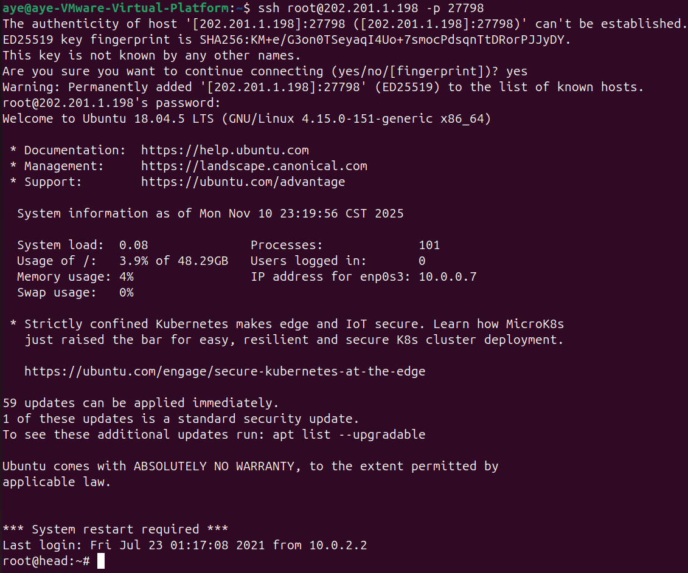
图4.1.1 成功登录头节点

#### 2.使用 `ifconfig`命令查看网络配置,确定头节点的IP地址

```bash
ifconfig
```


图4.1.2 查看网络配置

执行结果显示网络接口 `enp0s3`上头节点IP为`10.0.0.7`，同时确认两个计算节点IP分别为`10.0.0.22`和`10.0.0.23`。

尝试 `ssh n1`时连接失败，不成功。但尝试`ssh 10.0.0.22`时成功。


图4.1.3 `ssh n1`失败


图4.1.4  `ssh 10.0.0.22`成功

#### 3.配置hosts文件

在**所有三个节点**上编辑 `/etc/hosts`文件并保存：

```bash
vim /etc/hosts
```

在文件末尾添加：

```bash
10.0.0.7  head
10.0.0.22 n1
10.0.0.23 n2
```


图4.1.5 配置hosts文件

**分析**：

hosts文件提供本地DNS解析功能，使得节点间可以通过主机名相互访问，简化后续配置。

再次尝试 `ssh n1`时连接成功。


图4.1.6 直接`ssh n1`成功

配置hosts文件后可以直接 `ssh n1`或 `ssh n2`，说明hostname解析是SSH连接的前提。

### 4.2 配置NFS网络文件系统

#### 4.2.1 头节点配置NFS服务器

##### 1. 在head节点执行，安装NFS服务

```bash
  apt update
  apt -y install nfs-kernel-server
```

  
  图4.2.1.1 安装NFS服务

##### 2. 配置共享目录

  编辑 `/etc/exports`文件：

```bash
  vi /etc/exports
```

  添加以下配置,将 `/home`和 `/opt`导出为共享目录

```bash
  /home   10.0.0.0/16(rw,no_root_squash,sync)
  /opt    10.0.0.0/16(rw,no_root_squash,sync)
```

  
  图4.2.1.2 配置共享目录

  **参数说明**：

- `rw`：读写权限;
- `no_root_squash`：允许root用户访问;
- `sync`：同步写入磁盘;
- `10.0.0.0/16`：允许该网段所有主机访问。

##### 3. 启动NFS服务（否则会配置失效）

```bash
  #重启NFS服务器
  /etc/init.d/nfs-kernel-server restart
  #检查配置是否正确
  exportfs -ra
  #查看导出状态
  exportfs -v
```

  
  图4.2.1.3 重启NFS服务器

  
  图4.2.1.4 检查配置是否正确

  
  图4.2.1.5 查看导出状态

  执行 `exportfs -v`后输出：

```bash
  /home          10.0.0.0/16(rw,wdelay,no_root_squash,no_subtree_check,sec=sys,rw,secure,no_root_squash,no_all_squash)
  /opt           10.0.0.0/16(rw,wdelay,no_root_squash,no_subtree_check,sec=sys,rw,secure,no_root_squash,no_all_squash)
```

  说明NFS服务配置成功。

#### 4.2.2 计算节点配置NFS客户端

#### n1节点配置NFS客户端

##### 1. 在n1节点安装NFS客户端

登录n1节点：

```bash
ssh root@10.0.0.22  # 登录n1
```

图4.2.2.1 登录n1节点

更新软件包列表并安装nfs-common：

```bash
apt update
apt -y install nfs-common
```

图4.2.2.2 更新软件包列表

图4.2.2.3 安装nfs-common

安装过程显示成功安装nfs-common及相关依赖包。

##### 2. 挂载共享目录

在n1节点执行挂载命令：

```bash
mount -t nfs head:/home /home
mount -t nfs head:/opt /opt
```

图4.2.2.4  在n1挂载共享目录

##### 3. 验证目录挂载是否成功

查看挂载状态：

```bash
df -h | grep head
```

图4.2.2.5  查看挂载状态

说明 ``/home``和 ``/opt``目录已成功挂载到头节点的共享目录。

##### 4. 配置开机自动挂载

由于 `mount`命令所挂载的目录在重启后会失效，需要配置持久化挂载。
编辑 `/etc/fstab`文件：

```bash
vi /etc/fstab
```

在文件末尾添加以下内容：

```bash
head:/home /home   nfs   defaults,timeo=900,retrans=5,_netdev 0 0
head:/opt  /opt    nfs   defaults,timeo=900,retrans=5,_netdev 0 0
```


**参数说明**：

- `defaults`: 使用默认挂载选项
- `timeo=900`: 超时时间900秒
- `retrans=5`: 重传次数5次
- `_netdev`: 等待网络就绪后再挂载

##### 5. 验证持久化配置

测试fstab配置是否正确：

```bash
# 卸载当前挂载
umount /home
umount /opt

# 使用fstab重新挂载
mount -a

# 验证挂载
df -h | grep head
```


**分析**：n1节点成功配置NFS客户端后，可以访问头节点上的`/home`和`/opt`目录。NFS实现了统一的文件系统视图，用户在n1节点看到的 `/home`和 `/opt`目录内容与头节点完全一致，这是集群环境的基础。

#### n2节点配置NFS客户端

##### 1. 在n2节点安装NFS客户端

```bash
  ssh root@10.0.0.23  # 登录n2
  apt update
  apt -y install nfs-common
```

图4.2.2.6  登录n2节点并更新软件包列表

  图4.2.2.7  安装nfs-common

##### 2. 在n2挂载共享目录

```bash
  mount -t nfs head:/home /home
  mount -t nfs head:/opt /opt
```


##### 3. 在n2验证目录挂载是否成功

```bash
df -h | grep head
```


##### 4. 在n2配置开机自动挂载

编辑 `/etc/fstab`文件并添加相同配置：

```bash
vi /etc/fstab
```

添加：

```bash
head:/home /home   nfs   defaults,timeo=900,retrans=5,_netdev 0 0
head:/opt  /opt    nfs   defaults,timeo=900,retrans=5,_netdev 0 0
```


### 4.3 配置NIS网络信息服务

#### 4.3.1 头节点配置NIS服务器

##### 1.安装NIS系统，并配置NIS domain

```bash
apt -y install nis
```

安装过程中输入NIS域名：`hpc.cluster`


##### 2.配置NIS服务器

```bash
vi /etc/default/nis
```

修改：

```bash
NISSERVER=master
```


配置安全网络：

```bash
vi /etc/ypserv.securenets
```

注释默认行，添加：

```bash
255.255.0.0     10.0.0.0
```


修改Makefile：

```bash
vi /var/yp/Makefile
```

修改第52和56行：

```bash
MERGE_PASSWD=true
MERGE_GROUP=true
```


##### 3.初始化NIS数据库

```bash
systemctl start ypserv
/usr/lib/yp/ypinit -m
```

根据提示输入：

```bash
next host to add:  head
next host to add:  [Ctrl+D]
Is this correct?  [y/n: y]  y
```


##### 4.配置自动创建家目录

```bash
vi /etc/pam.d/common-session
```

末尾添加：

```bash
session optional        pam_mkhomedir.so skel=/etc/skel umask=077
```


重启服务：

```bash
systemctl restart nis
```

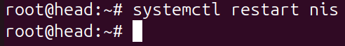

#### 4.3.2 计算节点配置NIS客户端

#### （一）n1节点配置NIS客户端

##### 1. 安装NIS系统

在n1节点执行：

```bash
apt -y install nis
```

安装过程中会弹出配置界面，要求输入NIS域名。

输入NIS域名：`hpc.cluster`


点击"Ok"完成安装。

##### 2. 配置NIS客户端

编辑NIS配置文件：

```bash
vi /etc/yp.conf
```

在文件末尾添加：

```bash
domain hpc.cluster server head
```

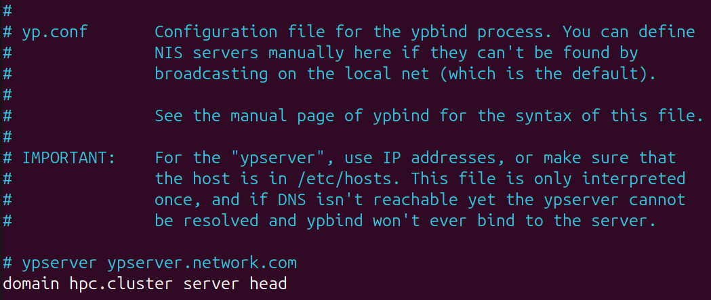

##### 3. 修改名称服务切换配置

编辑 `/etc/nsswitch.conf`文件：

```bash
vi /etc/nsswitch.conf
```

找到以下几行并修改为：

```bash
passwd:         compat systemd nis
group:          compat systemd nis
shadow:         compat nis
gshadow:        files

hosts:          files dns nis
```


**说明**：

- `passwd/group/shadow`添加nis，使系统可以从NIS服务器获取用户信息
- `hosts`添加nis，支持通过NIS解析主机名

##### 4. 配置自动创建家目录

编辑PAM配置文件：

```bash
vi /etc/pam.d/common-session
```

在文件末尾添加：

```bash
session optional        pam_mkhomedir.so skel=/etc/skel umask=077
```

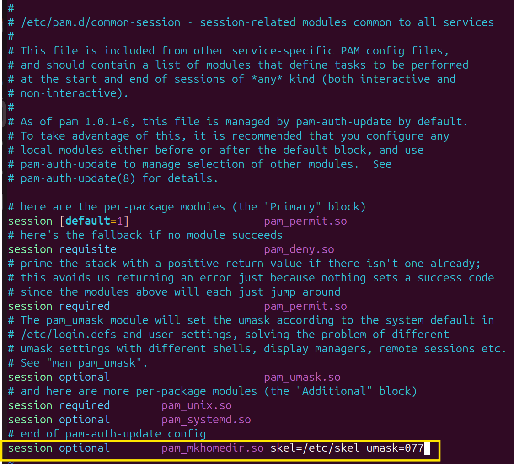

**说明**：当NIS用户首次登录时，系统会自动创建该用户的家目录。

##### 5. 重启NIS相关服务

重启rpcbind和nis服务：

```bash
systemctl restart rpcbind nis
```

检查服务状态：

```bash
systemctl status nis
```


确保服务状态为"active (running)"。

**总结：** n1节点成功完成NIS客户端配置。NIS实现了集中式用户管理机制，头节点创建的user1账户信息（包括用户名、UID、GID、密码等）通过NIS服务自动同步到所有计算节点，用户无需在每个节点分别创建，大大简化了集群环境下的用户账户管理和维护工作。

#### （二）n2节点配置NIS客户端

##### 1. 在n2安装NIS系统

```bash
ssh root@10.0.0.23  # 登录n2
apt -y install nis
# 输入域名: hpc.cluster
```


##### 2. 在n2配置NIS客户端

```bash
vi /etc/yp.conf
```

添加：

```bash
domain hpc.cluster server head
```

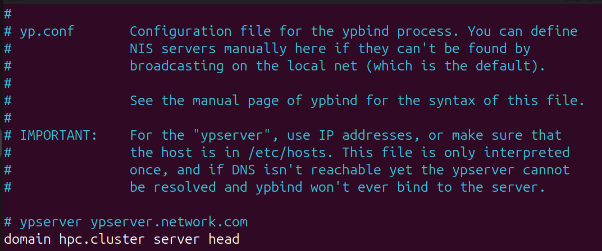

##### 3. 在n2修改名称服务切换配置

```bash
vi /etc/nsswitch.conf
```

修改相关行为：

```bash
passwd:         compat systemd nis
group:          compat systemd nis
shadow:         compat nis
gshadow:        files

hosts:          files dns nis
```


##### 4. 在n2配置自动创建家目录

```bash
vi /etc/pam.d/common-session
```

添加：

```bash
session optional        pam_mkhomedir.so skel=/etc/skel umask=077
```

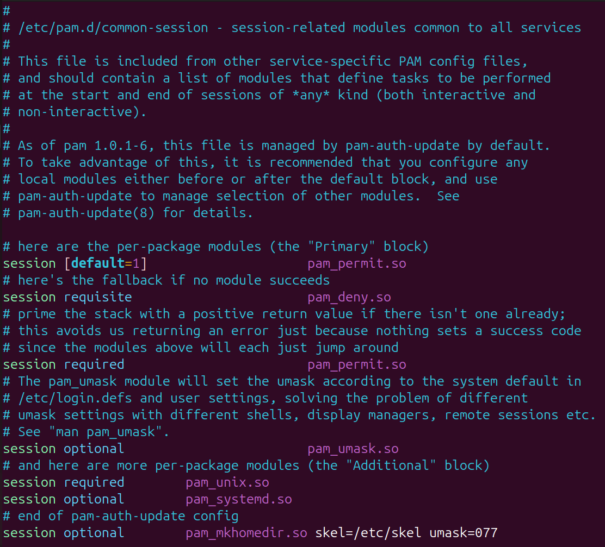

##### 5. 在n2重启NIS相关服务

```bash
systemctl restart rpcbind nis
```


#### 4.3.3创建测试用户

##### 1.返回头节点，创建用户user1并为用户设置密码

```bash
adduser user1
# 设置密码：test123
```


##### 2.更新NIS数据库

```bash
cd /var/yp
#启动NIS服务
ypserv start/running
make
```


输出显示数据库更新成功。

#### 4.3.4验证NIS功能

在计算节点n1上：

```bash
login user1
# 输入密码
```


登录成功说明NIS配置正确。

验证当前用户和家目录：

```bash
whoami
pwd
echo $SHELL
ls -al
```


**分析**：NIS实现了集中式用户管理，只需在头节点创建用户，所有计算节点自动同步，大大简化了集群用户管理。

### 4.4 配置SSH免密登录

#### 1.生成SSH密钥

在头节点切换到user1用户，生成ssh密钥（所有选项均为空）

```bash
su - user1
ssh-keygen -t rsa
```

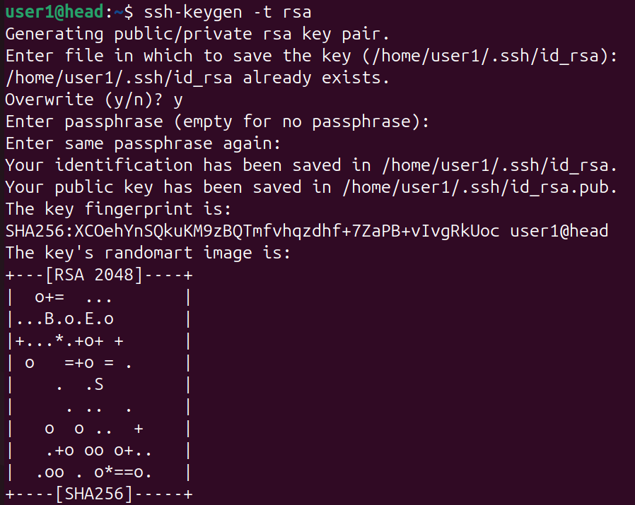
所有提示直接回车，使用默认设置。

#### 2.分发公钥到计算节点

```bash
ssh-copy-id n1
# 输入user1密码：test123

ssh-copy-id n2
```

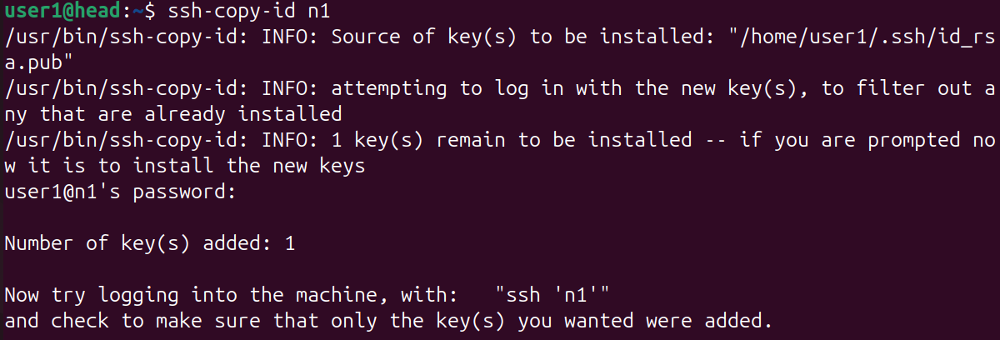
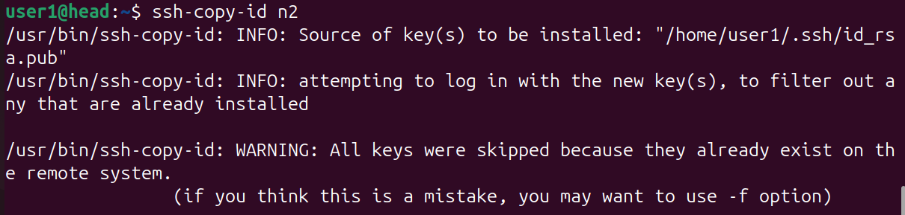

#### 3.在计算节点配置互信(使用ssh登陆到计算机节点再次执行上述操作) 登录n1节点

```bash
ssh n1
ssh-keygen -t rsa
ssh-copy-id head
ssh-copy-id n2
```


在n2节点执行类似操作：

```bash
ssh n2
ssh-keygen -t rsa
ssh-copy-id head
ssh-copy-id n1
```


#### 4.验证免密登录

```bash
ssh n1  # 无需密码直接登录
ssh n2  # 无需密码直接登录
ssh head # 无需密码直接登录
```

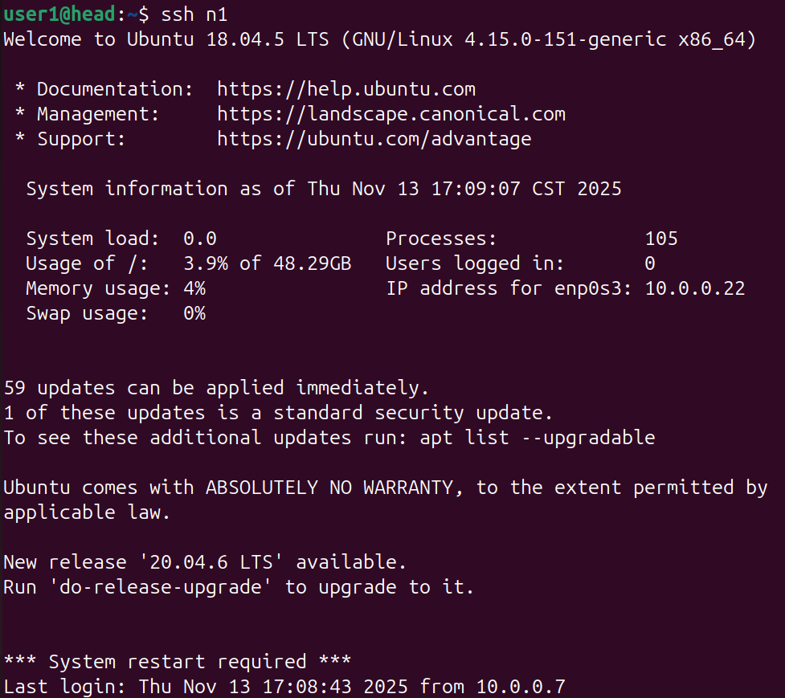

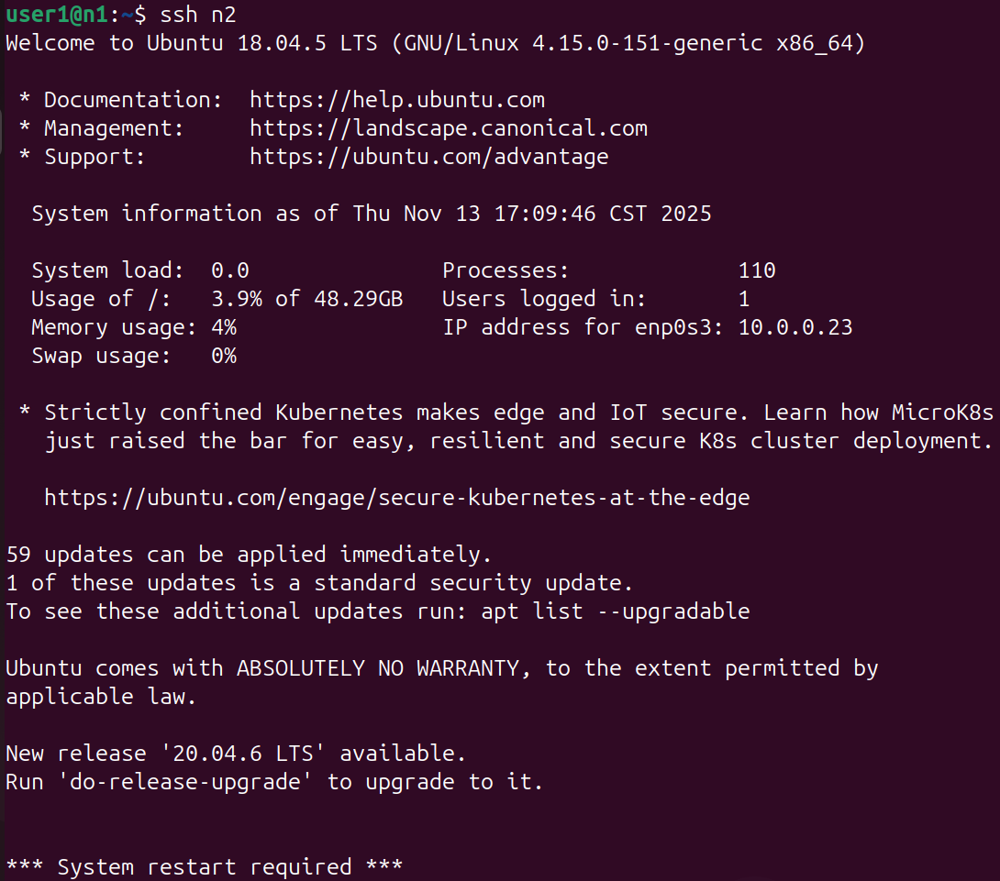

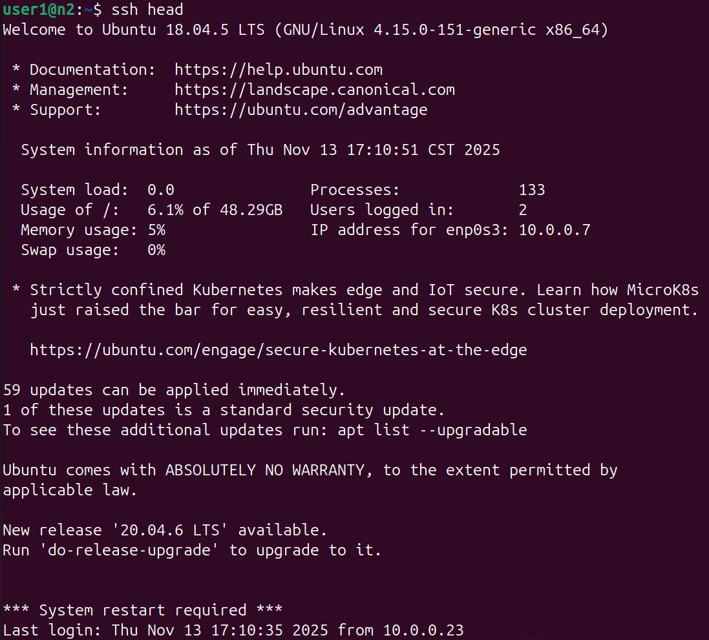

#### SSH免密登录拓扑图

配置完成后，集群形成了完全互信的网络拓扑：

```bash
        head
       ↗    ↖
      ↓       ↓
     n1  ←→   n2
```

**说明**：

- 每个节点都生成了自己的SSH密钥对;
- 每个节点都将公钥分发给了其他所有节点;
- 任意两个节点之间都可以免密登录。

#### 技术原理说明

**SSH密钥认证流程：**

1. **密钥生成**：`ssh-keygen`生成RSA算法的公私钥对;
2. **公钥分发**：`ssh-copy-id`将公钥追加到目标节点的 `~/.ssh/authorized_keys`文件;
3. 认证过程:
   - 客户端向服务器发起连接请求;
   - 服务器发送随机挑战（challenge）;
   - 客户端用私钥加密挑战并返回;
   - 服务器用公钥解密验证;
   - 验证成功则建立连接;

#### 分析总结

SSH免密登录配置是高性能计算集群的基础设施之一。通过在每个节点生成SSH密钥对并相互分发公钥，实现了集群内所有节点的完全互信。这种配置使得：

1. **MPI程序运行**：mpirun可以自动在各节点间启动和管理进程，无需交互式输入密码;
2. **便捷管理**：管理员可以方便地在节点间切换和执行命令;
3. **安全性**：基于非对称加密的密钥认证比密码认证更安全，且私钥不会在网络中传输;
4. **自动化支持**：为后续的作业调度、监控脚本等自动化工具提供了基础。

配置完成后，集群已具备运行分布式并行程序的完整条件。

### 4.5 安装并测试MPICH

#### 1.下载安装MPICH

登录到头节点，参考实验1安装mpich。
在头节点user1用户下,在configure时添加 `--prefix=/home/user1/mpich`
如果使用root账号安装，注意安装在共享目录 `/opt`，在 `configure`时添加 `--prefix=/opt/` 。

（此处选择在头节点的user1用户下安装mpich）

```bash
su - user1
cd ~
wget http://www.mpich.org/static/downloads/3.4.2/mpich-3.4.2.tar.gz
tar -xzvf mpich-3.4.2.tar.gz
cd mpich-3.4.2
./configure --prefix=/home/user1/mpich --with-device=ch3

make -j$(nproc)
make install
```


#### 2.配置环境变量

```bash
vi ~/.bashrc
```

添加：

```bash
export PATH=/home/user1/mpich/bin:$PATH
export LD_LIBRARY_PATH=/home/user1/mpich/lib:$LD_LIBRARY_PATH
```


使配置生效：

```bash
source ~/.bashrc
```


#### 3.编译测试程序

```bash
cd mpich-3.4.2/examples
mpicc -o cpi cpi.c
mpicc -o hellow hellow.c
```

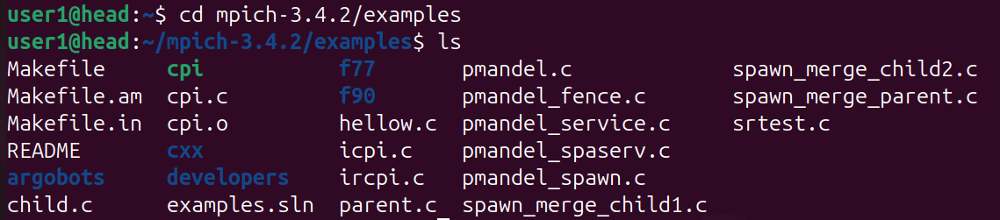
进入示例文件夹并查看其内容

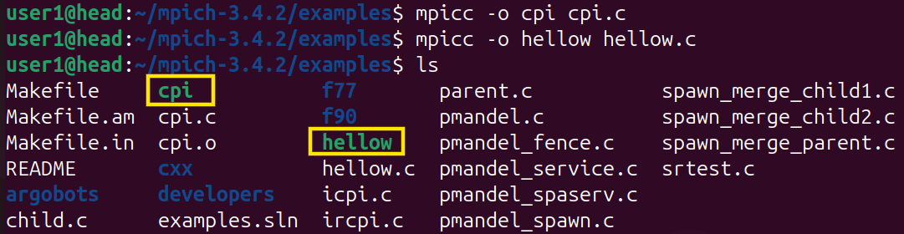
查看编译后的目标文件

#### 4.创建节点文件

```bash
vi ~/nodes
```

内容：

```bash
n1
n1
n1
n2
n2
n2
```

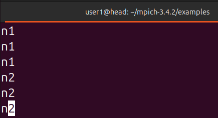
说明：每行代表一个进程，这里设置n1和n2各运行3个进程。

#### 5.运行MPI程序

运行cpi程序（计算π值）：

```bash
mpirun -np 6 -machinefile ~/nodes ./cpi
```

运行结果截图：
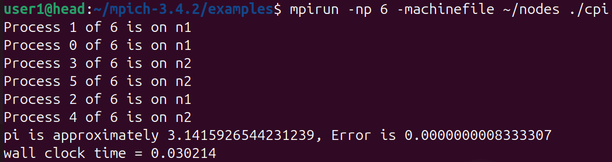

```bash
Process 1 of 6 is on n1
Process 0 of 6 is on n1
Process 3 of 6 is on n2
Process 5 of 6 is on n2
Process 2 of 6 is on n1
Process 4 of 6 is on n2
pi is approximately 3.1415926544231239, Error is 0.0000000008333307
wall clock time = 0.030214
```

运行hellow程序：

```bash
mpirun -np 6 -machinefile ~/nodes ./hellow
```

运行结果截图：
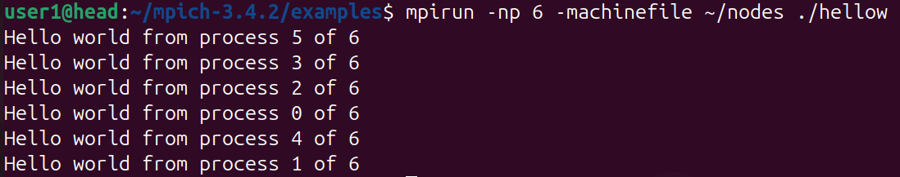

```bash
Hello world from process 5 of 6
Hello world from process 3 of 6
Hello world from process 2 of 6
Hello world from process 0 of 6
Hello world from process 4 of 6
Hello world from process 1 of 6
```

**结果分析**：

1. 6个进程成功分配到n1（3个）和n2（3个）两个节点;
2. cpi程序计算π值精度达到10位小数，误差仅0.0000000008333307;
3. 运行时间仅0.030214秒，体现了并行计算的高效性;
4. 进程编号随机输出，说明并行执行的异步特性。

## 五、实验过程中遇到的问题及解决方案

### 问题1：下载安装MPICH时，`./configure` 阶段没有成功生成Makefile


- 原因分析：`./configure`没有成功执行。
- 问题解决：
  - 再次执行 `./configure --prefix=/opt/mpich`发现后面几行的输出是这样的：

    ```bash
    ......
    checking for ucp/api/ucp.h... no
    checking for ucp_config_read in -lucp... no
    configure: error: no ch4 netmod selected

      The default ch4 device could not detect a preferred network
      library. Supported options are ofi (libfabric) and ucx:

        --with-device=ch4:ofi or --with-device=ch4:ucx

      Configure will use an embedded copy of libfabric or ucx if one is
      not found in the user environment. An installation can be specified
      by adding

        --with-libfabric=<path/to/install> or --with-ucx=<path/to/install>

      to the configuration.

      The previous MPICH default device (ch3) is also available and
      supported with option:

        --with-device=ch3
    ```

    根据输出可知是因为没有指定网络通信设备（device）。

    MPICH在 `v3.4.x`版本之后默认推荐使用新一代的通信层 `ch4`，而它需要依赖网络库（`ucx`或 `libfabric`）。

    目前的系统没有安装这些库，所以 `configure`就报了：

    ```bash
    configure: error: no ch4 netmod selected
    ```

  - 选择使用旧版通信层 `ch3`

    ```bash
    ./configure --prefix=/opt/mpich --with-device=ch3
    ```

### 问题2：使用旧版通信层ch3之后出现问题

```bash
configure: error: No Fortran 77 compiler found. If you don't need to
        build any Fortran programs, you can disable Fortran support using
        --disable-fortran. If you do want to build Fortran
        programs, you need to install a Fortran compiler such as gfortran
        or ifort before you can proceed.
```

- 原因分析：

  ```bash
  configure: error: No Fortran 77 compiler found.
  ```

  MPICH默认会同时编译C和Fortran接口，但Ubuntu系统中没有安装Fortran编译器（`gfortran`），所以配置失败，Makefile没生成（因此 `make`也无法执行）。
- 问题解决：

  安装Fortran编译器。

  ```bash
  sudo apt update
  sudo apt install -y gfortran
  ```

  然后重新执行：

  ```bash
  cd ~/mpich-3.4.2
  ./configure --prefix=/opt/mpich --with-device=ch3
  make -j$(nproc)
  sudo make install
  ```

  

### 问题3：尝试修改NIS用户shell时提示"user does not exist in /etc/passwd"


在n1节点尝试使用 `chsh -s /bin/bash`修改user1的默认shell时，系统提示：

```bash
chsh: user 'user1' does not exist in /etc/passwd
```

- **原因分析**：

  - user1是通过NIS服务管理的远程用户，其账户信息存储在头节点的NIS服务器上
  - 本地的 `/etc/passwd`文件中没有user1的记录
  - `chsh`命令默认只能修改本地用户账户，无法直接修改NIS用户
- **问题解决**：

  1. 通过 `echo $SHELL`命令验证当前shell，发现已经是 `/bin/bash`，无需修改
  2. 如果确实需要修改NIS用户的shell，应该在头节点进行操作：
     - 在头节点使用 `usermod -s /bin/bash user1`修改用户shell
     - 重新生成NIS数据库：`cd /var/yp && make`
     - 计算节点会自动同步更新后的用户信息
- **经验总结**：
  在NIS集群环境中，所有用户账户的管理操作（创建、删除、修改密码、修改shell等）都应该在NIS服务器（头节点）上进行，计算节点只负责查询和使用用户信息。这体现了NIS集中式管理的设计理念。

## 六、实验分析与总结

### 6.1 系统架构分析

#### 6.1.1 集群整体架构图

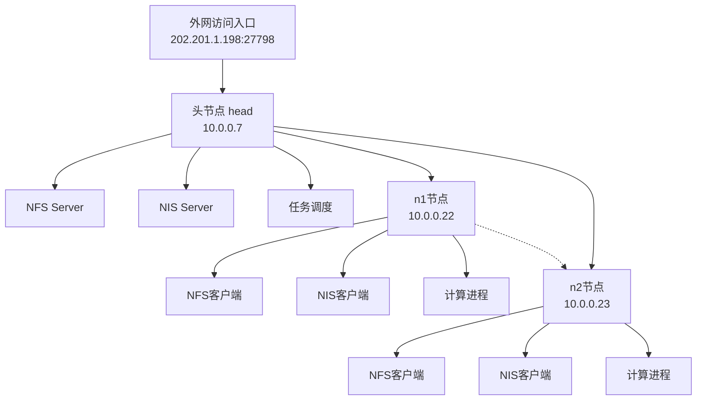

#### 6.1.2 数据流分析

**1. 文件访问流程（NFS）：**

```bash
用户程序 → 本地文件系统 → NFS客户端 → 网络 → NFS服务器 → 实际存储
```

**2. 用户认证流程（NIS）：**

```bash
登录请求 → PAM认证 → NSS查询 → NIS客户端 → NIS服务器 → 用户数据库
```

**3. MPI通信流程：**

```bash
mpirun → SSH免密登录 → 各节点启动进程 → MPI消息传递 → 结果汇总
```

### 6.2 技术要点总结

#### 6.2.1 关键配置项对比

- 服务头节点配置计算节点配置作用;
- hosts添加所有节点映射添加所有节点映射主机名解析;
- NFS导出/home和/opt挂载/home和/opt文件共享;
- NIS配置master服务器配置client客户端用户统一管理;
- SSH生成密钥并分发生成密钥并分发免密登录;
- MPICH安装在共享目录通过NFS访问并行计算。

#### 6.2.2 配置文件清单

**头节点关键配置文件：**

- `/etc/hosts` - 主机名映射
- `/etc/exports` - NFS共享目录配置
- `/etc/default/nis` - NIS服务器类型
- `/var/yp/Makefile` - NIS数据库配置
- `/home/user1/.ssh/authorized_keys` - SSH公钥

**计算节点关键配置文件：**

- `/etc/hosts` - 主机名映射
- `/etc/fstab` - NFS自动挂载
- `/etc/yp.conf` - NIS服务器地址
- `/etc/nsswitch.conf` - 名称服务顺序
- `/etc/pam.d/common-session` - PAM认证配置

### 6.3 实验总结与收获

通过本次超算集群搭建实验，我们成功构建了一个由一个头节点和两个计算节点组成的小型高性能计算集群。整个过程不仅锻炼了我们的动手实践能力，更深化了我们对分布式计算环境、并行计算原理以及Linux系统管理的理解。

**主要收获如下：**

1. **掌握了集群搭建的核心技术：** 我们亲手配置了构成集群基础的几项关键服务。通过配置NFS，我们理解了如何在多台服务器间实现文件系统的共享，保证了数据和应用环境的一致性。通过部署NIS，我们掌握了集中式用户账户管理的方法，极大地简化了多节点环境下的用户维护工作。SSH免密登录的配置，则为后续MPI并行任务的自动化部署和节点间的无缝通信奠定了基础。
2. **深化了对并行计算的理解：** 此次实验不再是理论学习，而是真实地将一个MPI程序（如 `cpi`和 `hellow`）在多台物理（虚拟）机上并行执行。通过 `mpirun`命令和 `machinefile`，我们直观地看到了任务如何被分配到不同的计算节点上协同工作，并最终汇总结果。性能测试部分的数据也清晰地展示了并行计算相对于单机处理的效率优势，以及进程数增加带来的性能提升趋势。
3. **提升了系统管理与问题解决能力：** 实验过程并非一帆风顺，我们遇到了诸如MPICH编译依赖缺失、NIS用户无法在本地修改等问题。通过分析错误日志、查阅资料和逻辑推理，我们学会了如何定位问题根源——无论是缺少 `gfortran`编译器，还是对NIS用户管理机制理解不深——并成功找到了解决方案。这个排错过程极大地提升了我们在复杂Linux环境下分析和解决实际问题的能力。
4. **形成了对集群架构的宏观认识：** 从最初的网络规划、IP地址和主机名配置，到NFS、NIS服务的部署，再到最终MPI程序的运行，我们完整地走过了一个集群从无到有的全过程。这使我们不再将集群看作一个神秘的黑盒，而是能够清晰地描绘出其内部的主从架构、数据流（文件访问、用户认证）和通信模式（MPI消息传递），对高性能计算平台的整体运行机制有了系统性的认知。

**总结：**

本次实验是一次理论与实践的高度结合。它不仅验证了我们课堂所学的关于操作系统、计算机网络和并行计算的知识，更重要的是，它提供了一个宝贵的平台，让我们将这些知识融会贯通，应用于解决一个具体的、复杂的工程问题。从配置文件的每一个参数，到服务重启的每一个命令，再到最终并行程序成功运行后输出的结果，每一步都加深了我们的理解和成就感。
