# 作业1

姓名：官瑞琪
学号：320220912420
班级：超级计算前沿技术1班(课序号1)

- [作业1](#作业1)
  - [1 Shell脚本排序程序](#1-shell脚本排序程序)
    - [1.1创建一个名为 `sort_numbers.sh`的脚本文件](#11创建一个名为-sort_numberssh的脚本文件)
    - [1.2添加执行权限](#12添加执行权限)
    - [1.3运行脚本](#13运行脚本)
  - [2 在VMware上安装Linux](#2-在vmware上安装linux)
    - [2.1 下载必要软件](#21-下载必要软件)
    - [2.2 安装步骤](#22-安装步骤)
      - [(1)创建虚拟机](#1创建虚拟机)
      - [(2)配置虚拟机](#2配置虚拟机)
      - [(3)安装CentOS](#3安装centos)
    - [2.3 安装后配置](#23-安装后配置)
  - [3 构建容器并创建新账户](#3-构建容器并创建新账户)
    - [3.1 安装Docker](#31-安装docker)
    - [3.2 拉取CentOS镜像](#32-拉取centos镜像)
    - [3.3 创建并运行容器](#33-创建并运行容器)
    - [3.4 在容器中创建新账户](#34-在容器中创建新账户)
    - [3.5 保存容器为新镜像](#35-保存容器为新镜像)
    - [3.6 验证结果](#36-验证结果)
  - [4 制作MPI的Singularity容器镜像](#4-制作mpi的singularity容器镜像)
    - [4.1 安装Singularity](#41-安装singularity)
    - [4.2 创建MPI容器定义文件](#42-创建mpi容器定义文件)
    - [4.3 构建容器镜像](#43-构建容器镜像)
    - [4.4 测试MPI容器](#44-测试mpi容器)
    - [4.5 运行结果](#45-运行结果)
  - [5 安装编译GROMACS](#5-安装编译gromacs)
    - [5.1 安装依赖](#51-安装依赖)
    - [5.2 下载GROMACS源码](#52-下载gromacs源码)
    - [5.3 编译GROMACS](#53-编译gromacs)
    - [5.4 配置环境变量](#54-配置环境变量)
    - [5.5 验证安装](#55-验证安装)
    - [5.6 运行简单测试](#56-运行简单测试)
  - [6 总结](#6-总结)
  - [7 完成过程中遇到的问题](#7-完成过程中遇到的问题)
    - [1.拉取CentOS 7镜像时Docker无法连接到Docker官方镜像仓库](#1拉取centos-7镜像时docker无法连接到docker官方镜像仓库)
    - [2.下载并安装Singularity时，`builddir`目录下没有生成正确的 `Makefile`](#2下载并安装singularity时builddir目录下没有生成正确的-makefile)
    - [3.构建Singularity镜像时出现权限问题](#3构建singularity镜像时出现权限问题)
    - [4.Singularity在从Docker Hub拉取镜像时,由于网络不稳定导致连接重置,很难下载成功](#4singularity在从docker-hub拉取镜像时由于网络不稳定导致连接重置很难下载成功)
    - [5.在没有hostfile或调度器时,MPI默认只允许启动与物理核心数相同的进程数](#5在没有hostfile或调度器时mpi默认只允许启动与物理核心数相同的进程数)
    - [6.编译GROMACS时置编译选项时遇到了一个问题](#6编译gromacs时置编译选项时遇到了一个问题)
    - [7.后续发现新问题](#7后续发现新问题)
    - [8.继续问题7验证安装，检查GROMACS版本出现一个新的问题](#8继续问题7验证安装检查gromacs版本出现一个新的问题)

<!-- TOC -->
<!-- /TOC -->

## 1 Shell脚本排序程序

编写一个shell脚本，完成输入五个数字并进行升序和降序排序，打
印出脚本内容和执行结果。

### 1.1创建一个名为 `sort_numbers.sh`的脚本文件

```bash
vim sort_numbers.sh
```

```bash
#提示用户输入五个数字
echo "请输入五个数字(用空格分隔):"
read -a numbers

#检查输入数量
if [ ${#numbers[@]} -ne 5 ]; then
    echo "错误: 必须输入五个数字!"
    exit 1
fi

#验证输入是否为数字
for num in "${numbers[@]}"; do
    if ! [[ "$num" =~ ^-?[0-9]+(\.[0-9]+)?$ ]]; then
        echo "错误: '$num' 不是有效数字!"
        exit 1
    fi
done

echo "原始数据: ${numbers[@]}"

#升序排序
ascending=($(printf '%s\n' "${numbers[@]}" | sort -n))
echo "升序排序: ${ascending[@]}"

#降序排序
descending=($(printf '%s\n' "${numbers[@]}" | sort -nr))
echo "降序排序: ${descending[@]}"
```

### 1.2添加执行权限

```bash
chmod +x sort_numbers.sh
```

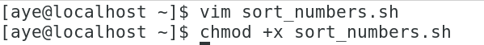

### 1.3运行脚本

```bash
./sort_numbers.sh
```

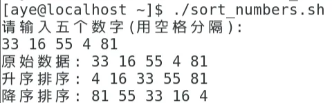
图1.1.1 正确输入情况

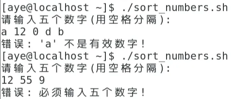
图1.1.2 不正确输入情况

---

## 2 在VMware上安装Linux

在虚拟机上安装linux (VMware)。

### 2.1 下载必要软件

- VMware Workstation Pro
- CentOS ISO镜像（选择实验1中要求的CentOS-7.X镜像）

  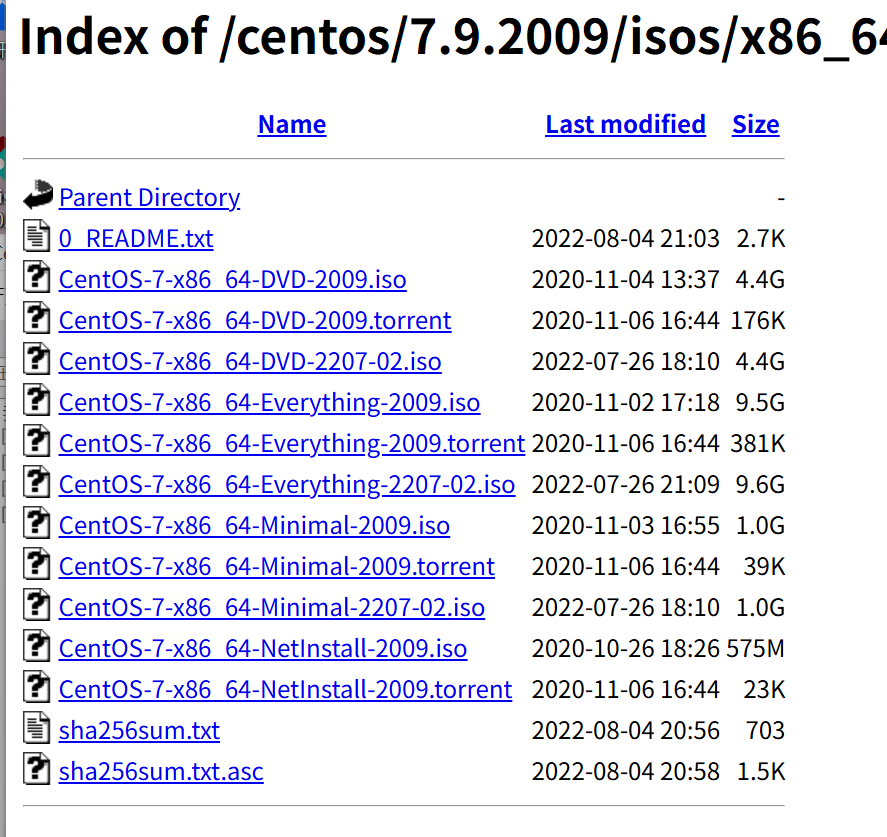

### 2.2 安装步骤

#### (1)创建虚拟机

1. 打开VMware,点击"创建新的虚拟机";
2. 选择"典型"配置;
3. 选择"稍后安装操作系统";
4. 选择Linux系统类型和版本(CentOS 7 64位);
5. 设置虚拟机名称(设置为CentOS-Cluster)和存储位置;
6. 设置磁盘大小。

#### (2)配置虚拟机

- 内存: 2GB;
- 处理器: 2核心;
- CD/DVD: 选择ISO镜像文件;
- 网络适配器: NAT。

#### (3)安装CentOS

1. 启动虚拟机;
2. 选择"Install CentOS";
3. 选择语言;
4. 配置安装目的地(选择自动分区);
5. 配置网络和主机名;
6. 设置root密码和创建用户;
7. 开始安装;

   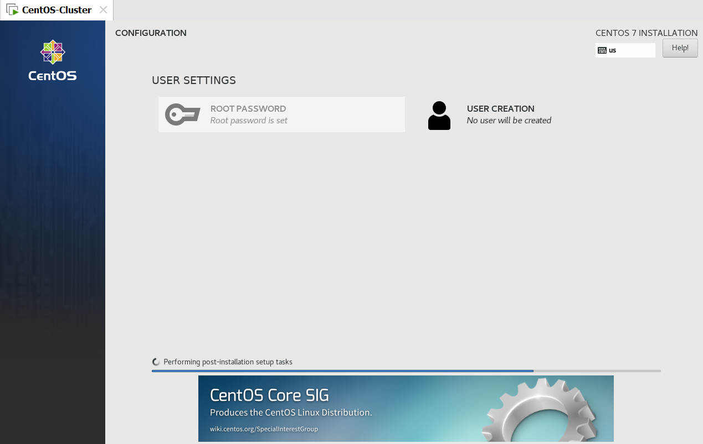
8. 安装完成后重启。

### 2.3 安装后配置

```bash
#更新系统
sudo yum update -y
#安装常用工具
sudo yum install -y vim wget curl net-tools
#安装VMware Tools
sudo yum install open-vm-tools
```

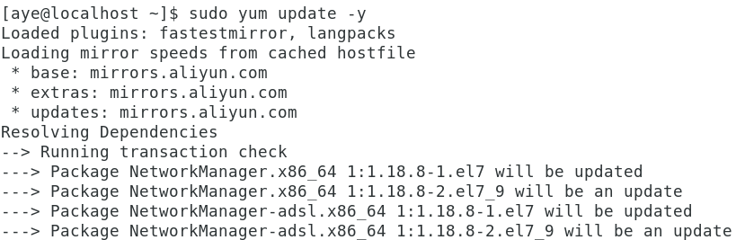
图2.3.1 更新系统


图2.3.2 常用工具已安装

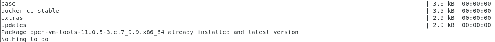
图2.3.3 VMware Tools已安装

---

## 3 构建容器并创建新账户

### 3.1 安装Docker

```bash
#安装依赖包
sudo yum install -y yum-utils device-mapper-persistent-data lvm2

#添加Docker仓库
sudo yum-config-manager --add-repo \
    https://download.docker.com/linux/centos/docker-ce.repo

#安装Docker
sudo yum install -y docker-ce docker-ce-cli containerd.io

#启动Docker服务
sudo systemctl start docker
sudo systemctl enable docker

#验证安装
sudo docker --version
```

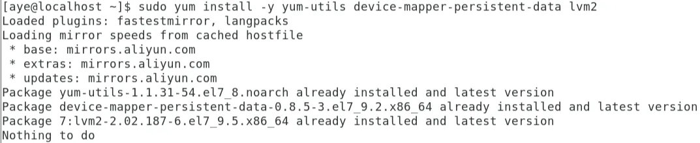
图3.1.1 已安装依赖包


图3.1.2 添加Docker仓库


图3.1.3 安装Docker


图3.1.4 启动Docker服务


图3.1.5 验证安装

### 3.2 拉取CentOS镜像

此处需要使用镜像加速器访问Docker Hub。(见[问题1](#1拉取centos-7镜像时docker无法连接到docker官方镜像仓库))

```bash
#拉取CentOS 7镜像
sudo docker pull centos:7
#查看镜像
sudo docker images
```

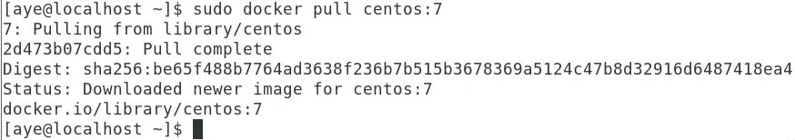
图3.2.1 拉取CentOS 7镜像


图3.2.2 查看镜像

### 3.3 创建并运行容器

```bash
#运行CentOS容器
sudo docker run -it --name mycentos centos:7 /bin/bash
```

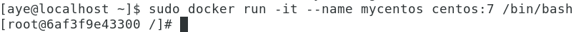
图3.3.1 运行CentOS容器

### 3.4 在容器中创建新账户

在创建的容器内执行以下命令:

```bash
#创建新用户(用户名: testuser)
useradd -m -s /bin/bash testuser
#设置用户密码
passwd testuser
#验证用户创建
id testuser
cat /etc/passwd | grep testuser
#切换到新用户
su - testuser
#查看当前用户
whoami
```


图3.4.1 创建新用户并设置密码


图3.4.2 验证新用户创建


图3.4.3 切换到新用户并查看当前用户

### 3.5 保存容器为新镜像

```bash
#退出容器(Ctrl+D或exit)
exit
#将容器保存为新镜像
sudo docker commit mycentos centos-with-user:v1
#查看新镜像
sudo docker images
```


图3.5.1 退出容器


图3.5.2 将容器保存为新镜像
并查看该新镜像

### 3.6 验证结果

```bash
#从新镜像启动容器
sudo docker run -it centos-with-user:v1 /bin/bash
#验证用户存在
cat /etc/passwd | grep testuser
```


图3.6.1 从新建镜像v1启动容器
并验证新建用户testuser存在

---

## 4 制作MPI的Singularity容器镜像

### 4.1 安装Singularity

```bash
#安装依赖
sudo yum install -y epel-release
sudo yum groupinstall -y 'Development Tools'
sudo yum install -y openssl-devel libuuid-devel libseccomp-devel \
    wget squashfs-tools cryptsetup

#安装Go语言(Singularity依赖)
export VERSION=1.19.5 OS=linux ARCH=amd64
cd /tmp
wget https://dl.google.com/go/go$VERSION.$OS-$ARCH.tar.gz
sudo tar -C /usr/local -xzvf go$VERSION.$OS-$ARCH.tar.gz
rm go$VERSION.$OS-$ARCH.tar.gz

#配置环境变量
echo 'export PATH=/usr/local/go/bin:$PATH' >> ~/.bashrc
source ~/.bashrc

#下载并安装Singularity
export VERSION=3.11.0
cd /tmp
wget https://github.com/sylabs/singularity/releases/download/v${VERSION}/singularity-ce-${VERSION}.tar.gz
tar -xzf singularity-ce-${VERSION}.tar.gz
cd singularity-ce-${VERSION}

./mconfig
make -C builddir
sudo make -C builddir install

#验证安装
singularity --version
```


图4.1.1 安装依赖


图4.1.2 安装Go语言后移除其压缩包


图4.1.3 配置环境变量

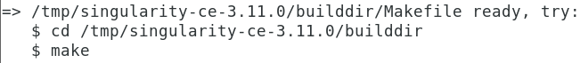
图4.1.4 运行配置脚本(```mconfig```)
此处如果失败，后续的编译和安装无法正常进行。(见[问题2](#2下载并安装singularity时builddir目录下没有生成正确的-makefile))


图4.1.5 编译

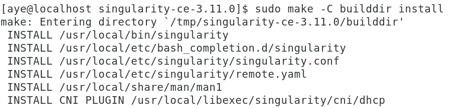
图4.1.6 安装


图4.1.7 安装成功

### 4.2 创建MPI容器定义文件

创建文件 `mpi.def`:

```bash
vi mpi.def
```

```bash
Bootstrap: docker
From: centos:7

%post
    #使用阿里云镜像源
    sed -e 's|^mirrorlist=|#mirrorlist=|g' \
        -e 's|^#baseurl=http://mirror.centos.org|baseurl=https://mirrors.aliyun.com|g' \
        -i.bak /etc/yum.repos.d/CentOS-Base.repo
    yum clean all
    yum makecache

    #更新系统
    yum update -y
  
    #安装依赖
    yum install -y gcc gcc-c++ gcc-gfortran make wget
  
    #下载并安装OpenMPI
    cd /tmp
    wget https://download.open-mpi.org/release/open-mpi/v4.1/openmpi-4.1.5.tar.gz
    tar -xzf openmpi-4.1.5.tar.gz
    cd openmpi-4.1.5
  
    ./configure --prefix=/usr/local/openmpi
    make -j4
    make install
  
    #清理
    cd /
    rm -rf /tmp/openmpi-4.1.5*

%environment
    export PATH=/usr/lib64/openmpi/bin:$PATH
    export LD_LIBRARY_PATH=/usr/lib64/openmpi/lib:$LD_LIBRARY_PATH
    export MANPATH=/usr/share/man:$MANPATH

%runscript
    echo "MPI 容器已启动"
    echo "OpenMPI 版本："
    mpirun --version

%labels
    Author student@university.edu
    Version v1.1
    Description OpenMPI container for HPC (CentOS 7 + OpenMPI via Yum)

```

### 4.3 构建容器镜像

```bash
#构建Singularity镜像
sudo usr/local/bin/singularity build mpi.sif docker-archive://centos7.tar
#查看镜像信息
singularity inspect mpi.sif
```


图4.3.1 构建容器镜像
此处需要注意两点：

- 使用绝对路径(见[问题3](#3构建singularity镜像时出现权限问题))
- 用Docker pull下载，然后用Singularity转换，否则网络不稳定且不支持断点续传，很难构建成功。(见[问题4](#4singularity在从docker-hub拉取镜像时由于网络不稳定导致连接重置很难下载成功))


图4.3.2 查看镜像信息

### 4.4 测试MPI容器

1. 在家目录下新建文件夹进行测试。

   ```bash
   cd ~
   mkdir mpi_test
   cd mpi_test
   ```

2. 创建测试程序 `hello_mpi.c`:

   ```c
   #include <mpi.h>
   #include <stdio.h>

   int main(int argc, char** argv) {
       MPI_Init(&argc, &argv);

       int world_size;
       MPI_Comm_size(MPI_COMM_WORLD, &world_size);

       int world_rank;
       MPI_Comm_rank(MPI_COMM_WORLD, &world_rank);

       char processor_name[MPI_MAX_PROCESSOR_NAME];
       int name_len;
       MPI_Get_processor_name(processor_name, &name_len);

       printf("Hello from processor %s, rank %d out of %d processors\n",
              processor_name, world_rank, world_size);

       MPI_Finalize();
       return 0;
   }
   ```

   
   图4.4.1 创建并确认测试程序
3. 编译并运行:

   ```bash
   #在容器中编译
   sudo /usr/local/bin/singularity build mpi.sif mpi.def
   #运行MPI程序
   singularity exec mpi.sif mpirun --oversubscribe -np 4 ./hello_mpi
   ```

   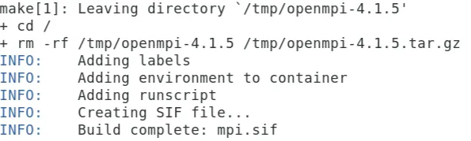
   图4.4.2 编译成功

### 4.5 运行结果

运行时注意加上```--oversubscribe```参数，让MPI忽略“核心数量限制”，强制启动多个进程。
否则由于该虚拟机设置时是8个**单核**处理器，无法成功运行。(见[问题5](#5在没有hostfile或调度器时mpi默认只允许启动与物理核心数相同的进程数))

```bash
Hello from processor localhost.localdomain, rank 1 out of 4 processors
Hello from processor localhost.localdomain, rank 2 out of 4 processors
Hello from processor localhost.localdomain, rank 3 out of 4 processors
Hello from processor localhost.localdomain, rank 0 out of 4 processors
```


图4.4.3 运行结果

---

## 5 安装编译GROMACS

### 5.1 安装依赖

```bash
#安装编译工具和依赖库
sudo yum install -y gcc gcc-c++ cmake make
sudo yum install -y fftw-devel openmpi-devel
sudo yum install -y python3 python3-pip
#设置环境变量
export PATH=/usr/lib64/openmpi/bin:$PATH
export LD_LIBRARY_PATH=/usr/lib64/openmpi/lib:$LD_LIBRARY_PATH
```


图5.1.1-5.1.3 编译工具和依赖库安装成功


图5.1.4 设置环境变量

### 5.2 下载GROMACS源码

这里一开始选择下载GROMACS 2023版本，后续因为一系列兼容问题选择了重新下载GROMACS 2021版本。
两者的源码文件放在两个文件夹中，使用时需注意指定具体版本的地址。(见[问题6](#6编译gromacs时置编译选项时遇到了一个问题)&[问题7](#7后续发现新问题))

```bash
#创建工作目录
mkdir -p ~/software
cd ~/software

#下载GROMACS 2023版本
wget ftp://ftp.gromacs.org/gromacs/gromacs-2023.tar.gz
#后续由于一系列兼容问题选择下载2021版本。
wget ftp://ftp.gromacs.org/gromacs/gromacs-2021.2.tar.gz

# 2023版本解压
tar -xzf gromacs-2023.tar.gz
cd gromacs-2023
# 2021版本解压
tar -xzf gromacs-2021.2.tar.gz
cd gromacs-2021.2

```

两个版本的截图类似，不再赘述。

图5.2.1 创建工作目录后下载GROMACS


图5.2.2 解压并进入该目录

### 5.3 编译GROMACS

此处均换成GROMACS 2021版。

```bash
#创建构建目录
mkdir build
cd build

#配置编译选项
cmake .. -DGMX_BUILD_OWN_FFTW=ON \
         -DGMX_MPI=ON \
         -DCMAKE_INSTALL_PREFIX=/usr/local/gromacs \
         -DGMX_GPU=OFF

#编译(使用4个线程)
make -j4

#安装
sudo make install
```


图5.3.1 配置编译选项


图5.3.2 使用4个线程编译完成


图5.3.3 安装完成

### 5.4 配置环境变量

```bash
# 添加到bashrc
echo 'source /usr/local/gromacs2021/bin/GMXRC' >> ~/.bashrc
source ~/.bashrc
```


图5.4.1 配置环境变量

### 5.5 验证安装

需要创建软链接，让```gmx```调用```gmx_mpi```(见[问题8](#8继续问题7验证安装检查gromacs版本出现一个新的问题))

```bash
# 检查GROMACS版本
gmx --version

# 查看可用命令
gmx help
```


图5.5.1 检查GROMACS版本


图5.5.2 查看可用命令

### 5.6 运行简单测试

```bash
#下载示例文件
cd ~/
mkdir gromacs_test
cd gromacs_test

#创建简单的水分子系统
gmx pdb2gmx -h

#检查MPI版本
gmx_mpi --version
```


图5.6.1 创建简单的水分子系统


图5.6.2 检查MPI版本

---

## 6 总结

本报告完成了以下五个任务:

1. Shell脚本排序:编写了能够接收五个数字并进行升序和降序排序的脚本;
2. VMware安装Linux:详细说明了在VMware上安装Ubuntu/CentOS的完整步骤;
3. Docker容器创建:构建了基于Ubuntu的容器并创建了新用户账户;
4. Singularity MPI容器:制作了包含OpenMPI的Singularity容器镜像并成功运行测试程序;
5. GROMACS编译安装:从源码编译安装了GROMACS分子动力学模拟软件。

所有任务均已测试验证,可以正常运行。

---

## 7 完成过程中遇到的问题

### 1.拉取CentOS 7镜像时Docker无法连接到Docker官方镜像仓库

   ```bash
   from daemon: Get "<https://registry-1.docker.io/v2/>": 
   net/http: request canceled while waiting for connection (Client.Timeout exceeded while awaiting headers)
   ```

- **原因分析**：
  网络无法访问Docker Hub。
- **解决方法**：
  使用镜像加速器。
     1. 编辑 `/etc/docker/daemon.json` 。

        ```bash
        sudo mkdir -p /etc/docker
        sudo tee /etc/docker/daemon.json <<-'EOF'
        {
          "registry-mirrors": [
            "https://docker.m.daocloud.io",
            "https://mirror.ccs.tencentyun.com",
            "https://hub-mirror.c.163.com",
            "https://registry.docker-cn.com"
          ]
        }
        EOF
        ```

     2. 然后重启Docker。

        ```bash
        sudo systemctl daemon-reexec
        sudo systemctl daemon-reload
        sudo systemctl restart docker
        ```

### 2.下载并安装Singularity时，`builddir`目录下没有生成正确的 `Makefile`

   

- **问题分析**：
  - **可能原因一**
       `./mconfig`未成功执行。
       `mconfig`脚本会检查系统依赖，并配置编译环境。如果系统缺少某些必要的依赖包（如Go语言环境、GCC、`libseccomp-devel`等），`mconfig`可能会失败或中止，导致 `builddir`目录下没有生成 `Makefile`文件。

  - **解决方法**：
      1. 在运行 `./mconfig` 之前，**确保CentOS 7系统安装了所有必要的编译依赖**，然后重新执行配置和编译步骤。

            
            如图，未成功安装Go.
      2. 重新安装之后再次检查。

            
  - **可能原因二**
       `make: *** No targets specified and no makefile found. Stop.`。
       这明确表明在 `/tmp/singularity-ce-3.11.0/builddir`目录中，`make`命令找不到它需要执行的 `Makefile`文件。

       
       如图，CentOS 7系统缺少GLib 2.0库的开发文件（Header Files），这是编译Conmon (Container Monitor)所必需的。

  - **解决方法**：

      安装 `glib2-devel`包，它是CentOS/RHEL系统上提供GLib 2.0头文件的开发包。

      以 `sudo`权限运行以下命令：

      ```bash
         # 安装GLib 2.0的开发包，解决b-2.0 headers缺失的问题
         sudo yum install -y glib2-devel
      ```

      
      再次进入解压的Singularity目录 `/tmp/singularity-ce-3.11.0` ，**运行配置脚本 (`mconfig`)**，这将检查依赖，并生成 `builddir` 目录下的 `Makefile`。

      
      如图，已成功解决。

### 3.构建Singularity镜像时出现权限问题

   

- **问题分析**：

  - Singularity被安装到了非标准路径。

       运行 `sudo make -C builddir install`时，Singularity的可执行文件（singularity）通常被安装到了 `/usr/local/bin`路径下。
  - **而`sudo`环境的 `$PATH`变量不包含该路径。**

       `sudo`命令在执行时，出于安全考虑，会使用一个最小化的、受限的`$PATH`环境变量。这个受限的路径列表可能只包含 `/bin`,`/sbin`,`/usr/bin`,`/usr/sbin`，但**不包含** `/usr/local/bin`。

     故，普通用户 `aye`知道 `singularity`在哪里（运行 `singularity --version`成功了），但是 `sudo`环境找不到这个命令。
- **解决方法**：

     使用完整的绝对路径。

     1. 首先确认 `singularity`的绝对路径。

        ```bash
        which singularity
        ```

        
     2. **使用该绝对路径执行 `sudo` 命令：**

        ```bash
        sudo /usr/local/bin/singularity build --fakeroot mpi.sif mpi.def
        ```

### 4.Singularity在从Docker Hub拉取镜像时,由于网络不稳定导致连接重置,很难下载成功

   ```bash
   Getting image%20source signatures
   Copying blob 2d473b07cdd5 [>-------------------------------------] 1.0MiB / 72.6MiB
   INFO[0225] Reading blob body from https://registry-1.docker.io/v2/library/centos/blobs/sha256:2d473b07cdd5f0912cd6f1a703352c82b512407db6b05bCopying blob 2d473b07cdd5 [>-------------------------------------] 2.2MiB / 72.6MiB
   INFO[0363] Reading blob body from https://registry-1.docker.io/v2/library/centos/blobs/sha256:2d473b07cdd5f0912cd6f1a703352c82b512407db6b05bCopying blob 2d473b07cdd5 [=>------------------------------------] 3.4MiB / 72.6MiB
   INFO[0494] Reading blob body from https://registry-1.docker.io/v2/library/centos/blobs/sha256:2d473b07cdd5f0912cd6f1a703352c82b512407db6b05bCopying blob 2d473b07cdd5 [=>------------------------------------] 4.2MiB / 72.6MiB
   FATAL:   While performing build: conveyor failed to get: initializing source oci:/root/.singularity/cache/blob:sha256.be65f488b7764ad3638f236b7b515b3678369a5124c47b8d32916d6487418ea4: copying system image%20from manifest list: writing blob: happened during read: (heuristic tuning data: last retry 3616768, current offset 4456448; 525416.539 ms total, 818.523 ms since progress): read tcp 192.168.19.133:52212->172.64.66.1:443: read: connection reset by peer
   [aye@localhost ~]$ sudo -E /usr/local/bin/singularity build mpi.sif mpi.def
   [sudo] password for aye: 
   INFO:    Starting build...
   Getting image%20source signatures
   Copying blob 2d473b07cdd5 [>-------------------------------------] 1.1MiB / 72.6MiB
   ```

- **问题分析**：
  Docker Hub国内访问慢
- **解决方法**:
  可以先用Docker pull下载，然后用Singularity转换。

  - Docker Hub拉取可以用Docker自带的断点续传;
  - Singularity不再直接访问Docker Hub;
  - 避免重复下载。

     ```bash
     #先拉取Docker镜像
     sudo docker pull centos:7
     #导出为tar
     sudo docker save centos:7 -o centos7.tar
     # 用Singularity构建——**注意：绝对路径**
     sudo /usr/local/bin/singularity build mpi.sif docker-archive://centos7.tar

     ```

     

     

### 5.在没有hostfile或调度器时,MPI默认只允许启动与物理核心数相同的进程数

   ```bash
   There are not enough slots available in the system to satisfy the 4 slots that were requested by the application: ./hello_mpi
   ......
   Alternatively, you can use the --oversubscribe option to ignore the number of available slots when deciding the number of processes to launch.
   ```

- **问题分析**：
  OpenMPI 检测到容器里只有“1个可用CPU slot（即1个核心）”，但请求了 `-np 4` 个进程。
- **解决方法**：

     在单机或容器测试时，可以加上 `--oversubscribe` 参数，让MPI忽略“核心数量限制”，强制启动多个进程：

     ```bash
     singularity exec mpi.sif mpirun --oversubscribe -np 4 ./hello_mpi
     ```

### 6.编译GROMACS时置编译选项时遇到了一个问题

   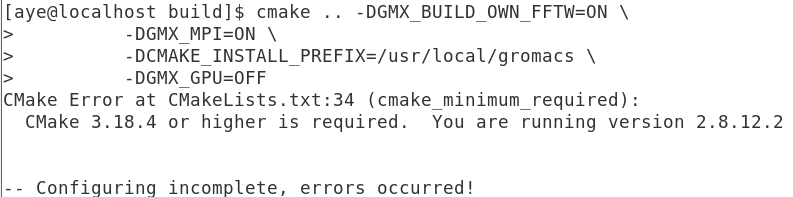

- **问题分析**：
  系统上CMake版本太旧（只有 2.8.12.2），而GROMACS 2023需要至少CMake 3.18.4。
- **解决方法**：

     从源码安装新版 CMake，而不影响系统自带版本。

     ```bash
     #1.创建目录
     mkdir -p ~/software
     cd ~/software

     #2.下载新版 CMake（以3.27.9为例，可根据需要换版本）
     wget https://cmake.org/files/v3.27/cmake-3.27.9.tar.gz

     #3.解压
     tar -xzf cmake-3.27.9.tar.gz
     cd cmake-3.27.9

     #4.编译并安装到本地目录（不覆盖系统版本）
     ./bootstrap --prefix=$HOME/software/cmake
     make -j4
     make install

     ```

     安装完成后会得到一个新的 `CMake`:

     ```bash
     ~/software/cmake/bin/cmake --version
     ```

### 7.后续发现新问题

   ```bash
   CMake Error in /home/aye/software/gromacs-2023/build/CMakeFiles/CMakeTmp/CMakeLists.txt: 
   Target "cmTC_6cfcd" requires the language dialect "CXX17" . 
   But the current compiler "GNU" does not support this, 
   or CMake does not know the flags to enable it. 
   CMake Error at cmake/gmxDetectTargetArchitecture.cmake:43 (try_compile): 
   Failed to generate test project build system. 
   Call Stack (most recent call first): CMakeLists.txt:187 (gmx_detect_target_architecture) 
   -- Configuring incomplete, errors occurred!
   ```

- **问题分析**：
   GROMACS 2023需要Python 3.7以上版本，而系统Python版本过旧（CentOS 7 默认是Python 2.7）。
   GROMACS 2023需要支持C++17的编译器，而该系统使用的GCC 4.8.5太旧。
   它只支持到C++11，因此无法满足要求。

- **解决方法**：
      决定换一个兼容版本——GROMACS 2021.2。

   ```bash
   mkdir -p ~/software
   cd ~/software

   #1.下载源码
   wget ftp://ftp.gromacs.org/gromacs/gromacs-2021.2.tar.gz

   #2.解压
   tar -xzf gromacs-2021.2.tar.gz
   cd gromacs-2021.2

   #3.建立构建目录
   mkdir build
   cd build

   #4.配置
   cmake .. -DGMX_BUILD_OWN_FFTW=ON \
            -DGMX_MPI=ON \
            -DCMAKE_INSTALL_PREFIX=/usr/local/gromacs \
            -DGMX_GPU=OFF

   #5.编译与安装
   make -j4
   sudo make install

   #6.配置环境
   echo 'source /usr/local/gromacs/bin/GMXRC' >> ~/.bashrc
   source ~/.bashrc

   #7.验证
   gmx --version

   ```

### 8.继续问题7验证安装，检查GROMACS版本出现一个新的问题

- **问题分析**：

     ```bash
     [aye@localhost ~]$ gmx --version
     bash: gmx: command not found...
     ```

     于是查看是否安装成功:

     ```bash
     [aye@localhost ~]$ ls /usr/local/gromacs2021/bin/
     demux.pl  gmx-completion.bash  gmx-completion-gmx_mpi.bash  gmx_mpi  GMXRC  GMXRC.bash  GMXRC.csh  GMXRC.zsh  xplor2gmx.pl
     ```

     如上，输出显示该文件夹中没有普通的 `gmx`可执行文件，只有 `gmx_mpi`。

     这是因为在 `cmake`时启用了：

     ```bash
     -DGMX_MPI=ON
     ```

     在这种模式下，GROMACS只生成**MPI版本**的可执行文件，名字叫 `gmx_mpi`，而不是 `gmx`。

     `GMXRC`脚本里通常会设置一个别名或者软链接，但系统里似乎没有生效。
- **解决方法**：

     创建软链接，让 `gmx`调用 `gmx_mpi`。

     ```bash
     sudo ln -s /usr/local/gromacs2021/bin/gmx_mpi /usr/local/gromacs2021/bin/gmx
     ```

     然后再执行：

     ```bash
     gmx --version
     ```

     就可以正常显示了。
