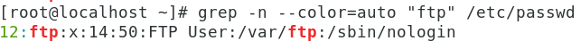
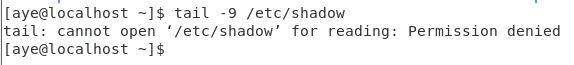

# 实验一——Linux操作实践和编译安装MPI

姓名：官瑞琪
学号：320220912420
班级：超级计算前沿技术1班(课序号1)

<!-- TOC -->

- [实验一——Linux操作实践和编译安装MPI](#实验一linux操作实践和编译安装mpi)
  - [一、实验环境](#一实验环境)
  - [二、实验目的](#二实验目的)
  - [三、实验内容与步骤](#三实验内容与步骤)
    - [3.1 Linux命令实践](#31-linux命令实践)
      - [3.1.1 系统文件目录和用户管理](#311-系统文件目录和用户管理)
      - [3.1.2 Shell使用技巧和文件属性](#312-shell使用技巧和文件属性)
    - [3.2 MPI编译安装与测试](#32-mpi编译安装与测试)
      - [3.2.1 MPI安装步骤](#321-mpi安装步骤)
      - [3.2.2 MPI程序测试](#322-mpi程序测试)
    - [3.3 Shell 脚本编写：三数排序](#33-shell-脚本编写三数排序)
      - [3.3.1 脚本设计思路](#331-脚本设计思路)
      - [3.3.2 脚本实现](#332-脚本实现)
      - [3.3.3 脚本执行与测试](#333-脚本执行与测试)
  - [四、实验结果分析](#四实验结果分析)
    - [4.1 Linux 命令掌握情况](#41-linux-命令掌握情况)
    - [4.2 MPI 安装与测试结果](#42-mpi-安装与测试结果)
    - [4.3 Shell 脚本实现效果](#43-shell-脚本实现效果)
  - [五、实验问题与解决方案](#五实验问题与解决方案)
    - [5.1 Linux命令实践中的问题](#51-linux命令实践中的问题)
    - [5.2 MPI 安装过程中的问题](#52-mpi-安装过程中的问题)

<!-- /TOC -->

## 一、实验环境

- **虚拟机软件**: VMware Workstation
- **操作系统**: CentOS 7

## 二、实验目的

1. 熟悉Linux基本命令的操作;
2. 在虚拟机或HPC集群上编译安装MPICH;
3. 进行MPI样例程序的测试;
4. 掌握高性能计算应用并行运行环境。

## 三、实验内容与步骤

### 3.1 Linux命令实践

#### 3.1.1 系统文件目录和用户管理

（1）在/root目录下创建一个文件Lab1.c，然后显示其文件名在屏幕上。

```bash
#进入root目录
cd /root
#创建文件
touch Lab1.c
#查看文件详细信息
ls -al lab1.c
```


图3.1.1.1 创建并查看文件详细信息

**执行结果分析**:

- `touch`命令用于创建空文件或更新文件时间戳。
- `ls -al`显示文件的详细属性，包括权限、所有者、大小、修改时间等。

---

（2）创建目录并移动文件
在 `/root`目录下创建一个 `test`目录，将 `/root`目录中的 `Lab1.c`文件移动（剪切）到 `test`目录中，并改名为 `labnew.c`。

```bash
#在/root下创建test目录
mkdir test
#移动文件到test目录
mv Lab1.c test
#进入test目录
cd test
#查看test文件夹内容
ls
#重命名文件
mv Lab1.c labnew.c
#验证结果
ls
```

**执行结果分析**:

- `mkdir`创建目录。
- `mv`命令既可以移动文件，也可以重命名文件。
- 移动和重命名可以在一条命令中完成：`mv lab1.c test/labnew.c`。

  
  图3.1.1.2 移动文件

---

（3）删除目录及其内容
删除 `/root`目录中的 `test`目录（包括里面的 `labnew.c`文件）。

```bash
#返回上级目录
cd ..
#查看当前目录内容
ls
#递归删除test目录及其内容
rm -r test
#验证删除结果
ls
```

**执行结果分析**:

- `rm -r`递归删除目录及其所有内容。
- 可以使用 `rm -rf`强制删除，无需确认（需谨慎使用）。

  
  图3.1.1.3 递归删除目录

---

（4）查看文件指定行。
查看 `/etc/shadow`文件的最后9行信息，查看 `/etc/shadow`文件的前10行信息。

```bash
#查看shadow文件最后9行
tail -9 /etc/shadow
#查看shadow文件前10行
head -10 /etc/shadow
```

**执行结果分析**:

- `tail -n`显示文件末尾n行。
- `head -n`显示文件开头n行。
- `/etc/shadow`存储用户加密密码信息，需要root权限查看。

  

  
  图3.1.1.4 查看文件指定行(需要root权限)

---

（5）查找指定文件
在 `/etc`目录下找出名为 `ifcfg-eth0`的普通文件。

```bash
#在/etc目录下查找ifcfg-eth0文件
find /etc -name ifcfg-eth0 -type f
```

**执行结果分析**:

- `find`命令用于文件搜索。
- `name`按名称查找。
- `type f`限定为普通文件类型。
- 网络配置文件通常位于 `/etc/sysconfig/network-scripts/`目录。

  
  图3.1.1.5 按名称查找指定文件

---

（6）文件内容搜索
在 `/etc/shadow`或 `/etc/passwd`文件中查找 `ftp`字符串相匹配的行，显示所在行号，且用颜色凸显 `ftp`字符串。

```bash
#在shadow文件中搜索ftp字符串
grep -n --color=auto "ftp" /etc/shadow
#在passwd文件中搜索ftp字符串
grep -n --color=auto "ftp" /etc/passwd
```

**执行结果分析**:

- `grep`用于文本搜索。
- `n`显示行号。
- `-color=auto`高亮显示匹配内容。

  
  图3.1.1.6 在shadow文件中搜索ftp字符串

  
  图3.1.1.7 在passwd文件中搜索ftp字符串

---

（7）创建用户并设置密码
创建一个用户user1,并设置密码123456。

```bash
#创建用户user1
useradd user1
#设置密码
passwd user1
#输入密码: 123456
#再次输入确认密码: 123456
```

**执行结果分析**:

- `useradd`创建新用户，自动创建同名组和家目录。
- `passwd`设置用户密码。
- 密码需要满足系统安全策略（长度、复杂度等）。

  
  图3.1.1.7 创建用户并设置密码

---

（8）查看用户信息

查看下增加了user1用户后，`/etc/passwd`文件增加的内容，并进行解释每一样内容。

```bash
#查看passwd文件内容
cat /etc/passwd
```


图3.1.1.8 查看用户信息

**执行结果分析**:

```bash
user1:x:1001:1001::/home/user1:/bin/bash
```

各字段含义：

- **登录名**: user1
- **密码占位符**: x（实际密码存储在 `/etc/shadow`）
- **UID**: 1001（用户ID）
- **GID**: 1001（主组ID）
- **个人信息**: 空（GECOS字段）
- **家目录**: `/home/user1`
- **登录Shell**: `/bin/bash`

---

（9）查看用户密码密文
查看下user1的密码密文是什么。

```bash
#查看shadow文件中的密码信息
cat /etc/shadow | grep user1
```


图3.1.1.9 查看user1的密码密文

**执行结果分析**:

```bash
user1:$1$vX7TYoLH$VZlsQvP2CC6Z5XjjsAliU.:20403:0:99999:7:::
```

密文格式说明：

- `user1`:用户名;
- `$1$vX7TYoLH$VZlsQvP2CC6Z5XjjsAliU`：密码字段（一个哈希密码）
  - `$1$`表示使用MD5-crypt来加密密码;
  - `vX7TYoLH`是salt;
  - `VZlsQvP2CC6Z5XjjsAliU`是加密后的密码(即计算得到的哈希值);
  - 后续数字表示密码策略（最后修改日期、最大使用期限等）

---

（10）用户切换
从当前root用户切换到user1用户，再切换回root；

```bash
#从root切换到user1
su - user1
#验证当前用户
whoami
#返回root
exit
#或使用
su - root
```


图3.1.1.10 切换并验证当前用户

**执行结果分析**:

- `su -`会切换用户并加载目标用户的环境变量。
- `su`仅切换用户身份，保留当前环境。
- `exit`退出当前会话，返回上一个用户。

---

（11-14）组管理操作
创建一个组group1;
查看下group1的GID是多少;
把user1用户加入组group1;
查看下当前user1属于哪些组，而所属的每个组的ID分别是多少;

```bash
#创建一个组group1
groupadd group1

#查看group1的GID是多少
cat /etc/group

#将user1加入group1
gpasswd -a user1 group1

#查看当前user1所属组
id user1
#查看主组ID
id -g user1
```


图3.1.1.11 创建一个组group1


图3.1.1.12 查看group1的GID


图3.1.1.23 将user1加入group1


图3.1.1.24 查看当前user1所属组
——为user1和group1


图3.1.1.25 查看主组ID(即组user1)

**执行结果分析**:

- `groupadd`创建新组。
- `gpasswd -a`将用户添加到组。
- `id`命令显示用户的UID、GID和所属组信息。
- 用户可以属于多个组（图中示例的user1和group1），但只有一个主组（图中示例的user1）。

---

（15）删除用户
删除user1用户，同时删除该用户的家目录。

```bash
#删除user1用户，同时删除该用户的家目录
userdel -r user1
#验证删除结果
cat /etc/passwd | grep user1
ls /home/ | grep user1
```


图3.1.1.26 删除用户及其家目录


图3.1.1.27 均无输出，说明已成功删除

**执行结果分析**:

- `r`选项同时删除用户的家目录和邮件池。
- 不加 `r`则保留家目录。
- 删除用户前应确保该用户没有正在运行的进程。

---

（16-18）高级用户管理
创建一个用户xiaoming,创建的同时，设置该用户的UID为4000，家目录为 `/home/xm`;
修改xiaoming的用户名为xm1;

```bash
#创建用户xiaoming，指定UID和家目录
useradd -u 4000 -d /home/xm xiaoming

#修改用户属性
usermod -d /home/xmnew -u 5000 xiaoming

#修改用户名为xm1;
usermod -l xm1 xiaoming
```


图3.1.1.28 创建用户xiaoming，指定UID和家目录


图3.1.1.29 验证创建结果，符合预期


图3.1.1.30 修改用户属性并验证修改结果


图3.1.1.31 修改用户名并验证修改结果

**执行结果分析**:

- `u`指定UID。
- `d`指定家目录。
- `usermod`用于修改现有用户属性。
- `l`修改登录名。

---

（19-20）组删除和Shell设置
删除组group1;
创建一个用户xiaohong, 创建的同时，设置该用户所使用的shell程序为 `csh`。

```bash
#删除组group1
groupdel group1

#创建创建用户并指定Shell
useradd -s /bin/csh xiaohong
```


图3.1.1.32 删除组并验证结果


图3.1.1.33 创建用户并指定Shell
并验证结果

**执行结果分析**:

- 删除组前需确保没有用户以该组为主组。
- `s`指定用户登录时使用的Shell。
- 常用Shell：bash、sh、csh、tcsh、zsh等。

---

#### 3.1.2 Shell使用技巧和文件属性

（1）查看Linux中当前所支持的Shell程序种类

```bash
cat /etc/shells
```


图3.1.2.1 查看支持的shell种类

---

（2）统计c开头的命令
统计下当前Linux中以字母c开头的命令的个数有几个。

```bash
#按两次Tab键，系统会列出所有c开头的命令
c
```


图3.1.2.2 统计c开头的命令

**执行结果分析**:

- Tab键自动补全功能可以列出匹配的命令。

---

（3-4）别名管理
显示下当前Linux系统中所有的别名设置;
给 “`ls -a`”命令设置一个别名lsa;

```bash
#显示下当前Linux系统中所有的别名设置
alias

#设置别名
alias lsa='ls -a'
#验证结果
alias
```


图3.1.2.3 显示所有别名


图3.1.2.4 设置别名并验证

**执行结果分析**:

- `alias`创建命令别名，提高工作效率。
- 直接在命令行设置的别名仅在当前会话有效，写入 `.bashrc`可以永久保存。

---

（5）命令连接符

用命令连接符一次性执行以下动作：
1）在当前目录下创建一个文件；2）进入到 `/home`目录中；3）在 `/home`目录中创建一个目录 `dir1`。

```bash
#用命令连接符一次性执行以下动作：
#1）在当前目录下创建一个文件；2）进入到/home目录中；3）在/home目录中创建一个目录dir1
touch file1; cd /home; mkdir dir1

#验证结果
ls -l /home/ | grep dir1
```


图3.1.2.5 使用分号连接多个命令，
并验证在home目录下创建目录dir1成功


图3.1.2.6 验证当前目录下创建file1成功

**执行结果分析**:

- `;`顺序执行命令，前一个命令失败不影响后续命令。

此外，`&&`逻辑与，前一个成功才执行下一个；`||`逻辑或，前一个失败才执行下一个。

---

（6-8）重定向操作
把 `/etc/passwd`文件中的内容备份到 `/home`下的另一个文件 `passwd.bak`文件中，请写出2种方法;
把 `#ls -al /etc/`命令原本显示在屏幕上的信息保存到 `/home/ls.bak`文件中;
再把 `/etc/shadow`文件（系统中已存在）中的信息附加到 `/home/ls.bak`文件中（原内容要保留）。

```bash
#方法1：使用>>追加
cat /etc/passwd >> /home/passwd.bak
#先移除该.bak文件再尝试方法2
cd /home
rm passwd.bak
#输入y
#方法2：使用>覆盖
cat /etc/passwd > /home/passwd.bak

#保存命令输出
ls -al /etc > /home/ls.bak

#追加内容
cat /etc/shadow >> /home/ls.bak
```


图3.1.2.7 使用<<追加并验证


图3.1.2.8 移除该文件并验证


图3.1.2.9 使用>覆盖并验证


图3.1.2.10 保存命令输出并验证


图3.1.2.11 追加内容

**执行结果分析**:

- `>`覆盖式重定向，清空原文件内容。
- `>>`追加式重定向，保留原文件内容。
- 标准输出（stdout）重定向到文件

---

（9）管道操作
在屏幕上显示出 `/etc/passwd`文件中的第3行到第5行的内容。

```bash
#显示3-5行内容
head -5 /etc/passwd | tail -3
```


图3.1.2.12 显示3-5行内容

**执行结果分析**:

- 管道 `|`将前一个命令的输出作为后一个命令的输入。
- `head -5`取前5行，`tail -3`再取最后3行，即第3-5行。
- 管道可以连接多个命令，实现复杂操作。

---

（10-12）文件权限管理
在 `/home`目录下创建一个文件 `file1.txt`;
查看下 `file1.txt`文件的属性信息，写出当前该文件的所属主和所属组，以及所属主、所属组、其它用户对该文件的权限是什么，以及该文件的类型。

```bash
#在/home目录下创建一个文件file1.txt
touch /home/file1.txt

#查看文件属性
ls -l /home/file1.txt
```


图3.1.2.13 创建文件并验证


图3.1.2.14 查看文件属性

执行结果为:

```bash
-rw-r--r--. 1 root root 0 Nov 11 09:01 /home/file1.txt
```

**属性解析**:

- **文件所属主**：root
- **文件所属组**：root
- **所属主权限**:`rw-`可读可写（6）。
- **所属组权限**:`r--`只读（4）。
- **其他用户权限**:`r--`只读（4）。
- **文件类型**: `-`普通文件（`d`目录，`l`链接）。

---

（13）三种方法设置权限
请用三种方法设置 `file1.txt`的权限为：所属主有读写可执行，所属组有读写，其它用户无任何权限。

```bash
#方法1：符号模式
chmod u=rwx,g=rw,o-rwx /home/file1.txt

#方法2：数字模式
chmod 760 /home/file1.txt

#方法3：混合模式
chmod ug=rw,u+x,o-rwx /home/file1.txt

#验证结果
ls -l /home/file1.txt
```


图3.1.2.15 方法1-符号模式


图3.1.2.16 方法2-数字模式


图3.1.2.16 方法3-混合模式

**权限说明**:

- **数字表示**:r=4, w=2, x=1。
- **760**:所属主7(rwx)，所属组6(rw-)，其他0(---)。
- **符号**:u(user)、g(group)、o(other)、a(all)。
- **操作**:+(添加)、-(删除)、=(设置)。

---

（14-16）更改文件所有者
创建一个用户为 `xiaohong` ,创建一个组为 `xueshenghui`;
设置 `file1.txt`文件的所属主为 `xiaohong`;
设置 `file1.txt`文件的所属组为 `xueshenghui`;
再把 `file1.txt`文件的属主和属组改回 `root`。

```bash
#创建用户和组
useradd xiaohong
groupadd xueshenghui

#更改所属主
chown xiaohong /home/file1.txt
#验证结果
ls -l /home/file1.txt

#更改所属组
chown :xueshenghui /home/file1.txt
#验证结果
ls -l /home/file1.txt

#同时更改所属主和组
chown root:root /home/file1.txt
#验证结果
ls -l /home/file1.txt
```


图3.1.2.17 创建用户和组


图3.1.2.18 更改所属主并验证


图3.1.2.19 更改所属组并验证


图3.1.2.20 同时更改所属主和组并验证

**执行结果分析**:

- `chown`改变文件所有者。
- `chown user:group file`同时修改所属主和组。
- `chown :group file`仅修改所属组。
- 需要root权限或文件所有者权限。

---

### 3.2 MPI编译安装与测试

#### 3.2.1 MPI安装步骤

（1）下载MPI安装包

到官网：[http://www.mpich.org/downloads/](http://www.mpich.org/downloads/)下载 mpi-3.4.2版本的MPI包。

```bash
#使用wget下载
cd /opt
wget http://www.mpich.org/static/downloads/3.4.2/mpich-3.4.2.tar.gz
```


图3.2.1.1 下载完成

**说明**:

- 下载到 `/opt`目录便于管理。
- 确保网络连接正常。

---

（2）解压安装包
到下载安装包的目录下，可以看到有 `mpi-3.4.2.tar.gz`的压缩包，在终端运行如下命令可以解压安装包:
(若无法解压，尝试 `tar -xvf mpich-3.4.2.tar.gz`。)

```bash
#解压tar.gz文件
tar -zxvf mpich-3.4.2.tar.gz

#查看解压结果
ls -l mpich-3.4.2/
```


图3.2.1.2 解压tar.gz文件完成


图3.2.1.3 查看解压结果

**参数说明**:

- `z`:使用gzip解压。
- `x`:提取文件。
- `v`:显示详细过程。
- `f`:指定文件名。

---

（3）配置编译环境

```bash
#进入解压目录
cd mpich-3.4.2

#配置安装路径和编译选项
./configure --prefix=/opt/mpich-3.4.2 --with-device=ch4:ofi
```


图3.2.1.4 进入解压目录


图3.2.1.5 配置完成

**配置说明**:

- `-prefix`:指定安装目录。
- 配置过程会检查系统依赖和编译环境。

---

（4）编译安装

```bash
#编译
make -j4

#安装
make install

#验证安装
/opt/mpich/bin/mpicc -v
/opt/mpich/bin/mpirun -version
```


图3.2.1.6 编译完成


图3.2.1.7 安装完成


图3.2.1.8 验证安装

**编译说明**:

- `make`根据Makefile编译源代码。
- 可以使用 `make -j4`利用4核并行编译加速。
- 编译过程会产生大量输出信息。

---

（5）设置环境变量
用vi或vim打开 `bashrc`文件;
然后在最下面添加环境变量, 这里需要vim编辑的基础知识，可以学习下三种模式：插入模式，命令行模式和底行模式;
设置环境变量是为了在执行mpi命令时可以让计算机自己找到相应的一些函数库，而不至于报错找不到命令或文件;
更新（激活）环境变量。

```bash
#编辑bashrc文件
vim ~/.bashrc

#在文件末尾添加以下内容（按i进入插入模式）
export PATH=/usr/local/mpich-3.4.2/bin:$PATH
export LD_LIBRARY_PATH=/usr/local/mpich-3.4.2/lib:$LD_LIBRARY_PATH

#保存退出（按ESC，输入:wq）

#激活环境变量
source ~/.bashrc
```


图3.2.1.9 添加环境变量

**环境变量说明**:

- `PATH`:可执行文件搜索路径。
- `LD_LIBRARY_PATH`:动态库搜索路径。
- 添加到用户配置文件使每次登录都生效。

---

（6）验证安装

```bash
#查看MPI版本
mpicc --version
mpiexec --version

#查看安装路径
which mpicc
which mpirun
```


图3.2.1.10 验证安装

---

#### 3.2.2 MPI程序测试

通过mpi接口运行“Hello World”, 检测安装效果。

（1）测试Hello World程序

进入刚才解压的 `mpi-3.4.2`目录中的 `examples`目录里，是安装自带的一些示例。

可以看到里面有一个 `hellow.c`的c源文件，我们通过mpi接口对其进行编译;

- `-o`是objective的缩写，`hellow`是文件名，意思是把 `hellow.c`源文件编译成名字为 `hellow`的目标（可执行）文件。编译完成后发现 `examples`目录下会多出一个 `hellow`文件。

```bash
#进入示例目录
cd /opt/mpich-3.4.2/examples

#查看示例文件
ls -l *.c

#编译hellow.c
mpicc hellow.c -o hellow

#查看生成的可执行文件
ls -l hello
```


图3.2.2.1 进入示例目录


图3.2.2.2 查看示例文件


图3.2.2.3 编译并查看生成的可执行文件

**编译说明**:

- `mpicc`是MPI的C语言编译器包装器。
- 自动链接MPI库。
- `o`指定输出文件名。

---

（2）运行 MPI 程序

运行hellow文件;
`-np`表示number of processors,即进程数，N自己取值。

```bash
#使用2个进程运行
mpirun -np 2 ./hellow

#使用4个进程运行
mpirun -np 4 ./hellow

#使用8个进程运行
mpirun -np 8 ./hellow
```


图3.2.2.4 使用2个进程运行


图3.2.2.5 使用4个进程运行


图3.2.2.6 使用8个进程运行

**参数说明**:

- `np N`:指定进程数量;
- 每个进程独立执行，输出顺序可能不同。

---

（3）测试其他示例

```bash
# 编译并运行cpi程序（计算π值）
cd /opt/mpich-3.4.2/examples
mpicc cpi.c -o cpi
mpirun -np 4 ./cpi
```


图3.2.2.7 编译并运行cpi程序

---

### 3.3 Shell 脚本编写：三数排序

#### 3.3.1 脚本设计思路

编写一个Shell脚本实现输入三个数字并进行升序排序的功能。

**设计要点**:

1. 接收用户输入的三个数字;
2. 使用条件判断进行比较和交换;
3. 输出排序后的结果;
4. 添加输入验证和错误处理。

---

#### 3.3.2 脚本实现

**创建脚本文件**:

```bash
#创建脚本文件
vim sort_three_numbers.sh
```

**脚本内容**:

```bash
#读取三个数字
read -p "请输入第一个数字: " num1
read -p "请输入第二个数字: " num2
read -p "请输入第三个数字: " num3

#验证输入是否为数字
if ! [[ "$num1" =~ ^-?[0-9]+([.][0-9]+)?$ ]] || \
   ! [[ "$num2" =~ ^-?[0-9]+([.][0-9]+)?$ ]] || \
   ! [[ "$num3" =~ ^-?[0-9]+([.][0-9]+)?$ ]]; then
    echo "错误：请输入有效的数字！"
    exit 1
fi

echo ""
echo "原始输入: $num1, $num2, $num3"

#方法1：使用冒泡排序思想
#第一轮比较
if [ $(echo "$num1 > $num2" | bc) -eq 1 ]; then
    temp=$num1
    num1=$num2
    num2=$temp
fi

if [ $(echo "$num2 > $num3" | bc) -eq 1 ]; then
    temp=$num2
    num2=$num3
    num3=$temp
fi

#第二轮比较
if [ $(echo "$num1 > $num2" | bc) -eq 1 ]; then
    temp=$num1
    num1=$num2
    num2=$temp
fi

echo "升序排序结果: $num1, $num2, $num3"
echo ""

#方法2：使用数组和sort命令（更简洁）
echo "使用sort命令的排序结果："
arr=($num1 $num2 $num3)
sorted=$(printf '%s\n' "${arr[@]}" | sort -n | tr '\n' ' ')
echo "升序排序结果: $sorted"
```

**保存并设置执行权限**:

```bash
#保存文件（ESC + :wq）

#添加执行权限
chmod +x sort_three_numbers.sh

#查看文件权限
ls -l sort_three_numbers.sh
```


图3.2.2.8 添加执行权限并查看

---

#### 3.3.3 脚本执行与测试

1. 整数排序

   ```bash
   ./sort_three_numbers.sh
   ```

   
   图3.2.2.9 输出正确

   ---
2. 负数排序

   ```bash
   ./sort_three_numbers.sh
   ```

   
   图3.2.2.10 输出正确

   ---
3. 小数排序

   ```bash
   ./sort_three_numbers.sh
   ```

   
   图3.2.2.11 输出正确

   ---
4. 错误输入

   ```bash
   ./sort_three_numbers.sh
   ```

   
   图3.2.2.12 错误输入情况

   ---

## 四、实验结果分析

### 4.1 Linux 命令掌握情况

通过本次实验，熟练掌握了以下Linux操作：

1. **文件管理**: touch、mkdir、mv、rm、cp等命令的使用;
2. **用户管理**: useradd、userdel、usermod、passwd等命令;
3. **组管理**: groupadd、groupdel、gpasswd等命令;
4. **权限管理**: chmod、chown命令的符号模式和数字模式;
5. **文本处理**: grep、head、tail、cat等命令及管道操作;
6. **Shell技巧**: 别名设置、重定向、命令连接符等。

### 4.2 MPI 安装与测试结果

**安装成功标志**:

- MPICH 3.4.2 成功编译安装;
- 环境变量配置正确;
- mpicc和mpirun命令可用;
- Hello World程序运行正常。

### 4.3 Shell 脚本实现效果

**功能实现**:

- 成功接收三个数字输入;
- 正确实现升序排序算法;
- 支持整数、负数、小数排序;
- 包含输入验证和错误处理;
- 提供两种排序方法对比。

---

## 五、实验问题与解决方案

### 5.1 Linux命令实践中的问题

**问题1：查看文件 `/etc/shadow`指定行时权限不足。**

由于该文件存储用户加密密码信息，需要root权限查看。



**解决方案**:

切换到root进行操作。

```bash
#切换到root用户
su -
#输入密码
```


图5.1.1 切换到root用户

### 5.2 MPI 安装过程中的问题

1. configure 配置失败

   ```bash
   configure: error: no ch4 netmod selected

   The default ch4 device could not detect a preferred network
   library. Supported options are ofi (libfabric) and ucx:

       --with-device=ch4:ofi or --with-device=ch4:ucx
   ```
   - **问题分析：**

     错误提示表明在配置MPI时，默认的 ch4 device（即通信模块）没有指定使用的网络库。

     MPI的ch4设备需要选择一个具体的网络模块来支持通信。常见的网络模块包括 libfabric (ofi) 和 ucx。
   - **解决方法：**

   1. 使用以下命令安装libfabric或ucx库。

      - 对于libfabric (ofi)：

      ```bash
      sudo yum install libfabric-devel
      ```
      

      - 对于ucx：

      ```bash
      sudo yum install ucx-devel
      ```
   2. 指定网络模块。

      运行 `configure`命令时，明确指定网络模块——

      - 使用libfabric(ofi)，则执行：

        ```bash
        ./configure --with-device=ch4:ofi
        ```
      - 使用ucx，则执行：

        ```bash
        ./configure --with-device=ch4:ucx
        ```
        配置成功。

        

      ---
2. make编译错误

   ```bash
   ......
   CC       src/pmi/simple/lib_libmpi_la-simple_pmi.lo
   GEN      lib/libmpi.la
   /bin/ld: cannot find -lpsm_infinipath
   /bin/ld: cannot find -lpsm2
   /bin/ld: cannot find -lrdmacm
   /bin/ld: cannot find -libverbs
   /bin/ld: cannot find -lnl-3
   /bin/ld: cannot find -lnl-route-3
   collect2: error: ld returned 1 exit status
   make[2]: *** [lib/libmpi.la] Error 1
   make[2]: Leaving directory `/opt/mpich-3.4.2'
   make[1]: *** [all-recursive] Error 1
   make[1]: Leaving directory `/opt/mpich-3.4.2'
   make: *** [all] Error 2
   ```
   - 问题分析：

     MPI在编译时检测到 RDMA/Infiniband 相关库缺失导致的链接错误。
   - 解决方法：

     1. 安装缺失的RDMA依赖库（用于HPC环境）;

        ```bash
        sudo yum install -y rdma-core libibverbs libibverbs-devel librdmacm librdmacm-devel \
                        libpsm2 libpsm2-devel libnl3 libnl3-devel

        ```
        但还是有问题：

        ```bash
        /bin/ld: cannot find -lpsm_infinipath
        collect2: error: ld returned 1 exit status
        make[2]: *** [lib/libmpi.la] Error 1
        make[2]: Leaving directory `/opt/mpich-3.4.2'
        make[1]: *** [all-recursive] Error 1
        make[1]: Leaving directory `/opt/mpich-3.4.2'
        make: *** [all] Error 2
        [root@localhost mpich-3.4.2]# 
        ```
        这是因为MPICH使用 `--with-device=ch4:ofi`时，底层依赖libfabric。

        libfabric本身支持多种“provider”，包括：

        - verbs (Infiniband)
        - psm / psm2 (Omni-Path)
        - tcp (普通网卡)
        - shm (共享内存)

          如果系统里安装的libfabric检测到 PSM provider 文件存在（或路径配置残留），但实际没有相应库，就会触发：

          ```bash
          /bin/ld: cannot find -lpsm_infinipath
          ```
     2. 禁用PSM（适用于虚拟机、普通服务器、没有Infiniband网卡的环境）。

        重新执行：

        ```bash
        make clean
        ./configure --prefix=/opt/mpich \
            --disable-fortran \
            --with-device=ch4:tcp
        make -j4
        sudo make install
        ```
        
3. 重新配置出现错误。

   

   - 问题分析：

     当前编译的MPICH版本（3.4.2）中没有 `ch4:tcp`这个网络模块。

     在MPICH 3.4.2中，CH4支持的netmod只有：

     ```bash
     ofi（基于 libfabric）
     ucx（基于 UCX）
     ```
   - **解决方案**:
     使用TCP通信后端：`ch3:sock`

     ```bash
     make clean

     ./configure --prefix=/opt/mpich \
         --disable-fortran \
         --with-device=ch3:sock
     ```

   ---
