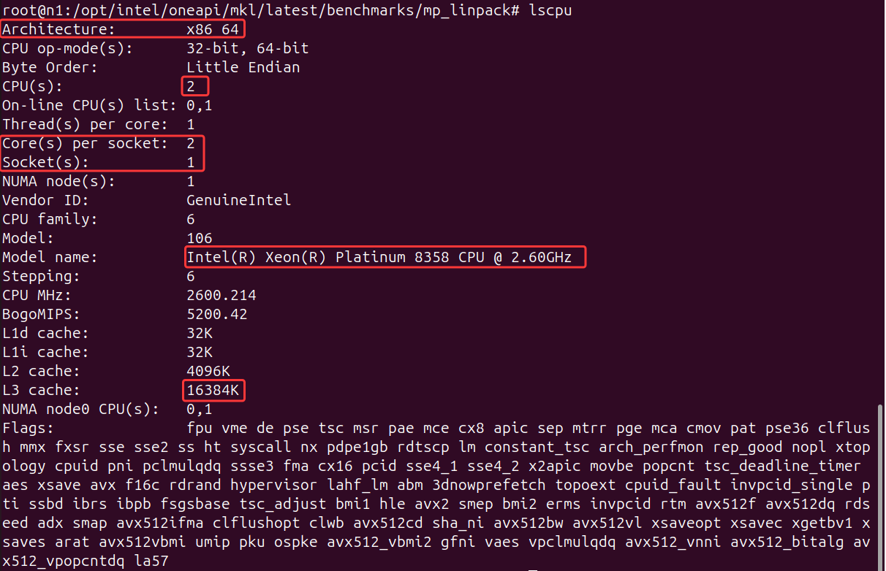

# IntelBenchmark实验报告

小组成员：

- 官瑞琪

  - 学号：320220912420
  - 班级：超级计算前沿技术1班(课序号1)
- 徐美好

  - 学号：320230943700
  - 班级：超级计算前沿技术1班(课序号1)
- 董慧玟

  - 学号：320230943010
  - 班级：超级计算前沿技术2班(课序号2)
- [IntelBenchmark实验报告](#intelbenchmark实验报告)

  - [1 实验环境](#1-实验环境)
    - [1.1 硬件环境](#11-硬件环境)
    - [1.2软件环境](#12软件环境)
  - [2 实验目标](#2-实验目标)
  - [3 实验原理](#3-实验原理)
    - [3.1 浮点计算理论峰值](#31-浮点计算理论峰值)
    - [3.2 HPL测试原理](#32-hpl测试原理)
    - [3.3 关键参数说明](#33-关键参数说明)
    - [3.4 N值计算方法](#34-n值计算方法)
  - [4 实验步骤](#4-实验步骤)
    - [4.1 登录Head节点](#41-登录head节点)
    - [4.2 安装Intel编译器套件](#42-安装intel编译器套件)
      - [(1)安装必要的依赖包](#1安装必要的依赖包)
      - [(2) 创建下载目录并切换](#2-创建下载目录并切换)
      - [(3)下载Intel Base Kit](#3下载intel-base-kit)
      - [(4) 安装Intel Base Kit](#4-安装intel-base-kit)
      - [(5) 下载Intel HPC Kit](#5-下载intel-hpc-kit)
      - [(6) 安装Intel HPC Kit](#6-安装intel-hpc-kit)
    - [4.3 配置Intel环境变量](#43-配置intel环境变量)
      - [(1) 启用Intel oneAPI环境](#1-启用intel-oneapi环境)
      - [(2) 将环境变量配置添加到bashrc](#2-将环境变量配置添加到bashrc)
    - [4.4 准备Linpack测试环境](#44-准备linpack测试环境)
      - [(1) 切换到计算节点n1](#1-切换到计算节点n1)
      - [(2) 在n1节点启用Intel环境](#2-在n1节点启用intel环境)
      - [(3) 进入Linpack基准测试目录](#3-进入linpack基准测试目录)
      - [(4) 查看目录内容](#4-查看目录内容)
    - [4.5 单节点浮点计算测试](#45-单节点浮点计算测试)
      - [(1) 计算单节点理论峰值](#1-计算单节点理论峰值)
      - [(2) 计算N值](#2-计算n值)
      - [(3) 备份原始HPL.dat文件](#3-备份原始hpldat文件)
      - [(4) 修改HPL.dat文件](#4-修改hpldat文件)
      - [(5) 修改runme\_intel64\_dynamic脚本](#5-修改runme_intel64_dynamic脚本)
      - [(6) 创建host文件（单节点测试）](#6-创建host文件单节点测试)
      - [(7)执行单节点测试](#7执行单节点测试)
      - [(8) 查看测试结果](#8-查看测试结果)
      - [(9) 计算性能占比](#9-计算性能占比)
    - [4.6 多节点浮点计算测试](#46-多节点浮点计算测试)
      - [(1) 计算多节点理论峰值](#1-计算多节点理论峰值)
      - [(2) 计算多节点N值](#2-计算多节点n值)
      - [(3)修改HPL.dat文件（多节点）](#3修改hpldat文件多节点)
      - [(4) 修改runme\_intel64\_dynamic（多节点）](#4-修改runme_intel64_dynamic多节点)
      - [(5) 修改runme\_intel64\_prv](#5-修改runme_intel64_prv)
      - [(6) 修改host文件（多节点）](#6-修改host文件多节点)
      - [(7) 确保所有节点环境一致](#7-确保所有节点环境一致)
      - [(8) 执行多节点测试](#8-执行多节点测试)
      - [(9) 查看多节点测试结果](#9-查看多节点测试结果)
      - [(10)计算多节点性能占比](#10计算多节点性能占比)
  - [5 实验结果与分析](#5-实验结果与分析)
    - [5.1 单节点测试结果](#51-单节点测试结果)
    - [5.2 多节点测试结果](#52-多节点测试结果)
    - [5.3 性能分析](#53-性能分析)
      - [5.3.1 实际性能与理论峰值比值](#531-实际性能与理论峰值比值)
      - [5.3.2 性能分析](#532-性能分析)
      - [5.3.3 影响性能的关键参数](#533-影响性能的关键参数)
  - [6 第四章作业题解答](#6-第四章作业题解答)
    - [6.1题目](#61题目)
    - [6.2解答](#62解答)
      - [(1) 基于Amdahl定律](#1-基于amdahl定律)
      - [(2) 基于Gustafson定律](#2-基于gustafson定律)
      - [(3) 两种定律的对比](#3-两种定律的对比)
  - [7 实验收获](#7-实验收获)
  - [8 遇到的问题与解决](#8-遇到的问题与解决)
    - [8.1 环境变量配置](#81-环境变量配置)
    - [8.2 N值选择](#82-n值选择)

<!-- /TOC -->

<!-- TOC -->

## 1 实验环境

### 1.1 硬件环境

用于后续HPL.dat 参数计算与修改，以及计算系统的理论浮点峰值性能。




- **硬件类型**: x86_64
- **CPU**: 2×Intel(R) Xeon(R) Platinum 8358 CPU @ 2.60GHz
- **核心数量**: 2 cores
- **缓存**: L3 16M
- **内存**: 7.8G

### 1.2软件环境

- **虚拟机软件**: VMware;
- **操作系统**: Ubuntu;
- **服务器地址**: 202.201.1.198:27798;
- **节点信息**:
  - Head节点: 10.0.0.7
  - 计算节点: 10.0.0.22, 10.0.0.23
- **Root密码**: 1qaz!QAZ

## 2 实验目标

1. 掌握物理机浮点计算性能的计算方法;
2. 理解HPL.dat配置文件的参数设置;
3. 完成单节点和多节点的Linpack浮点性能测试;
4. 计算实际性能与理论峰值的比值;

## 3 实验原理

### 3.1 浮点计算理论峰值

理论浮点计算性能的计算公式为：

$$
理论浮点性能 = CPU主频(GHz) × CPU单核每时钟周期浮点运算次数 × CPU核心总数
$$

根据实验环境配置：

- **单节点理论峰值**: 2.6 GHz × 32  × 2 cores = 166.4 GFlops
- **多节点理论峰值**: 166.4 GFlops × 节点数

### 3.2 HPL测试原理

HPL (High Performance Linpack) 是衡量高性能计算系统浮点性能的基准测试程序，通过求解大规模稠密线性方程组来测试系统的计算能力。

### 3.3 关键参数说明

- **N**:问题规模，即矩阵的维度;
- **NB**:块大小，Intel官方建议使用384;
- **P**:进程网格的行数;
- **Q**:进程网格的列数;
- **P×Q**:必须等于总进程数，且通常P≤Q;

### 3.4 N值计算方法

$$
N = sqrt(Memory\_Utilization × P × Q × Memory_Size / 8) × (0.8~0.9)
$$

其中Memory_Utilization通常取0.8-0.9，表示使用80%-90%的可用内存。

## 4 实验步骤

### 4.1 登录Head节点

从本地计算机SSH登录。

打开终端，执行以下命令登录到head节点：

```bash
ssh root@202.201.1.198 -p 27798
# 输入密码: 1qaz!QAZ
```


图4.1.1 登录到head节点

### 4.2 安装Intel编译器套件

#### (1)安装必要的依赖包

在head节点执行以下命令安装缺省软件包：

```bash
apt-get update
apt-get install -y libnss3 x11vnc xserver-xorg libgtk2.0-dev libgtk2.0 libasound2 libgtk-3* libxss1*
```


图4.2.1 更新并安装依赖

#### (2) 创建下载目录并切换

```bash
cd /opt
mkdir -p intel_install
cd intel_install
```


图4.2.2 创建下载目录并切换

#### (3)下载Intel Base Kit

```bash
wget https://vip.123pan.cn/1816195927/share/l_BaseKit_p_2022.2.0.262_offline.sh
```


图4.2.3 下载Intel base kit

等待下载完成，使用 `ls -lh` 查看文件大小确认下载完整。


图4.2.4 查看文件大小

#### (4) 安装Intel Base Kit

```bash
sudo sh ./l_BaseKit_p_2022.2.0.262_offline.sh
```


如图，成功启动了 Intel® oneAPI Base Toolkit 的离线安装程序。

安装过程中的操作：

1. 使光标停留在第一个选项，按Enter键。
   
2. 继续使光标停留在Install选项，按Enter键。
   
3. 保持默认选项，即跳过Eclipse IDE配置。
   使光标停留在next选项，按Enter键。
   
4. 继续选择Begin Installation,开始安装。
   
5. 等待安装进度条完成。
   
6. 安装完成后选择close直接关闭。
   

#### (5) 下载Intel HPC Kit

```bash
wget https://vip.123pan.cn/1816195927/share/l_HPCKit_p_2022.3.0.8751_offline.sh
```


#### (6) 安装Intel HPC Kit

```bash
sudo sh ./l_HPCKit_p_2022.3.0.8751_offline.sh
```

安装过程与Base Kit类似，按提示操作即可。


安装完成后默认 intel 路径/opt/intel。

### 4.3 配置Intel环境变量

#### (1) 启用Intel oneAPI环境

每次新开终端都需要执行此命令来加载Intel编译环境。

```bash
source /opt/intel/oneapi/setvars.sh
```


如图，环境变量设置成功成功。

#### (2) 将环境变量配置添加到bashrc

```bash
echo "source /opt/intel/oneapi/setvars.sh" >> ~/.bashrc
```


### 4.4 准备Linpack测试环境

#### (1) 切换到计算节点n1

```bash
ssh n1
```


#### (2) 在n1节点启用Intel环境

```bash
source /opt/intel/oneapi/setvars.sh
```


#### (3) 进入Linpack基准测试目录

```bash
cd /opt/intel/oneapi/mkl/latest/benchmarks/mp_linpack/
```

#### (4) 查看目录内容

```bash
ls -l
```


看到以下重要文件：

- HPL.dat（配置文件）
- runme_intel64_dynamic（执行脚本）
- xhpl_intel64_dynamic（可执行文件）

### 4.5 单节点浮点计算测试

#### (1) 计算单节点理论峰值

根据实验环境配置：

- CPU主频: 2.6 GHz
- 单核每时钟周期浮点运算次数: 32 (AVX512指令集)
- 单节点CPU总核心数: 2 cores

$$
理论峰值 = 2.6 GHz × 32 (每时钟周期浮点运算) × 2 cores
         = 166.4 GFlops
$$

#### (2) 计算N值

N值的计算公式：

$$
N = sqrt(内存利用率 × P × Q × 内存大小(Bytes) / 8) × (0.8 - 0.9)
$$


假设使用80%的内存（7.8G），对于单节点测试（P=1, Q=1）：

$$
\begin{aligned}
N &= sqrt(0.8 × 1 × 1 × 7.8 × 1024³ / 8) × 0.85\\
&= sqrt(0.8 × 8375186227.2 / 8) × 0.85\\
&= sqrt(837518622.72 ) × 0.85\\
&≈ 28939.914 × 0.85\\
&≈ 24589.93
\end{aligned}
$$

取值：N = 24576

N需要是NB（块大小，384）的倍数。在27041附近，最接近的384的倍数是24576(64*384)或 24960 (65*384)。选择一个稍微保守的整数：
N值：24576
NB值：384

#### (3) 备份原始HPL.dat文件

```bash
cp HPL.dat HPL.dat.bak
```


#### (4) 修改HPL.dat文件

```bash
vim HPL.dat
```

按 `i` 进入插入模式，修改以下参数：


按 `Esc`，输入 `:wq` 保存退出。

**关键参数说明**:

- Ns=24576: 问题规模;
- NBs=384: 块大小;
- Ps=1, Qs=1: 单进程配置。

#### (5) 修改runme_intel64_dynamic脚本

```bash
vim runme_intel64_dynamic
```

找到以下参数并修改：

```bash
export MPI_PROC_NUM=1          # P × Q = 1 × 1 = 1
export MPI_PER_NODE=1          # 每节点1个进程
export HPL_EXE=xhpl_intel64_dynamic
# 添加
export OMP_NUM_THREADS=2
```


保存退出。

#### (6) 创建host文件（单节点测试）

```bash
vim host
```

添加内容：

```bash
n1
```


保存退出。

#### (7)执行单节点测试

```bash
./runme_intel64_dynamic
```


测试过程中会显示进度信息，等待测试完成。

#### (8) 查看测试结果

关注最后几行的测试结果，重点查看：


```bash
T/V                N    NB     P     Q               Time                 Gflops
--------------------------------------------------------------------------------
WC00C2R2       24576   384     1     1              61.16             1.61821e+02
```

其中：

- **Time**: 完成计算所需时间（秒）
- **Gflops**: 实际测得的浮点性能

#### (9) 计算性能占比

$$
单节点性能占比 = 实际测试值(Gflops) / 理论峰值(166.4 Gflops) × 100%
$$

$$
\begin{aligned}
性能占比&= 161.821 ÷ 166.4 × 100\%
\\&≈ 97.25\%
\end{aligned}
$$

### 4.6 多节点浮点计算测试

#### (1) 计算多节点理论峰值

使用2个计算节点（n1和n2）：

$$
理论峰值 = 166.4 GFlops × 2 = 332.8 GFlops
$$

#### (2) 计算多节点N值

对于2节点测试（P=1, Q=2，总2个进程）：

$$
\begin{aligned}
N &= sqrt(0.8 × 1 × 2 × 7.8 × 1024³ / 8) × 0.85\\
  &= sqrt(0.8 × 2 × 8375186227.2 / 8) × 0.85\\
  &= sqrt(1675037245.44) × 0.85\\
  &≈ 40927.219 × 0.85\\
  &≈ 34788.136
\end{aligned}
$$

取值：N = 34560

N需要是NB（块大小，384）的倍数。在34788附近，最接近的384的倍数是34560(90*384)或 34944 (91*384)。选择一个稍微保守的整数：
N值：34560
NB值：384

#### (3)修改HPL.dat文件（多节点）

```bash
vim HPL.dat
```

修改以下关键参数：


注意：**P和Q的选择原则**

- P × Q = 总进程数=2
- P通常选择2的幂次（1, 2, 4, 8...）

保存退出。

#### (4) 修改runme_intel64_dynamic（多节点）

```bash
vim runme_intel64_dynamic
```

修改参数：


```bash
export MPI_PROC_NUM=2          # P × Q = 1 × 2 = 2
export MPI_PER_NODE=1          # 每节点1个进程
export HPL_EXE=xhpl_intel64_dynamic
export OMP_NUM_THREADS=1
```

保存退出。

#### (5) 修改runme_intel64_prv

```bash
vim runme_intel64_prv
```

修改参数：


#### (6) 修改host文件（多节点）

```bash
vim host
```

修改内容为：

```bash
n1
n2
```


每个节点名称独占一行，保存退出。

#### (7) 确保所有节点环境一致

在n2节点也要配置Intel环境：

```bash
ssh n2
source /opt/intel/oneapi/setvars.sh
exit
```


#### (8) 执行多节点测试

返回n1节点的测试目录：

```bash
cd /opt/intel/oneapi/mkl/latest/benchmarks/mp_linpack/
./runme_intel64_dynamic
```


#### (9) 查看多节点测试结果

查看结果:


```bash
T/V                N    NB     P     Q               Time                 Gflops
--------------------------------------------------------------------------------
WC00C2R2       34560   384     1     2             106.51              2.58379e+02
```

#### (10)计算多节点性能占比

$$
多节点性能占比 = 实际测试值(Gflops) / 理论峰值(332.8 Gflops) × 100%
$$

如图，测得 258.379 Gflops：

$$
\begin{aligned}
性能占比 &= 258.379 / 332.8 × 100\%
\\&≈ 77.64\%
\end{aligned}
$$

## 5 实验结果与分析

### 5.1 单节点测试结果

**测试配置参数：**

- N=24576
- NB=384
- P=1
- Q=1
- 进程数=1

**理论峰值：** 166.4 GFlops

**实际测试结果：**

- 实际性能：161.821 GFlops
- 运行时间：61.16秒
- 性能占比：97.25%
  

### 5.2 多节点测试结果

**测试配置参数：**

- N=34560
- NB=384
- P=1
- Q=2
- 节点数=2
- 总进程数=2

**理论峰值**：332.8GFlops

**实际测试结果：**

- 实际性能：258.379 GFlops
- 运行时间：106.51秒
- 性能占比：77.64%


### 5.3 性能分析

#### 5.3.1 实际性能与理论峰值比值

**单节点：**

$$
实际测试值 / 理论峰值 = 161.821GFlops /  166.4 GFlops \\= 97.25\%
$$

**多节点：**

$$
实际测试值 / 理论峰值 = 258.379 GFlops /  332.8 GFlops\\ = 77.64\%
$$

#### 5.3.2 性能分析

1. 单节点性能分析——
   - 实际性能通常可达到理论峰值的80%-99%。
   - 未达到100%的原因：
     - 内存带宽限制;
     - Cache miss;
     - 指令流水线停顿;
     - MPI通信开销。
2. 多节点性能分析——
   - 多节点性能占比通常略低于单节点。
   - 主要损耗来源：
     - 节点间网络通信延迟;
     - 数据同步开销;
     - 负载不均衡。
3. 并行效率——

$$
并行效率 = (多节点实际性能 / 节点数) / 单节点实际性能
$$

理想情况下，2节点的性能应该是单节点的2倍，但实际会因为通信开销而略低。

$$
258.379/161.821≈1.60倍
$$

#### 5.3.3 影响性能的关键参数

1. N值选择——
   - N值过小：无法充分利用计算资源;
   - N值过大：超出内存限制，引起频繁换页;
   - 最优N值通常使内存利用率在80%-99%。
2. NB值（块大小）——
   - Intel官方推荐384;
   - 影响计算与通信的平衡。
3. P和Q值——
   - P×Q = 进程总数;
   - 建议P≤Q，且P为2的幂次;
   - 影响数据分布和通信模式。

## 6 第四章作业题解答

### 6.1题目

假设你希望并行化一个给定的串行程序，想要在16个处理器上得到的加速比至少为10。程序的最大串行比例是多少？分别考虑：

1. Amdahl定律
2. Gustafson定律

### 6.2解答

#### (1) 基于Amdahl定律

**Amdahl定律公式**:

```bash
Speedup = 1 / [s + (1-s)/p]
```

其中:

- s=串行比例（程序中无法并行化的部分）;
- p=处理器数量;
- 1-s=可并行化比例;

**已知条件**:

- p=16（处理器数量）;
- Speedup≥10（要求的加速比）;

**求解过程**:

$$
\begin{aligned}
&\Rightarrow10 = 1 ÷ [s + (1-s)÷16]\\
&\Rightarrow 10 × [s + (1-s)÷16] = 1\\
&\Rightarrow10s + 10(1-s)÷16 = 1\\
&\Rightarrow10s + 10÷16 - 10s÷16 = 1\\
&\Rightarrow10s - 10s÷16 = 1 - 10÷16\\
&\Rightarrow10s × (1 - 1÷16) = 1 - 0.625\\
&\Rightarrow10s × 15÷16 = 0.375\\
&\Rightarrow s = 0.375 × 16 ÷ (10 × 15)\\
&\Rightarrow s = 6 ÷ 150\\
&\Rightarrow s = 0.04\\
\end{aligned}
$$

**答案**: 根据Amdahl定律，程序的最大串行比例为**4%**。

**验证**:

$$
\begin{aligned}
Speedup &= 1 / [0.04 + (1-0.04)/16]
        \\&= 1 / [0.04 + 0.96/16]
        \\&= 1 / [0.04 + 0.06]
        \\&= 1 / 0.1
        \\&= 10
\end{aligned}
$$

**Amdahl定律的意义**:

- 强调了串行部分对加速比的限制作用;
- 即使有无限多的处理器，加速比也不能超过1/s;
- 在本例中，即使处理器数量无限大，最大加速比也只有1/0.04=25倍。

#### (2) 基于Gustafson定律

**Gustafson定律公式**:

$$
Speedup = s + p × (1-s)
$$

其中:

- s=串行比例（在单处理器上执行时的串行部分占比）;
- p=处理器数量;
- 1-s=并行比例;

**另一种形式**:

$$
Speedup = p - α × (p-1)
$$

其中α为串行比例。

**已知条件**:

- p=16;
- Speedup≥10;

**求解过程**:

使用第一种形式:

$$
\begin{aligned}
&\Rightarrow 10 = s + 16 × (1-s)\\
&\Rightarrow 10 = s + 16 - 16s\\
&\Rightarrow 10 = 16 - 15s\\
&\Rightarrow 15s = 6\\
&\Rightarrow s = 0.4\\
\end{aligned}
$$

**答案**: 根据Gustafson定律,程序的最大串行比例为**40%**。

**验证**:

$$
\begin{aligned}
Speedup &= 0.4 + 16 × (1-0.4)\\
        &= 0.4 + 16 × 0.6\\
        &= 0.4 + 9.6\\
        &= 10
\end{aligned}
$$

**Gustafson定律的意义**:

- 认为问题规模会随处理器数量增加而增大;
- 更乐观地估计了并行化的效果;
- 在本例中，允许的串行比例远大于Amdahl定律。

#### (3) 两种定律的对比

| 比较项       | Amdahl定律             | Gustafson定律          |
| ------------ | ---------------------- | ---------------------- |
| 最大串行比例 | 4%                     | 40%                    |
| 假设前提     | 问题规模固定           | 问题规模随处理器数增加 |
| 应用场景     | 强扩展性               | 弱扩展性               |
| 对并行化要求 | 严格，串行部分必须很小 | 宽松，允许较大串行部分 |

实际应用——

1. 对于固定规模问题(如特定大小的矩阵运算)，应参考Amdahl定律；
2. 对于可扩展问题(如大数据处理)，可参考Gustafson定律；
3. 实际系统往往介于两者之间；
4. HPL测试更符合Gustafson定律的假设，因为N值会随节点数增加而增大。

## 7 实验收获

1. 理论知识上——
   - 掌握了浮点计算性能的理论计算方法;
   - 理解了Amdahl定律和Gustafson定律的区别与应用;
   - 学习了HPL基准测试的原理;
2. 实践技能上——
   - 熟悉了Intel编译器和MKL库的安装配置;
   - 掌握了HPL.dat参数的优化方法;
   - 学会了使用MPI进行多节点并行计算;
   - 提升了Linux系统操作和脚本编写能力;
3. 分析能力上——
   - 学会分析影响性能的各种因素;
   - 能够解释理论性能与实际性能的差距;
   - 掌握了性能优化的基本方法;

通过本次实验，我们深入理解了高性能计算的基本概念和实践方法。HPL测试不仅是一个性能评估工具，更是学习并行计算、系统优化的excellent平台。实验中遇到的各种问题让我们认识到，实际系统的性能优化需要综合考虑硬件、软件、算法等多个方面。这次实验为后续学习更复杂的并行算法和优化技术打下了坚实的基础。

## 8 遇到的问题与解决

### 8.1 环境变量配置

- **问题：** 运行时找不到动态链接库。

  遇到的问题是：`mpirun: command not found`（找不到mpirun命令）

  
- **错误分析：**

  这个错误表明当前Shell环境不知道 `mpirun`这个命令在哪里。`mpirun`是**Intel MPI Library**用来启动并行进程HPLinpack的主程序。

  虽然安装了Intel oneAPI Base Toolkit（其中包括了Intel MPI Library），但是当前的终端会话并没有加载包含 `mpirun`路径的环境变量。
- **解决方案：**
  要解决此问题，需要运行 [setvars.sh](http://setvars.sh/) 脚本来设置必要的环境变量，包括将 Intel MPI 工具的路径添加到 `$PATH`中。

  (1)执行

  ```bash
  source /opt/intel/oneapi/setvars.sh
  ```

  激活环境。

  

  如图，尝试运行 `which mpirun`后输出 mpirun 的完整路径。

  (2)回到 `/opt/intel/oneapi/mkl/latest/benchmarks/mp_linpack`目录下，再次运行HPL脚本：

  ```bash
  cd /opt/intel/oneapi/mkl/latest/benchmarks/mp_linpack
  sh ./runme_intel64_dynamic
  ```

  

  如图，单节点测试执行成功。

### 8.2 N值选择

- **问题：** 初始N值过大导致内存不足。

  

  在进行多节点浮点计算性能测试时，一开始选择了P=2,Q=2。

  在此基础上计算得到的合适的Ns值为49152。

  多节点测试时显示如图所示的错误。
- **错误分析：**

  这是一个段错误 (Segmentation fault)，通常简称为 Segfault。它表明 HPL (High-Performance Linpack) 程序在运行时尝试访问了它无权访问的内存区域，导致操作系统终止了该程序。

  常见原因：

  - 配置错误 (最可能)
    - HPL依赖于一个名为 `HPL.dat`的输入文件来定义运行参数，包括矩阵的大小N、块大小NB、进程网格P*Q等。
    - 如果设置的**矩阵大小N过大**，或者**进程网格P*Q的配置不合理**，程序可能会试图分配比系统可用内存（RAM）更多的内存空间，从而导致内存分配失败或内存访问越界，触发段错误。
- **解决方案：**

  (1) 检查HPL配置 (HPL.dat)。

  

  如图，HPL 基准测试需要存储一个 $N \times N$ 的双精度浮点数矩阵。每个双精度数占用 8 字节。
  • 矩阵阶数 ($N$): $\mathbf{49152}$
  • 总矩阵元素数量: $N^2 = 49152^2 \approx 2.416$ 亿个元素
  • 所需的总内存 (理想情况下):
  $\text{Memory Required} \approx \frac{N^2 \times 8 \text{ Bytes}}{1024^3} \approx \frac{49152^2 \times 8}{1024^3} \approx \mathbf{1.80 \text{ TB}}$

  这和实际硬件值极度不匹配。

  (2)将Ps和Qs调整为$1 \times 2$，重新计算Ns值。

  因为系统只有2个物理核心 (CPU(s): 2)，最好使用2个MPI进程 (Ps=1, Qs=2 )。目前配置的$2 \times 2 = 4$个进程会导致严重的超额订阅，从而降低性能，虽然它不是 Segfault 的直接原因。

  然后重新计算合适的Ns值为34560。
  (3)修改HPL.dat文件后再次运行。

  
