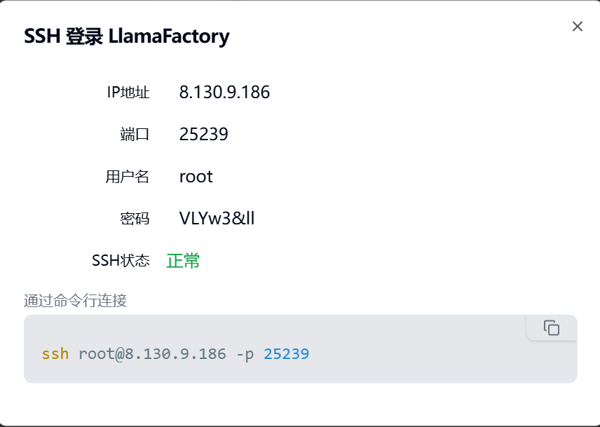
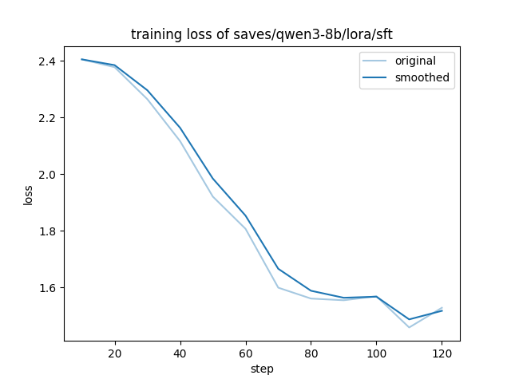

# Qwen3模型微调实验报告

姓名：官瑞琪
学号：320220912420
班级：课序号1
<!-- /TOC -->
- [Qwen3模型微调实验报告](#qwen3模型微调实验报告)
  - [1 实验目的](#1-实验目的)
  - [2 实验环境](#2-实验环境)
    - [2.1 硬件环境](#21-硬件环境)
    - [2.2 软件环境](#22-软件环境)
    - [2.3 登录信息](#23-登录信息)
  - [3 模型训练](#3-模型训练)
    - [3.1 申请GPU实例](#31-申请gpu实例)
    - [3.2 登录实例并配置环境](#32-登录实例并配置环境)
    - [3.3 安装LLaMA-Factory](#33-安装llama-factory)
    - [3.4 下载Qwen3模型](#34-下载qwen3模型)
    - [3.5 准备微调数据集](#35-准备微调数据集)
    - [3.6 配置LoRA微调参数](#36-配置lora微调参数)
    - [3.7 启动热插拔 GPU](#37-启动热插拔-gpu)
    - [3.8 启动分布式微调训练](#38-启动分布式微调训练)
    - [3.9 训练完成后的检查](#39-训练完成后的检查)
  - [4 模型推理与测试](#4-模型推理与测试)
    - [4.1 配置vLLM推理参数](#41-配置vllm推理参数)
    - [4.2 安装vLLM](#42-安装vllm)
    - [4.3 启动推理服务](#43-启动推理服务)
    - [4.4 测试模型效果](#44-测试模型效果)
  - [5 实验结果分析](#5-实验结果分析)
  - [6 实验总结](#6-实验总结)
    - [6.1 实验收获](#61-实验收获)
    - [6.2 实验中的问题与解决](#62-实验中的问题与解决)

<!-- TOC -->

## 1 实验目的

本实验旨在掌握大语言模型微调的完整流程，具体目标包括：

1. 基于 Qwen3-8B基座模型进行LoRA（Low-Rank Adaptation）监督微调(SFT)，使用两张RTX 4090 GPU进行单机多卡分布式训练。
2. 训练完成后使用vLLM框架承载基座模型和LoRA适配器，实现高吞吐量推理服务。
3. 掌握LlamaFactory工具的使用方法，该工具封装完善，支持快速训练和微调主流LLM模型。

## 2 实验环境

### 2.1 硬件环境

- GPU：2 × NVIDIA RTX 4090（24GB显存×2）
- 计算平台：云端GPU实例

### 2.2 软件环境

- 操作系统：Ubuntu 22.04 LTS
- GPU驱动：NVIDIA Driver 550.76（兼容CUDA 12.x）
- Python环境：Python 3.11（通过Miniconda管理）
- 核心框架：
  - LLaMA-Factory：模型微调框架
  - PyTorch：深度学习框架（CUDA 12.x 版本）
  - vLLM：高性能推理引擎
    - Hugging Face Transformers：模型加载与处理

### 2.3 登录信息

```bash
主机：8.130.9.186
端口：25239
用户：root
密码：VLYw3&ll
```

## 3 模型训练

### 3.1 申请GPU实例

1. 申请实例
    
    如图所示，已按照手册指示申请GPU实例。
    相关信息见“2实验环境”所写。

2. 启动该实例，查看ssh登录信息。
    

    如图所示，为该GPU实例的登录信息。

### 3.2 登录实例并配置环境

1. SSH登录服务器

    ```bash
    ssh root@8.130.9.186 -p 25239
    # 输入密码：VLYw3&ll
    ```

    通过SSH协议远程连接到云端GPU实例，建立安全的命令行交互环境。
    
    图3.2.1 成功登陆到GPU实例

2. 激活Conda基础环境

    ```bash
    source /home/ubuntu/conda/bin/activate
    ```

    图3.2.2 激活conda环境
    如图所示，命令提示符前出现 `(base)` 标识，表示已进入Conda基础环境。

3. 创建独立的Python环境

    ```bash
    conda create -n qwen3-sft python=3.10 -y
    ```

    操作说明：
    - `n qwen3-sft`：指定环境名称为 qwen3-sft
    - `python=3.10`：安装 Python 3.10 版本
      【注】:后续实验进行中发现当前克隆的LLaMA-Factory最新版本要求Python必须在 3.11.0 或以上。
      所以再次创建了独立的python环境，这里可以直接安装python 3.11版本。
    - `y`：自动确认所有安装提示

    
    如图所示，显示包下载和安装过程，最后显示环境创建成功。

4. 激活新环境

    ```bash
    conda activate qwen3-sft
    ```

    
    如图所示，命令提示符变为 `(qwen3-sft)`，说明已进入新创建的环境。

### 3.3 安装LLaMA-Factory

1. 安装

    ```bash
    apt-get install git
    git clone --depth 1 https://github.com/hiyouga/LLaMA-Factory.git
    cd LLaMA-Factory
    pip install -e ".[torch,metrics,vllm,modelscope]"
    ```

    
    图3.3.1 安装LLaMA-Factory
    进入LLaMA-Factory目录后安装，这里所需时间较长。

2. 验证安装是否成功

    ```bash
    llamafactory-cli version 
    ```

    
    图3.3.2 安装成功
    如图所示，输出版本信息，说明LLaMA-Factory安装成功。

### 3.4 下载Qwen3模型

1. 安装ModelScope CLI工具

    ```bash
    pip install modelscope -i https://pypi.tuna.tsinghua.edu.cn/simple
    ```

    ModelScope是阿里云开源的模型管理平台，使用清华镜像源加速下载。
    

2. 下载Qwen3-8B基座模型

    ```bash
    # 创建模型存储目录
    mkdir -p /home/ubuntu/models
    
    # 下载模型
    modelscope download --model 'Qwen/Qwen3-8B' --local_dir /home/ubuntu/models/Qwen3-8B
    ```

    
    
    图3.4.1 基座模型下载成功

### 3.5 准备微调数据集

1. 查看`LlamaFactory`内置数据集
    由于实验使用`LlamaFactory`自带数据集，先了解其数据集配置：

    ```bash
    # 进入 LlamaFactory 目录
    cd LLaMA-Factory
    
    # 查看数据集配置文件
    cd data
    ls
    
    # 查看目标文件的具体内容
    cat alpaca_zh_demo.json | head -20
    ```

    
    
    如图所示，Alpaca格式包含 instruction（指令）、input（输入）、output（输出)三个字段。

### 3.6 配置LoRA微调参数

1. 创建微调配置文件

    ```bash
    # 创建配置目录
    mkdir -p /root/experiments/train_lora
    
    # 创建配置文件
    vi /root/experiments/train_lora/qwen3_lora_sft.yaml
    ```

    
    配置文件内容（qwen3_lora_sft.yaml）：

    ```yaml
    ### model
    model_name_or_path: /home/ubuntu/models/Qwen3-8B
    trust_remote_code: true
    
    ### method
    stage: sft
    do_train: true
    finetuning_type: lora
    lora_rank: 8
    lora_target: all
    
    ### dataset
    dataset: alpaca_zh_demo
    dataset_dir: /root/LLaMA-Factory/data
    template: qwen3
    cutoff_len: 2048
    max_samples: 100000
    overwrite_cache: true
    preprocessing_num_workers: 16
    dataloader_num_workers: 4
    
    ### output
    output_dir: saves/qwen3-8b/lora/sft
    logging_steps: 10
    save_steps: 500
    plot_loss: true
    overwrite_output_dir: true
    save_only_model: false
    report_to: none # choices:[none, wandb, tensorboard, swanlab, mlflow]
    
    ### train
    per_device_train_batch_size: 1
    gradient_accumulation_steps: 8
    learning_rate: 1.0e-5
    num_train_epochs: 2.0
    lr_scheduler_type: cosine
    warmup_ratio: 0.1
    bf16: true
    ddp_timeout: 180000000
    resume_from_checkpoint: null
    ```

    
    部分参数说明：

    1. LoRA核心参数：
        - `lora_rank=8`：秩为8，决定低秩矩阵的维度，参数量约为全量微调的0.1%
        - `lora_target=all`：对所有注意力和MLP层应用LoRA
    2. 训练效率参数：
        - 每张卡的批次大小：1
        - 有效批次大小=1(单卡)×8(累积步数)×2(卡数)=16
        - BF16精度可节省约50%显存，加速训练
    3. 学习率策略：
        - Cosine调度器：学习率从5e-5逐渐衰减至0
        - Warmup 10%：前10%的步数学习率线性增长

### 3.7 启动热插拔 GPU

1. 在控制台启动 GPU

    操作流程：
    1. 登录超算控制台
    2. 找到实例管理页面
    3. 选择"热插拔 GPU"选项

    
    必须先完成环境配置再启用GPU，否则会按CPU计费导致成本浪费。
2. 验证GPU状态

    ```bash
    nvidia-smi
    ```

    
    如图所示：
    - 两张RTX 4090均已识别
    - 每张卡24GB显存，当前空闲
    - 驱动版本570.172.08，支持CUDA 12.8

### 3.8 启动分布式微调训练

1. 使用LlamaFactory启动训练

    ```bash
    # 查看安装路径
    which llamafactory-cli
    
    # 使用llamafactory-cli启动NativeDDP双卡并行微调
    CUDA_VISIBLE_DEVICES=0,1 FORCE_TORCHRUN=1 \
    /home/ubuntu/conda/envs/qwen3-sft/bin/llamafactory-cli \
    train /root/experiments/train_lora/qwen3_lora_sft.yaml
    ```

    
    如图所示，为llamafactory-cli所在目录，用于启动训练。

    说明：

    - `CUDA_VISIBLE_DEVICES=0,1`：使用GPU 0和GPU 1
    - `FORCE_TORCHRUN=1`：强制使用PyTorch的分布式启动器
    - `train`：执行训练任务
    
    图3.8.1 训练过程
    
    图3.8.2 训练完成
    如图所示，损失Loss从2.4+逐步下降，表明模型正在学习。
2. 监控训练过程
    在另一个终端窗口监控 GPU 使用情况：

    ```bash
    watch -n 1 nvidia-smi
    ```

    
    如图所示，显存占用：每张卡约18GB；功耗分别为185W和213W。

### 3.9 训练完成后的检查

1. 查看输出文件

    ```bash
    ls -lh saves/qwen3-8b/lora/sft
    ```

    
    部分文件说明：

    - `adapter_model.safetensors`：LoRA适配器权重（84MB，远小于基座模型）
    - `adapter_config.json`：LoRA配置信息
    - `checkpoint-126`：训练检查点
    - `training_loss.png`：损失曲线图
    - `trainer_log.jsonl`：详细训练日志
2. 查看训练日志

    ```bash
    cat saves/qwen3-8b/lora/sft/trainer_log.jsonl | tail -20
    ```

    

## 4 模型推理与测试

### 4.1 配置vLLM推理参数

1. 创建推理配置文件

    ```bash
    mkdir -p /root/experiments/inference
    vim /root/experiments/inference/qwen3.yaml
    ```

    
    配置文件内容（qwen3.yaml）：

    ```yaml
    ### model
    model_name_or_path: /home/ubuntu/models/Qwen3-8B
    adapter_name_or_path: saves/qwen3-8b/lora/sft
    template: qwen3
    finetuning_type: lora
    
    ### vLLL
    infer_backend: vllm # choices:[huggingface, vllm, sglang]
    trust_remote_code: true
    ```

    
    vLLM采用PagedAttention技术，显存利用率提升2-4倍，吞吐量提升22-24倍。

### 4.2 安装vLLM


如图，没在镜像文件中找到vLLM，根据以下步骤自行安装。

1. 安装vLLM（使用清华镜像）

    ```bash
    # 安装指定版本的vLLM
    pip install 'vllm>=0.4.3,<=0.11.0' -i https://pypi.tuna.tsinghua.edu.cn/simple
    ```

    
    图4.2.1 安装完成

2. 验证安装

    ```bash
    # 验证vLLM安装成功
    vllm --version
    ```

    

### 4.3 启动推理服务

1. 使用vLLM加载模型

    ```bash
    # 按照之前llamafactory-cli所在地址/home/ubuntu/conda/envs/qwen3-sft/bin/llamafactory-cli
    CUDA_VISIBLE_DEVICES=0,1 \
    /home/ubuntu/conda/envs/qwen3-sft/bin/llamafactory-cli \
    chat /root/experiments/inference/qwen3.yaml
    ```

    
    
    如图所示，模型加载成功。

### 4.4 测试模型效果

1. 进行对话测试
    1. 基础对话
        
        如图所示，输出显示了思考内容(<think>与</think>之间的内容)与回答。
    2. 指令跟随
        
        如图所示，输出显示了思考内容(<think>与</think>之间的内容)与回答。
    3. 知识问答
        
        
        如图所示，输出显示了思考内容(<think>与</think>之间的内容)与回答，且显然其回答为markdown格式。

## 5 实验结果分析

1. 损失曲线分析
    通过WinSCP查看训练损失图：
    
    
    如图所示，曲线平滑下降，无剧烈震荡；无明显过拟合迹象，最终收敛至合理水平。

## 6 实验总结

### 6.1 实验收获

1. 完整了解LoRA微调流程，包括环境配置、数据准备、训练启动、效果评估；学会使用LlamaFactory工具链，理解其配置参数和工作机制；掌握vLLM高性能推理部署，了解PagedAttention等核心技术。
2. 学会分布式训练的配置和调试(DDP、梯度累积)；掌握GPU资源管理和监控方法，理解训练日志分析和问题定位技巧。

### 6.2 实验中的问题与解决

1. LLaMA-Factory仓库的最新代码已经更新了对Python版本的要求。
    
    - **问题描述：**
    报错显示：`ERROR: Package 'llamafactory' requires a different Python: 3.10.19 not in '>=3.11.0'`，这意味着当前克隆的LLaMA-Factory最新版本要求Python必须在 3.11.0 或以上。
    - 原因分析：
    创建该环境是选择的是python=3.10，不符合该要求。
    - 解决方案：
        - 退出并删除旧环境

            ```bash
            conda deactivate
            conda remove -n qwen3-sft --all -y
            ```

            

        - 创建 Python 3.11 的新环境

            ```bash
            conda create -n qwen3-sft python=3.11 -y
            ```

            

        - 激活新环境并重新安装

            ```bash
            conda activate qwen3-sft
            cd LLaMA-Factory
            pip install -e ".[torch,metrics,vllm,modelscope]"
            ```

2. vLLM没有安装。

    
    按照指示（`pip install vllm>=0.4.3,<=0.11.0`)安装特定版本即可。
