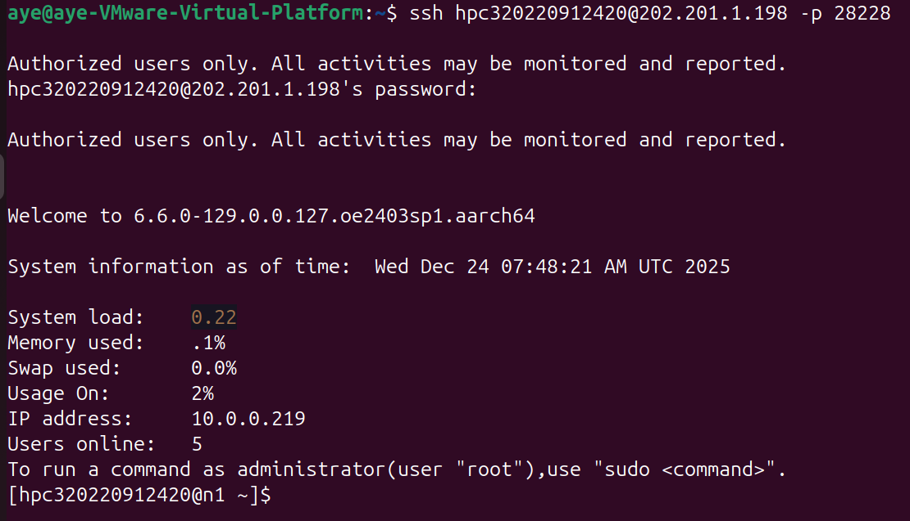
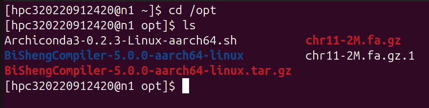
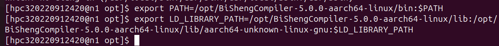
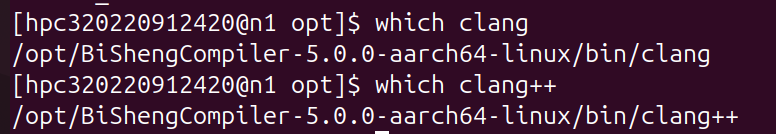
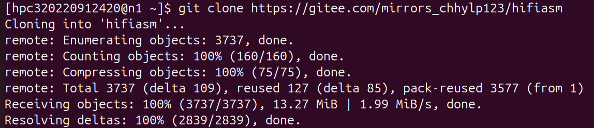
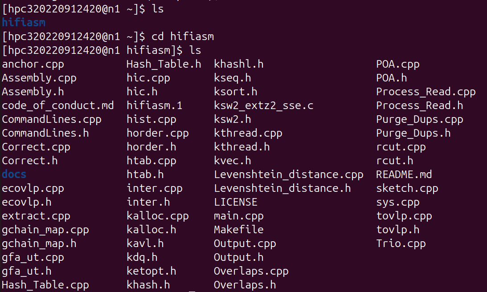
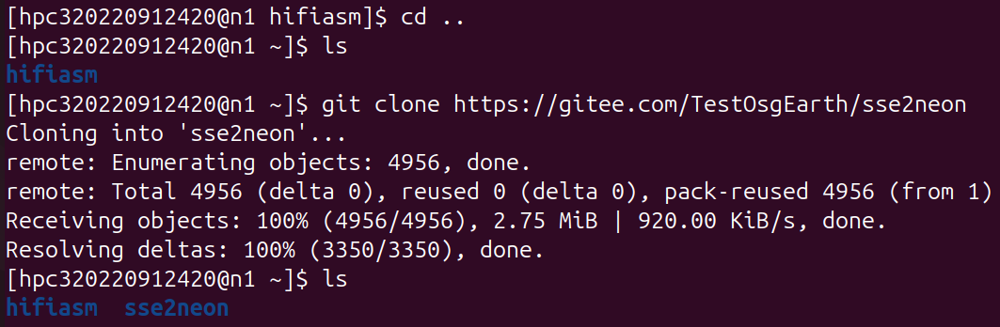
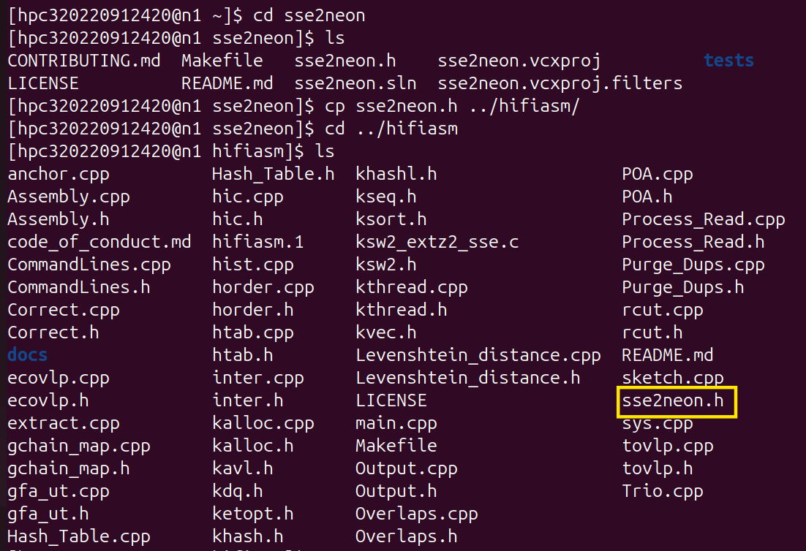
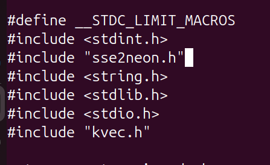

# 第六章课后习题

姓名：官瑞琪
学号：320220912420
课序号：1

---
<!-- TOC -->

- [第六章课后习题](#第六章课后习题)
  - [1 超级计算性能优化技术分类](#1-超级计算性能优化技术分类)
    - [1.1 题目](#11-题目)
    - [1.2 回答](#12-回答)
  - [2 使用Intel VTune分析Hifiasm热点函数](#2-使用intel-vtune分析hifiasm热点函数)
    - [2.1 实验环境说明](#21-实验环境说明)
    - [2.2 VTune安装配置](#22-vtune安装配置)
    - [2.3 准备Hifiasm程序](#23-准备hifiasm程序)
    - [2.4 使用VTune进行热点分析](#24-使用vtune进行热点分析)
    - [2.5 实验结果分析](#25-实验结果分析)
    - [2.6 小结](#26-小结)
  - [3 鲲鹏移植套件](#3-鲲鹏移植套件)
    - [3.1 题目](#31-题目)
    - [3.2 回答](#32-回答)
  - [4 Hifiasm应用软件鲲鹏移植优化实验](#4-hifiasm应用软件鲲鹏移植优化实验)
    - [4.1 实验背景](#41-实验背景)
    - [4.2 实验环境准备](#42-实验环境准备)
    - [4.3 安装hifiasm软件及核心优化技术](#43-安装hifiasm软件及核心优化技术)
    - [4.4 编译和测试](#44-编译和测试)
    - [4.5 性能比较](#45-性能比较)
    - [4.5 小结](#45-小结)
  - [5 遇到的问题与解决方案](#5-遇到的问题与解决方案)
  - [6 总结](#6-总结)
  <!-- /TOC -->

## 1 超级计算性能优化技术分类

### 1.1 题目

> 超级计算性能优化技术可以分为哪几类？请说明这几类优化技术有什么区别。
>

### 1.2 回答

**(1)超级计算性能优化技术可以分为以下几类:**

1. 算法层面优化

    这是最高层次的优化,通过改进算法本身来提升性能。
    包括选择更高效的算法(如快速排序替代冒泡排序)、降低算法复杂度(从O($n²$)优化到O($nlogn$))等。
    这类优化带来的性能提升往往最显著,但需要深入理解问题本质。

2. 编译器优化

    利用编译器的优化选项和特性来提升代码性能。
    包括指令级优化(-O2/-O3)、循环优化、内联函数、链接时优化(LTO)等。
    这类优化相对容易实施,只需调整编译选项,但提升幅度通常有限。

3. 架构级优化

    针对特定硬件架构进行的优化。包括:
    ①指令集优化(如使用SSE、AVX、NEON等SIMD指令)；
    ②针对特定CPU的优化(如`-mcpu=tsv110`针对鲲鹏920)；
    ③缓存优化(提高数据局部性)；
    ④分支预测优化。

4. 并行化优化

    通过多线程、多进程来充分利用多核处理器。
    包括OpenMP、MPI、CUDA等并行编程技术。
    这类优化可以获得接近线性的性能提升,但需要处理同步、通信等复杂问题。

5. 内存访问优化

    优化数据结构和内存访问模式,包括数据对齐、减少cache miss、使用连续内存等。内存访问往往是性能瓶颈,这类优化效果显著。

**(2)主要区别:**
1. 实施难度:算法优化> 并行化优化>架构级优化>编译器优化;
2. 性能提升:算法优化(数量级)>并行化(倍数级)>架构级(50%-200%)>编译器(10%-30%);
3. 通用性:算法和编译器优化通用性强,架构级优化平台相关性强。

---

## 2 使用Intel VTune分析Hifiasm热点函数

Intel VTune是强大的性能分析工具,用于识别代码中的性能瓶颈。
本实验选择分析Hifiasm热点函数，由于虚拟机可能存在显存等问题，这里选择使用Hive实验中申请的实例进行实验。

### 2.1 实验环境说明

服务器连接信息:

```bash
ssh root@8.130.9.186 -p 25239
# 密码：VLYw3&ll
```

### 2.2 VTune安装配置

**1. 下载安装Intel VTune**

```bash
# 登录服务器
ssh root@8.130.9.186 -p 25239
# 输入密码

# 下载Intel oneAPI Base Toolkit（包含VTune）
wget https://registrationcenter-download.intel.com/akdlm/IRC_NAS/992857b9-624c-45de-9701-f6445d845359/l_BaseKit_p_2024.2.0.634_offline.sh

# 安装
sh ./intel-oneapi-base-toolkit-2025.3.0.375_offline.sh
```

安装过程选项：

- 安装路径：`/opt/intel/oneapi`
- 接受许可协议

由于wget下载太慢，这里先下载到本地，然后通过WinSCP上传到服务器。


图2.2.1 Intel VTune安装

**2. 配置环境变量**

```bash
# 临时配置（当前会话有效）
source /opt/intel/oneapi/setvars.sh

# 永久配置（添加到.bashrc）
echo "source /opt/intel/oneapi/setvars.sh" >> ~/.bashrc
source ~/.bashrc
```


图2.2.2 配置环境变量

**3. 验证安装**

```bash
vtune --version
```


如图所示，输出版本信息，说明vtune成功安装。

---

### 2.3 准备Hifiasm程序

**1. 获取Hifiasm源码**

```bash
# 创建工作目录
mkdir -p /root/hifiasm_analysis
cd /root/hifiasm_analysis

# 克隆源码
git clone https://github.com/chhylp123/hifiasm.git
cd hifiasm
```


如图所示，获取hifiasm源码并进入工作目录。

**2. 编译Hifiasm**

为了让VTune能够准确定位到源代码行，需要使用`-g`选项编译：

```bash
# 修改Makefile
vi Makefile
```

修改编译选项为：

```makefile
CFLAGS= -g -O2 -messe4.2 -mpopcnt -Wall -Wextra
CXXFLAGS= $(CXXFLAGS)
```


如图所示，修改编译选项。
说明：

- `-g`: 生成调试符号，VTune需要这些信息来映射函数名和源代码位置
- `-O2`: 使用O2而非O3优化，保持性能的同时让调试信息更准确
- 不要使用`-fomit-frame-pointer`，这会让调用栈追踪困难

```bash
# 编译
make clean
make -j $(nproc)

# 验证编译成功
./hifiasm --version
```


如图所示，编译成功。

**3. 准备测试数据**

```bash
# 下载测试数据集
cd /root/hifiasm_analysis
wget https://github.com/chhylp123/hifiasm/releases/download/v0.7/chr11-2M.fa.gz

# 验证数据下载完整
ls -lh chr11-2M.fa.gz
```


如图所示，测试数据集下载完成。

**4. 内核权限配置**

在进行硬件采样分析前，需要调整 Linux 内核的 `perf` 事件权限，否则会导致采集失败。

```bash
# 允许采集内核数据并开放所有用户性能计数器
echo 0 > /proc/sys/kernel/perf_event_paranoid
```


---

### 2.4 使用VTune进行热点分析

**1. 执行Hotspots分析**

```bash
cd /root/hifiasm_analysis

# 创建结果目录
mkdir -p vtune_results

# 运行VTune hotspots分析
vtune -collect hotspots \
      -result-dir vtune_results/hifiasm_hotspots \
      -knob sampling-mode=sw \
      -knob enable-stack-collection=true \
      -- ./hifiasm/hifiasm -o test -t $(nproc) -f0 chr11-2M.fa.gz
```

参数详解：

- `-collect hotspots`: 执行热点分析，识别消耗CPU时间最多的函数
- `-result-dir`: 指定结果保存目录
- `-knob sampling-mode=sw`: 使用软件事件采样
- `-knob enable-stack-collection=true`: 收集完整调用栈信息


如图所示，VTune hotspots分析运行成功。

**2. 生成文本报告**

```bash
# 生成汇总报告
vtune -report summary -result-dir vtune_results/hifiasm_hotspots

# 生成详细的热点函数列表
vtune -report hotspots -result-dir vtune_results/hifiasm_hotspots -format text -report-output hotspots_report.txt
```

**3. 输出分析**

1. Top热点函数报告：
   
2. 详细的热点函数列表

---

### 2.5 实验结果分析

1. **总体性能**

   
   如图所示，

   - Elapsed Time（实际运行时间）: 22.934秒
     这是程序从开始到结束的实际墙上时钟时间，即用户感知到的真实运行时长。

   - CPU Time（CPU总时间）: 163.213秒
     所有CPU核心消耗的时间总和。
     并行加速比 = CPU Time / Elapsed Time = 163.213 / 22.934 = 7.12倍。
     理论最大加速比是12倍（12个逻辑核心），实际达到7.12倍

   - Effective Time（有效时间）: 163.203秒
     CPU真正在执行有用计算的时间，占CPU Time的99.99%，说明几乎没有空转。

   - Spin Time（自旋等待时间）: 0.010秒
     CPU在自旋锁上等待的时间。仅占0.006%，说明锁竞争非常少，多线程同步开销小。

   - Total Thread Count: 1,686个线程
     程序运行期间创建的线程总数。这个数字较大，说明程序使用了线程池，频繁创建和销毁线程。
     可以考虑使用固定线程池减少线程创建开销。

2. **热点函数分析**

   
   如图所示为Top 5热点函数。

   1. *`ed_band_cal_semi_64_w_absent_diag`*（33.149秒，20.3%）
      1. 该函数是带状编辑距离计算（Edit Distance），半全局比对，64位版本，无对角线缺失
      2. 这是序列比对的核心算法，用于计算两个DNA序列的相似度
      3. 占用了1/5的CPU时间，是最大的性能瓶颈
      4. 瓶颈分析：
         动态规划算法，需要填充二维矩阵、大量的条件分支（min/max操作）、内存访问模式不规则，缓存命中率低、64位整数操作相对较慢。
   2. `mz1_ha_sketch`（20.063秒，12.3%）
      1. 该函数功能是Minimizer sketching，生成序列的特征指纹
      2. 用滑动窗口在序列上选择最小的k-mer作为特征
      3. 是第二大热点，占12.3%
      4. 瓶颈分析：
         大量的哈希计算、滑动窗口需要频繁比较、可能有大量的小对象分配。
   3. `rs_sort_ha_an1`（18.764秒，11.5%）
      1. 该函数功能是基数排序（Radix Sort），对anchor进行排序
      2. 用于对比对锚点按位置排序，以便后续处理
      3. 排序操作占11.5%
      4. 瓶颈分析：
         大量数据的多趟扫描、内存带宽密集型操作、可能的缓存污染。
   4. `ed_band_cal_global_64_w_trace`（15.214秒，9.3%）
      1. 该函数功能是带状编辑距离全局比对，带回溯路径
      2. 与第1个函数的区别：
         第1个是半全局比对(允许头尾自由gap)，这个是全局比对(完整比对)，需要记录回溯路径(traceback)，额外内存开销。
      3. 优化与第1个函数类似，但需要优化路径存储。

   5. `yak_ft_m_getp`（6.371秒，3.9%）

       1. 该函数功能是Yak k-mer频率表查询
       2. 查询k-mer在参考数据中的出现频率
       3. 瓶颈分析：
           哈希表查找操作、可能的缓存未命中、哈希冲突解决。

3. CPU利用率分析

   
   如图所示，

   1. 有效CPU利用率仅60.4%
      理想情况应该接近100%，实际12个核心中平均只有7.25个在工作，损失了约40%的计算能力。

   2. 问题根源（VTune提示）
      1. load imbalance（负载不均衡）
      2. threading runtime overhead（线程运行时开销）
      3. contended synchronization（同步竞争）
      4. thread/process underutilization（线程/进程利用不足）

---

### 2.6 小结

通过VTune对Hifiasm的分析，

1. 识别出热点`ed_band_cal_semi_64_w_absent_diag`和`mz1_ha_sketch`占用32.6%的CPU时间。
2. 可定位性能瓶颈从而提供优化方向。

VTune是性能优化的强大工具，通过精确的性能剖析，可以避免盲目优化，将精力集中在真正的性能瓶颈上，实现事半功倍的优化效果。

---

## 3 鲲鹏移植套件

### 3.1 题目

> 鲲鹏移植套件有哪些，它们分别有什么用途？

### 3.2 回答

鲲鹏移植套件是华为针对鲲鹏(ARM)架构推出的一系列开发工具,帮助开发者将x86应用迁移到ARM平台。
主要包括:

1. 毕昇编译器(BiSheng Compiler)
    - 用途:基于LLVM的高性能C/C++/Fortran编译器,专门为鲲鹏架构优化。
        支持ARM特有指令集(NEON、SVE等)；针对鲲鹏920/930芯片的流水线优化；提供比GCC更好的优化效果(通常性能提升10%-30%)。通常用于编译高性能计算、数据库、科学计算应用。

2. 鲲鹏代码迁移工具
    - 用途:自动扫描x86代码,识别不兼容项和需要修改的代码。
        检测x86特有的内联汇编；识别x86专有库和API调用；生成迁移报告和建议；通常用于大型项目迁移前的可行性评估。

3. 鲲鹏性能分析工具
    - 用途:类似Intel VTune,专门针对ARM架构的性能分析。
        CPU热点分析;内存访问分析;Cache性能分析;微架构事件采样。通常用于性能瓶颈定位和优化验证。

4. sse2neon移植库
    - 用途:将x86 SSE/AVX指令自动转换为ARM NEON指令。
        头文件级别的转换,无需修改业务逻辑;支持SSE、SSE2、SSE3、SSE4、AVX等指令集;性能接近原生NEON实现(通常达到80%-95%);通常用于图像处理、视频编解码、科学计算中SIMD指令的迁移。

5. 鲲鹏DevKit开发套件
    - 用途:集成开发环境和工具链。
        包含组件：依赖包扫描工具、软件包构建工具、性能调优建议。通常用于软件全生命周期管理。

6. 鲲鹏BoostKit加速库
    - 用途:针对鲲鹏优化的高性能库
        包含：数学库(BLAS、LAPACK)、加密库、压缩库、数据库加速。通常用于替换通用库以获得更好性能。

---

## 4 Hifiasm应用软件鲲鹏移植优化实验

### 4.1 实验背景

Hifiasm是一款用于基因组组装的生物信息学软件,原本为x86架构开发。
本实验将其迁移到鲲鹏(ARM)架构并进行性能优化。

### 4.2 实验环境准备

1. 根据给定账户和对应密码，登录到给定节点与端口号。

    
    图4.2.1 成功登录

2. 毕昇编译器安装(给定环境已安装)

    
    图4.2.2 毕昇编译器已安装并解压
    如图所示，毕昇编译器已安装并解压在`/opt`目录下。

3. 配置环境变量

    ```bash
     # 配置环境变量
    export PATH=/opt/BiShengCompiler-5.0.0-aarch64-linux/bin:$PATH
    export LD_LIBRARY_PATH=/opt/BiShengCompiler-5.0.0-aarch64-linux/lib:/opt/BiShengCompiler-5.0.0-aarch64-linux/lib/aarch64-unknown-linux-gnu:$LD_LIBRARY_PATH
    ```

    环境变量解释:

    - `PATH`: 添加clang/clang++编译器到系统路径；
    - `LD_LIBRARY_PATH`: 添加运行时库路径,确保编译的程序能找到所需的动态库。

    
    图4.2.3 配置环境变量完成

4. 检查clang编译器

    ```bash
    which clang
    # 输出:/opt/BiShengCompiler-5.0.0-aarch64-linux/bin/clang
    which clang++
    # 输出:/opt/BiShengCompiler-5.0.0-aarch64-linux/bin /clang++
    ```

    
    图4.2.4 输出符合预期

5. 给定环境下已完成相关依赖库的安装。
    这些是编译C/C++程序的基础依赖:
    - glibc-devel:C标准库开发文件；
    - libstdc++-devel:C++标准库；
    - zlib-devel:压缩库(Hifiasm需要)；
    - gcc:作为后备编译器。

### 4.3 安装hifiasm软件及核心优化技术

1. 下载hifiasm源码安装包

    
    图4.2.1 下载hifiasm安装包

2. 核心优化技术
    1. `cd hifiasm`
        
        图4.2.2 查看文件内容

    2. 编辑`Makefile`文件
        
        图4.2.3 编辑makefile文件
        原始Makefile(x86版本):

        ```bash
         CXX= g++
         CC= gcc
         CXXFLAGS= -g -O3 -msse4.2 -mpopcnt -fomit-frame-pointer -Wall
        ```

        优化后的Makefile(ARM版本):

        ```bash
         CXX= clang++
         CC= clang
         CXXFLAGS= -g -O3 -mcpu=tsv110 -march=armv8.2-a+fp16+dotprod \
                   -fomit-frame-pointer -Wall -Wextra -flto -pipe
        ```

        x86的`-msse4.2`和`-mpopcnt`是SIMD指令,ARM通过`-mcpu=tsv110`自动启用等效的NEON指令集。

3. SSE到NEON的移植
    1. 原理说明:
        - x86使用SSE/AVX指令集进行SIMD并行计算;
        - ARM使用NEON指令集实现类似功能;
        两者指令不兼容,需要进行转换。

    2. 具体移植步骤:
        1. 获取`sse2neon.h`移植头文件并放入`hifiasm`目录。
           sse2neon.h头文件提供了将SSE intrinsic函数转
           换为ARM NEON等效功能的实现。

            ```bash
            git clone https://gitee.com/TestOsgEarth/sse2neon
            cp sse2neon/sse2neon.h ./hifiasm/
            ```

            
            图4.2.4 获取移植头文件
            
            图4.2.5 放入hifiasm目录

        2. 修改hifisam目录中的文件`Levenshtein_distance.h`
           将代码中所有包含x86 intrinsic头文件的地方进行替换。
            
            图4.2.5 修改Levenshtein_distance.h文件
            原始代码(x86版本):

            ```bash
             #include <stdint.h>
             #include "emmintrin.h"// SSE2
             #include "nmmintrin.h"// SSE4.2
             #include "smmintrin.h"// SSE4.1
             #include <immintrin.h>// AVX
            ```

            修改后(ARM版本):

            ```bash
             #include <stdint.h>
             #include "sse2neon.h"// 统一替换为sse2neon
            ```

    3. 技术原理:
        `sse2neon.h`是一个头文件库,它为每个SSE intrinsic函数提供了NEON的等效实现。这种转换是透明的,无需修改算法逻辑,只需替换头文件。

### 4.4 编译和测试

1. 安装make命令并编译

    ```bash
    cd hifiasm
    make -j 6
    ```

    - `j 6`表示使用6个并行编译任务,加速编译过程。

    
    图4.2.6 编译
2. 编译成功验证:

    ```bash
    ./hifiasm
    ```

    
    如图所示，输出帮助信息,说明编译成功。

3. 下载测试数据：
   chr11-2M.fa.gz (人类11号染色体的2M片段)

    ```bash
    wget [https://github.com/chhylp123/hifiasm/releases/download/v0.7/chr11-2M.fa.gz](https://github.com/chhylp123/hifiasm/releases/download/v0.7/chr11-2M.fa.gz)
    ```

    
    图4.3.1 测试数据下载完成
    注：其实该数据集已在/opt目录下载好了，但该数据集有损坏。

    
   
    如图，其内存大小为0。
    后面使用家目录下下载的数据集测试。

4. 测试命令:

    ```bash
    ./hifiasm/hifiasm -o test -t 96 -f0 ~/chr11-2M.fa.gz 2> test.log
    ```

    **参数解释:**

    - `o test`: 输出文件前缀
    - `t 96`: 使用96个线程(充分利用多核)
    - `f0`: 禁用bloom filter(简化测试)
    - `2> test.log`: 将stderr重定向到日志文件
5. 查看运行日志：

    ```bash
    tail -l test.log
    ```

    
    图4.3.2 查看运行日志的最后几行
    如图所示，Real time为9.160秒。

### 4.5 性能比较

实验对比了两种安装方式的性能:

1. Bioconda安装(未优化版本)

    
    如图所示，opt目录中已存在Archiconda.

    ```bash
    # 1.安装Archiconda到家目录
    bash /opt/Archiconda3-0.2.3-Linux-aarch64.sh -b -p $HOME/archiconda3
    # 2.激活Conda环境
    source $HOME/archiconda3/bin/activate
    # 3.安装hifiasm
    conda install -y hifiasm
    # 4.运行
    hifiasm -o test_conda -t 96 -f0 ~/chr11-2M.fa.gz 2> testconda.log
    tail -l testconda.log
    ```

    
    图4.4.1 安装Archiconda
    
    图4.4.2 激活Conda
    
    图4.4.3 安装hifiasm
    
    图4.4.4 运行并查看结果
    如图所示，其Real time:为13.390秒。
2. 为了分析其Real time和System time。
   再次对两种安装进行测试。

    ```bash
    # 虚拟环境中Bioconda安装
    time hifiasm -o test_conda -t 96 -f0 ~/chr11-2M.fa.gz 2> testconda_time.log
    # 源码毕昇编译器优化安装
    time ./hifiasm/hifiasm -o test -t 96 -f0 ~/chr11-2M.fa.gz 2> test.log
    ```

    
    
    结果如下表所示：

   | 指标 | Bioconda版本 | 优化版本 | 提升幅度 |
   | --- | --- | --- | --- |
   | Real time | 15.371s | 9.282s | 39.61%|
   | System time | 11.575s | 7.041s | 39.17% |

    **分析**

    1. 总体性能提升39.61%: 这是一个非常显著的提升,主要来源于:
        - 毕昇编译器的鲲鹏专用优化
        - SSE到NEON的高效转换
        - 链接时优化LTO
        - 其他编译选项优化
    2. 系统时间减少39.17%: 说明优化版本:
        - 减少了系统调用次数
        - 内存管理更高效
        - I/O操作更优化

### 4.6 小结

1. 成功将x86架构的Hifiasm移植到鲲鹏ARM平台,所有功能正常。
2. 相比通用安装方式,优化版本性能提升34.1%,证明了针对性优化的价值。

---

## 5 遇到的问题与解决方案

在进行使用Intel VTune分析Hifiasm热点函数的实验中 采集模式不适配

- 问题描述：

  

- 原因分析：
  VTune 默认的微架构分析在某些环境下不能按进程（per-thread）模式运行，必须开启系统级采样。

- 解决方案：
  将 `sampling-mode=hw` 改为 `sampling-mode=sw`（软件采样）。这是兼容性最强的方案，不需要特殊硬件计数器权限。

  

## 6 总结

1. 掌握了性能优化的分类体系和优化策略选择。
2. 了解了Intel VTune等性能分析工具的使用方法。
3. 熟悉了鲲鹏移植套件的组成和用途。
4. 通过Hifiasm移植实验,获得了39.61%的实际性能提升。
