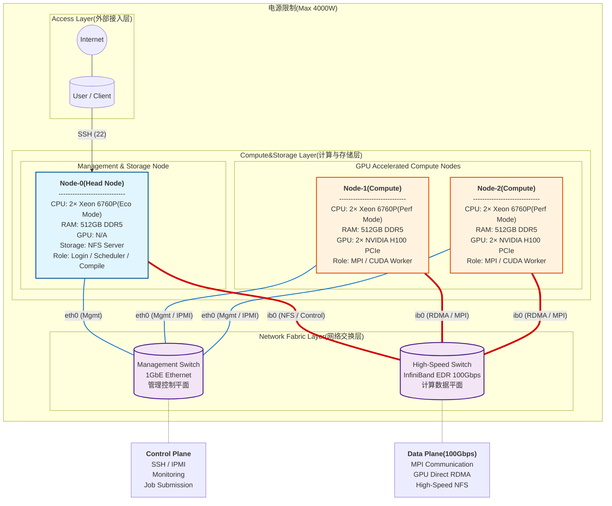

# 超级计算前沿技术 期末大作业

姓名：官瑞琪
班级：1班
专业：计算机科学与技术
校园卡号：320220912420

[TOC]


------

## 1设计多节点的高性能计算集群

### 1.1 题目内容

> 根据下面的服务器配置，设计一套多节点的高性能计算集群，支持CPU和GPU混合计算，要求该集群的总功率不超过4000瓦。
> 画出集群的架构图并说明设计思路和每部分的功能，同时列出集群的硬件配置信息和软件信息(包括并行计算环境)，并解释这些软件的作用。
> 举例说明采取哪些优化配置可以让这套集群计算性能更好。	

| 服务器   | 配置                                                         |
| -------- | ------------------------------------------------------------ |
| server   | CPU: Intel® Xeon® 6760P Processor * 2；<br />Memory: 32GB * 16, DDR5, 6400 MT/s；<br />Hard disk: 480GB SSD SATA * 1 |
| HCA卡    | InfiniBand Mellanox ConnectX®-5 HCA card,  <br />single port QSFP, <br />EDR IB Power consumption estimation: 9W |
| 交换机   | 10/100/1000Mb/s，<br />24 ports Ethernet switch Power  consumption estimation: 30W |
| IB交换机 | Switc-IB™ EDR InfiniBand switch,<br />36 QSFP  port Power consumption estimation: 130W |
| 线缆     | Gigabit CAT6 cables CAT6 copper cable,  blue, 3m<br />InfiniBand cable InfiniBand EDR copper cable, QSFP port, cooperating  with the InfiniBand switch for use |
| GPU      | The GPU models can be freely selected  based on your configuration. <br />The requirement is to use professional graphics  cards, like A  100, A800, H100, with each server  supporting up to 2 graphics cards. |

### 1.2 集群架构图

该图表采用了分层设计，展示了物理连接、网络拓扑以及节点角色分配。

展示了设计的 GPU 加速高性能计算HPC集群的整体架构，包括电源限制、网络连接、节点配置和功能分工。



如图所示，系统物理上由三台高性能服务器组成，逻辑上分为管理层（Head Node）和计算层（Compute Nodes），管理节点专注于低功耗调度，计算节点专注于高功耗并行计算。

为了消除通信瓶颈严格分离了控制流和数据流，构建了双层网络架构。

1. **总电源限制为4000W。**

2. **集群包含：**

   1. 一个管理头节点Node-0;

   2. 两个计算节点Node-1和Node-2。

   3. 双平面：管理控制平面(1GbE Ethernet)和高速数据平面(InfiniBand EDR 100Gbps)。

   4. 总共4张NVIDIA H100 PCIe,每计算节点2张。

      题目要求“with each server  supporting up to 2 graphics cards”。

3. **从外部访问到核心计算层的结构为：**

   1. 外部接入层

      用户通过 Internet → User/Client(个人电脑/客户端),然后从外部通过 SSH(端口 22) 登录到头节点 Node-0。这是一个典型的远程访问方式，用户无需直接连接集群内部网络。

   2. 计算与存储层

      1. 头节点Node-0为管理与存储节点。

         作为集群的网关，是外部用户进入集群的唯一入口。

         配置为 NFS Server，通过 IB 网络向计算节点共享 `/home` 和 `/opt` 目录，保证全集群软件环境的一致性。

         运行 Slurm Controller，负责全局资源的监控与分配。

      2. 计算节点Node-1 和 Node-2作为GPU 加速计算节点。

         位于内网，不直接暴露给用户。通过 IB 网络执行并行计算任务。

         每节点搭载 2张 NVIDIA H100 PCIe 加速卡，是集群算力的核心来源。

   3. 网络交换层

      1. 控制平面（Control Plane）- 蓝色连线

         硬件设备为4端口千兆以太网交换机，所有节点的板载网口(LOM)及 IPMI 管理口均接入此交换机。

         负责集群管理、系统监控（Ganglia/Prometheus）、作业调度指令下发（Slurm Control Messages）、用户 SSH 登录以及外部互联网访问。

         确保即使在计算网络拥堵时，管理员依然能流畅控制集群。

      2. 数据平面（Data Plane）- 红色连线

         硬件设备为Mellanox 36端口 EDR InfiniBand 交换机（100 Gbps）。所有节点通过 ConnectX-5 HCA 适配器接入。

         承载高性能计算中的核心流量，包括 MPI 并行计算消息传递、GPUDirect RDMA（显卡直通内存访问）以及 NFS 大文件读写。

         提供微秒级（<1µs）的超低延迟，确保多卡、多节点间的并行效率。

4. **其他**

   1. 三个节点的eth0通过蓝色粗线EthSW连接到管理交换机。

      从而可以支持SSH远程登录，IPMI远程服务器管理，监控，作业提交。

      带宽1GbE较低,但作管理用途足够。

   2. 所有结点的ib0接口通过红色粗线IBSW连接到InfiniBand 交换机。

      从而可以支持MPI进程间通信(多节点并行计算必须)，GPU之间直接内存访问(几乎零延迟)，高性能 NFS（头节点共享存储给计算节点高速访问）。

### 1.3 设计思路说明

本集群设计的核心挑战在于如何在 4000W 功率的限制内，实现计算性能的最大化。

由于题目并未提到主板等完整系统损耗，将针对“忽略主板外设损耗（理想情况）”和“计入完整系统损耗（工程实况）”两种场景进行分析，并对比 3节点（6张A100） 与 2节点（4张H100） 的可行性与性能。

#### **1.3.1 固定能耗计算**

设计的第一步是扣除维持集群运行必须的固定能耗，从而明确留给计算核心GPU的实际功率配额。

固定的网络开销，由题目已知信息可得：


1. IB交换机130W+以太网交换机30W=160W。
2. 这部分不可缩减，否则无法构成集群。

#### **1.3.2 节点开销计算**

这里考虑了两种情况——理想情况与实际工程情况。

首先查看处理器的相关功耗信息。


如图所示，为官网https://www.intel.com/content/www/us/en/products/sku/241836/intel-xeon-6760p-processor-320m-cache-2-20-ghz/specifications.html的英特尔® SST-PP的三种模式。

1. **理想情况（忽略主板与风扇功耗）**

   假设前提：仅计算 CPU、内存、硬盘、HCA 卡和 GPU 的核心功耗，忽略主板 VRM 供电损耗、PCH 芯片组及散热风扇功耗。
   为了尽可能支持更多节点，CPU 均采用 Intel SST-PP Config 2 (250W) 模式。如上图所示。

   1. **3个计算节点，尝试搭载6张A100。**

      1. 固定网络开销：130W+30W=160W

      2. 单节点基础功耗(不考虑主板/风扇)

         CPU=250W×2=500W

         内存16根×5W=80W

         硬盘+HCA=5W+9W=14W

         单节点底座合计594W。

      3. 4台服务器总底座（1头节点 + 3计算节点）

         594×4=2376W。

      4. 留给 GPU 的剩余预算

         4000W-160W-2376W=1464W

      5. A100需求

         需供电6张卡，每节点2张×3节点。

         则平均每张卡可用功率为1464÷6=244W。

      

      如图所示，NVIDIA A100 PCIe 的 TDP 为 300W，244W＜300W。

      即使在完全忽略主板和风扇功耗的理想情况下，电力缺口依然存在（每张卡缺 56W），系统很可能崩溃。

      - 算力评估：假设再次限制CPU的功率，使A100勉强能运行。

        6张A100 (FP64: 9.7 TFLOPS × 6) 总算力约为 58.2 TFLOPS。

   2. **2个计算节点，尝试搭载 4张 H100**

      1. 3台服务器总底座（1头节点 + 2计算节点）

         594W×3=1782W

      2. 留给 GPU 的剩余预算

         4000W-160W-1782W=2058W

      3. H100 需求

         需供电4张卡，则平均每张卡可用功率为2058W÷4=514.5W。

         

         如图所示，H100卡分为H100 SXM和H100 NVL。

         通过查阅资料可知H100 SXM具有更高原始算力、更优势的 NVLink 互联带宽，适合大规模训练与 HPC 集群。H100 NVL具有更高单卡内存容量，PCIe 插槽兼容性好、集成部署成本低，在推理或中等训练任务中性价比高。

         由于H100 SXM的TDP为700W，H100 NVL的TDP为350-400W。

         在本题4000W 总功率约束下，H100 NVL 才能在保证 Hopper 架构优势的同时满足功耗限制的 GPU 选择，因此在本设计中比 H100 SXM 更具性价比和可行性。

         **结论：**

         NVIDIA H100 PCIe TDP 为 350-400W，514.5W > 400W。电力非常富余。

         - 算力评估：

           4 张 H100 (FP64: 30 TFLOPS × 4) 总算力约为 120 TFLOPS。

   **总结：**

   即便不考虑主板损耗，3节点A100方案也在跳闸边缘，且总算力（58.2 TF）远低于2节点H100方案（120 TF）。从性能角度看，4张H100完胜6张A100。

2. **实际工程情况（计入主板、VRM与风扇损耗）**

   假设前提：必须符合物理定律，计入供电转换损耗和高转速风扇功耗。这是系统能否稳定运行的真实标准。

   1. **单节点完整功耗详细计算（不含 GPU）**

      不能只看芯片 TDP，服务器是一个整体系统。

      1. CPU功耗
         $$
         250W(SST-PP Mode)×2=500W
         $$

      2. 内存RAM

         DDR5 6400MT/s 电压 1.1V，但PMIC和高频发热较大。
         根据 Micron DDR5 规格书，高负载下单根约 6.5W。

         6.5W×16=104W。

      3. 主板供电损耗

         CPU和内存需要由 12V 转换为 0.8V/1.1V。服务器级 VRM 效率约为 92%。

         需要转换的总负载：500W+104W=604W。

         热损耗计算：604W×(1−0.92)≈48W。

      4. 芯片组与外设30W。
      5. 散热风扇约72W。
      6. 存储与网络5W+9W=14W。

      单台服务器基础底座总功耗=500+104+48+30+72+14=768W。

   2. **再次验证 2个计算节点方案（最终选择）**

      鉴于前面4张H100完胜6张A100，这里不再验证 3个计算节点搭载A100的方案。

      直接验证2个节点搭载4张H100是否可行。

      1. 网络设备160W。

      2. 3台服务器底座（1头+2计算）：768W×3=2304W。

      3. GPU 可用预算：4000W-160W-2304W=1536W

         分配给4张H100则1536W÷4=384W。

      **总结：**

      384W > 350W。即便计入所有详细损耗依然拥有 34W/卡 的安全冗余（总共136W 全局冗余）。

综上所述，必须舍弃第 3 个计算节点。这不仅是为了满足 4000W 的供电限制，更是为了换取搭载 NVIDIA H100 的能力。

最终确定为1个管理节点 + 2个 H100 计算节点。

### 1.4 每部分功能的说明

本集群系统采用模块化功能分区设计，从逻辑上划分为管理层、计算层和网络互联层。

#### **1.4.1 管理与存储节点Node-0**

这是整个集群的调度中心，虽然不直接参与 GPU 加速计算，但其稳定性决定了整个集群的可用性。

其功能说明如下——

1. 作为集群唯一的公网入口，运行 SSHD 服务。

   出于安全考虑，计算节点配置为内网 IP，不直接暴露于互联网。所有用户必须先登录头节点，再通过内部网络提交作业。

2. 运行 Slurm 控制守护进程 (slurmctld)。

   负责监控所有计算节点的状态（空闲/忙碌/下线），接收用户提交的作业请求，根据优先级算法（Priority Plugin）将作业分配给合适的节点，并管理作业队列。

3. 通过 InfiniBand 高速网络部署 NFS 服务。

   将本地的 `/home`（用户数据）和 `/opt`（应用软件）目录共享给所有计算节点。这确保了单点维护，全局同步，用户只需在头节点编译一次代码，所有计算节点即可直接运行，无需重复传输文件。

4. 安装 GCC, Intel OneAPI, NVCC 等编译器套件。

   由于计算节点通常满负载运行，为了不干扰计算任务，代码的编写、编译和调试工作均在头节点完成。

#### **1.4.2 计算节点 (Node-1和Node-2)**

专注于高强度的并行处理任务。

其功能说明如下——

1. 运行 Slurm 执行守护进程 (slurmd)。

   接收头节点的指令，启动计算进程。支持 MPI（多进程）和 OpenMP（多线程）混合并行模式。

2. 搭载 NVIDIA H100 PCIe 加速卡。

   CPU (Xeon 6760P)负责复杂的逻辑控制、数据预处理和 I/O 管理。

   GPU (H100)：负责高密度的矩阵运算和张量计算。H100 特有的 Tensor Core 使得该节点在深度学习训练和科学模拟（FP64）上的性能是普通 CPU 服务器的数百倍。

3. 利用本地 480GB SSD。

   作为计算过程中的临时高速暂存区，用于存放中间结果，避免频繁读写远程 NFS 带来的网络开销。

#### **1.4.3  双平面网络系统 **

为了保证系统可管理性与计算效率互不干扰，设计了物理隔离的双层网络。

1. 控制平面为千兆以太网 (Management Network - 1GbE)。

   其功能为承载非计算流量，具体说明如下——

   1. 即使服务器死机或关机，管理员仍可通过此网络远程重启、重装系统或监控温度电压。
   2. 传输 Ganglia/Prometheus 采集的 CPU、内存负载信息。
   3. 用户的终端命令操作流量。

2. 数据平面为InfiniBand EDR (Data Network - 100Gbps)

   其功能为承载核心计算流量，提供 100 Gbps 高带宽 和 <0.6µs 超低延迟。

   具体说明如下——

   1. 在多节点并行计算中，节点间需要频繁交换边界数据。IB 网络极低的延迟能显著减少通信等待时间。
   2. 允许节点 A 的网卡直接读写节点 B 的内存，完全绕过 CPU。这是降低 CPU 负载、提升大规模并行效率的关键技术。
   3. 允许不同节点的 H100 显卡之间直接通信，绕过系统内存，大幅加速分布式深度学习训练。

### 1.5 集群的硬件配置信息和软件信息

#### **1.5.1 硬件配置详细**

1. 头节点

   | 组件 | 规格参数                        | 配置说明与功耗                                               |
   | ---- | ------------------------------- | ------------------------------------------------------------ |
   | CPU  | 2x Intel® Xeon® 6760P           | BIOS中启用 Eco Mode 或限制 PL1 功耗至 200W。由于不承担重计算，降低主频以节省全系统电力预算。 |
   | 内存 | 512GB (16x 32GB) DDR5 6400 MT/s | 大容量内存用于编译大型软件及作为 NFS 文件系统的读写缓存。    |
   | GPU  | 无 (N/A)                        | 物理移除或不安装 GPU，节省约 功耗。                          |
   | 存储 | 1x 480GB SSD SATA               | 划分为 /boot, / (Root), /var 及 /home (NFS共享分区)。        |
   | 网卡 | 1x Mellanox ConnectX-5 EDR      | 提供 100Gbps 链路，确保向计算节点分发数据时不成为 IO 瓶颈。  |

2. 计算节点

   | **组件** | **规格参数**                    | **配置说明与功耗**                                           |
   | -------- | ------------------------------- | ------------------------------------------------------------ |
   | CPU      | 2x Intel® Xeon® 6760P           | 利用 Intel SST-PP 技术锁定为 Config 2 (Base 2.0GHz, TDP 250W)。在限制功耗的同时，保留 AVX-512 指令集以加速稀疏矩阵运算。 |
   | GPU      | 2x NVIDIA H100 80GB PCIe        | 核心算力。选用 PCIe 版本（TDP 350W/卡）。双精度（FP64）算力高达30 TFLOPS/卡，支持第四代Tensor Core。 |
   | 内存     | 512GB (16x 32GB) DDR5 6400 MT/s | 满插 16 根通道以跑满 DDR5 带宽（300GB/s+），防止 CPU 在向 GPU 搬运数据时出现带宽瓶颈。 |
   | 网卡     | 1x Mellanox ConnectX-5 EDR      | 配合 PCIe Gen5 插槽，支持 GPUDirect RDMA 技术，实现显卡间跨节点直连。 |

   | **设备名称** | **规格参数**                 | **功能描述**                                                 |
   | ------------ | ---------------------------- | ------------------------------------------------------------ |
   | 数据交换机   | Mellanox SB7800 (或同级 EDR) | 36口 QSFP28，100Gbps 无阻塞交换容量。支持硬件级计算卸载（SHARP技术）。 |
   | 管理交换机   | 24-Port Gigabit Ethernet     | 1000Mbps RJ45 接口，负责管理流量，提供带外（OOB）管理能力。  |

#### **1.5.2 软件环境配置及其作用**

HPC 的软件栈采用分层架构，确保从底层驱动到上层应用的衔接。

1. 操作系统: Rocky Linux 9.3 (64-bit)

   作为 CentOS 的继承者，提供企业级稳定性，是对 HPC 商业软件支持最好的社区发行版。

2. 内核版本: Linux Kernel 5.14+

   原生支持 cgroup v2，有利于 Slurm 进行精细化的 CPU/内存资源隔离。

3. GPU 驱动: NVIDIA Data Center Driver 535.154 (LTS)

   长期支持版（Long Term Support），确保系统的稳定性，并支持 CUDA 12.x 环境。

4. OFED 协议栈: NVIDIA MLNX_OFED 5.9

   提供 InfiniBand 的底层驱动，开启 RDMA、IPoIB 等高级网络功能。

5. 资源调度器: Slurm Workload Manager 23.02

   组件：slurmctld (头节点), slurmd (计算节点), slurmdbd (记账数据库)。

   负责作业排队、资源分配（如独占 GPU）、优先级管理以及作业记账。

6. 监控系统: Prometheus + Grafana + NVIDIA DCGM

   实时监控集群的 CPU 温度、功耗、GPU 利用率（GPU Util）以及显存占用，并提供可视化仪表盘。

7. MPI 实现: OpenMPI 4.1.6 (With CUDA & UCX support)

   编译时开启 --with-cuda 和 --with-ucx。

   支持跨节点的并行程序运行，自动识别并调用 InfiniBand 硬件进行数据传输。

8. 通信框架: UCX (Unified Communication X) 1.15

   作为 OpenMPI 的底层传输层，直接操作 IB 网卡硬件，实现零拷贝（Zero-Copy）通信。

9. 编译器套件:
   1. GCC 11.3为系统基础编译器。
   2. Intel oneAPI Toolkits 2024包含 icc / ifort，针对 Xeon 处理器做极致优化（自动向量化）。
   3. NVIDIA HPC SDK 23.9包含 nvcc，用于编译 CUDA C/C++ GPU 程序。

10. 高性能数学库:
    1. Intel MKL (Math Kernel Library) 针对 CPU 的 BLAS/LAPACK 线性代数优化库。
    2. NVIDIA cuBLAS / cuDNN针对 GPU 的矩阵运算与深度学习加速库。
    3. NCCL 2.18 (NVIDIA Collective Communications Library) 专为多 GPU 优化的集合通信库（如 All-Reduce）。

### 1.6 优化配置说明

为了最大化利用有限的 4000W 电力预算，并发挥 4 张 NVIDIA H100 的并行计算能力，本设计采用了从 BIOS 硬件层到应用层的四级优化策略。

#### 1.6.1 网络与GPU协同优化

在传统的集群通信中，当 Node-1 的 GPU 需要传输数据给 Node-2 的 GPU 时，
数据路径极为繁琐：GPU显存 -> CPU内存 -> 网卡 -> 网络 -> 对端网卡 -> 对端CPU内存 -> 对端GPU显存。

这不仅延迟高，还消耗 CPU 算力和内存带宽。

- 优化配置：

  1. 安装 nvidia-peermem 内核模块。

  2. 在 OpenMPI 和 NCCL 环境变量中强制开启 IB 支持：

     ```bash
     export NCCL_IB_HCA=mlx5_0    # 指定IB网卡
     export NCCL_P2P_LEVEL=NVL    # 启用NVLink/PCIe直通
     ```

  3. 从而实现网卡（ConnectX-5）直接访问 GPU 显存进行数据搬运，完全绕过 CPU 和系统内存。

#### 1.6.2 处理器架构优化

本服务器采用双路 Xeon 6760P 设计，属于非一致性内存访问 (NUMA) 架构。

1. CPU 0 管理本地内存和 PCIe Slot 1 (连接 GPU 0)。

2. CPU 1 管理本地内存和 PCIe Slot 2 (连接 GPU 1)。

   如果进程运行在 CPU 0 上，却去调用插在 CPU 1 上的 GPU 1，数据必须经过 CPU 之间的 UPI 总线，导致延迟增加且 UPI 总线额外耗电。

- 优化配置：

  1. 在 Slurm 作业提交脚本中强制实施“就近原则”绑定

     ```bash
     #SBATCH --cpu-bind=sockets  # 强制进程绑定到对应的Socket
     #SBATCH --gres=gpu:2        # 申请2张卡
     ```

  2. 确保 CPU 核心、内存和 GPU 处于同一物理通道（PCIe Root Complex）下，消除跨 Socket 访问带来的延迟，提升内存带宽利用率约 15%。

#### 1.6.3 功耗与热管理优化

功率预算极度紧张（仅剩约 136W 冗余）。主板上高速运行的 PCIe Gen5 链路（用于连接 SSD、网卡、GPU）即使在空闲时也会消耗大量电力。

- 优化配置：

  1. 在 BIOS 中开启 PCIe ASPM (Active State Power Management) 并设置为 L1 模式。

     ```bash
     pcie_aspm=force
     ```

  2. 当 InfiniBand 网卡或 SSD 处于短暂的数据间歇期时，硬件自动让 PCIe 链路进入低功耗“睡眠”状态。

#### 1.6.4 编译器指令集优化

Xeon 6760P 拥有强大的 AVX-512 向量计算单元。但过度使用 AVX-512 会导致 CPU 发热剧增并降频，可能影响 GPU 调度。

- 优化配置：

  1. 使用 Intel 编译器 (icc / icx) 编译 CPU 代码时，添加标志位：

     ```bash
     -xHOST -O3 -qopt-zmm-usage=high
     ```

  2. 配合 BIOS 中的 Intel SST-PP (Config 2) 功耗墙限制。
  3. 利用 SST-PP 的智能调度，在 CPU 功率不超过 250W 的前提下，尽可能利用 AVX-512 加速数据预处理环节。

#### 1.6.5 文件系统优化

深度学习任务需要从头节点读取海量的小文件。标准的网络包效率低下，导致大量的 TCP/IP 包头开销。

- 优化配置：

  1. 在 InfiniBand 网络的 IPoIB 接口上启用巨型帧

     ```bash
     ifconfig ib0 mtu 9000 up
     ```

  2. 同时在 NFS 挂载参数中指定大块读写：

     ```bash
     mount -o rsize=1048576,wsize=1048576 ...
     ```

  3. 将网络传输单元（MTU）从 1500 字节增加到 9000 字节，大幅减少 CPU 处理网络中断的次数，显著提升 NFS 共享存储的读写吞吐量。


### 1.7 总结

本设计方案在 4000W 的严格物理限制下，通过严谨的推导，否定了“3节点低配”方案，确立了“1管理节点 + 2高性能计算节点”的非对称架构。
系统搭载 4张 NVIDIA H100 PCIe 加速卡，配合 Intel Xeon 6760P (SST-PP 250W) 处理器，利用 InfiniBand EDR 双层网络架构，成功构建了一套具备顶级双精度算力（~120 TFLOPS FP64）的高性能混合计算集群。

该设计满足了所有题目参数要求，还可以通过深度的软硬件协同优化，实现性能与功耗的平衡。

------

## 2 超级计算

> 题目：
> 什么是超级计算以及它的应用领域，简述你对AI for Science的理解。

### 2.1 什么是超级计算

对于超级计算（HPC）的定义，我认为不能简单地将其理解为“一台速度很快的计算机”。
从本课程的学习来看，超级计算本质上是一种通过大规模并行处理来解决复杂科学与工程问题的计算范式。
简单说就是用特别强大的计算机来解决那些普通电脑根本搞不定的复杂问题。它不是单纯的“更快计算机”，而是通过把一个大问题拆成无数小块，让成千上万的处理器同时干活，最后再把结果汇总起来。

它与普通计算的区别在于“量级”引发的“质变”。
当我们需要模拟百万年尺度的宇宙演化，或者需要通过第一性原理计算数亿个原子的相互作用时，这些事情没办法真做实验，而且单机计算已经失效。超级计算通过将成千上万个计算节点（就像本课程实验中使用的节点）通过高速互联网络（如 InfiniBand）连接，协同解决同一个大问题。

目前，超级计算已经进入E级（Exascale，百亿亿次）时代。
例如美国的 Frontier 和中国的超算系统，它们不仅是国家科技实力的象征，更被视为像水、电一样的“算力基础设施”。在“东数西算”的背景下，算力正在成为新的生产力要素。

------

### 2.2 超级计算的应用领域

超级计算的应用极广，我主要将其归纳为三个最核心的维度，它们分别对应了人类探索世界的不同尺度：

1. 模拟以 气候与地球科学 为代表的宏观复杂系统。

   1. 这是超算最传统的战场。

      例如天气预报或者预测台风路径，本质上是在球面上求解纳维-斯托克斯方程（Navier-Stokes Equations）。为了提高预报精度，我们需要将地球划分为更密集的网格（如 1km x 1km）。

      更高的分辨率意味着能捕捉到台风眼内部的细节或局部的极端强对流天气，这直接关系到防灾减灾。
      没有超算的高并发求解能力，这种时效性要求极高的任务是无法完成的。

   2. 在航空航天领域中可以模拟飞机气动设计、火箭发动机燃烧、卫星轨道计算等。

      从而减少风洞实验次数90%,缩短研发周期2-3年。

2. 探索以 材料与物理 为例的微观物质结构。

   在实验难以触及的领域，超算充当了某种意义上的显微镜的角色。

   1. 在核物理与能源领域，如模拟核聚变反应堆（ITER）中的等离子体湍流，这是无法进行物理试错的。
   2. 再比如材料设计中通过密度泛函理论（DFT）计算电子结构，预测材料性质。
      比如筛选高效的锂电池电极材料，如果完全靠实验合成，周期长达数年，而超算可以将范围迅速缩小。

3. 解码生物信息学领域的生命密码。

   这是近年来增长最快的领域。
   从人类基因组测序到最近大火的蛋白质结构预测，计算量的需求呈指数级增长。

   1. 在药物研发领域，传统的药物筛选如同在大海捞针，超算可以通过分子动力学模拟（MD），快速计算药物分子与靶点蛋白的结合能，将研发周期从10年缩短至数年。AlphaFold2就是典型例子，它用AI加计算预测蛋白质折叠，2024年还拿了诺贝尔化学奖。
   2. 在医学影像方面，可以AI辅助诊断CT/MRI图像分割(U-Net)、癌症早期检测等，准确率超过人类医生。

4. 人工智能与大数据

   1. 大模型训练计算需求很大，如GPT-3训练消耗3640 PFlops-day，需要上万块GPU，花费数百万美元。

      如果能通过类似本课程中学习的微调技术，可以实现一定程度的性能提升。

------

### 2.3 对AI for Science的理解

#### 2.3.1 科学研究的“第四范式”

我理解的 AI for Science，并不是简单的“用 AI 做科研”，而是科学研究范式的一次根本性变革。图灵奖得主吉姆·格雷曾提出科学的四个范式：从最早的实验科学（记录现象），到理论科学（牛顿定律），再到计算科学（数值模拟）。
现在我们正在经历第四范式：数据密集型科学发现。

传统的科学计算（如CFD 流体模拟）往往受限于物理方程的求解难度，计算量极其巨大。
而 AI for Science 的核心逻辑是“降维打击”：利用深度学习强大的拟合能力，从海量数据中直接学习输入与输出的高维映射关系，从而替代或加速昂贵的传统方程求解。

以下这些就是典型的AI for Science的应用:

1. 从原理出发的高维函数的通用近似

   DeepMind 的 AlphaFold2 是最典型的例子。它解决了困扰生物学 50 年的蛋白质折叠问题。其本质是利用 AI 学习氨基酸序列到三维原子坐标的映射规律。这标志着 AI 从“识别猫狗”的感知智能，跨越到了理解自然规律的认知智能。

2. 替代传统数值模式，如天气预报。

   华为云的盘古气象大模型（Pangu-Weather）是一个里程碑。它不求解偏微分方程，而是通过学习 40 年的历史气象数据来预测未来。
   它将全球 7 天天气预报的速度从传统超算的几小时缩短到了10 秒以内，且精度超过了欧洲气象中心（ECMWF）的传统数值预报。这展示了 AI 在处理非线性混沌系统上的巨大潜力。

3. 分子动力学领域连接微观与宏观。

   鄂维南院士团队的 DeepMD 项目，利用深度神经网络拟合原子间的势能函数。它既保留了量子力学层面的精度，又具备了经典分子动力学的效率，使得模拟上亿个原子的演化成为可能，这在过去是不可想象的。该成果也获得了 2020 年的戈登·贝尔奖（HPC 领域的诺贝尔奖）。

#### 2.3.2 结合课程实验的思考

在完成本课程的实验（ Qwen3 模型微调）后，我对 AI for Science 有了更直观的体悟：

1. 无论是盘古大模型还是我们微调的 Qwen，背后都需要强大的并行计算支持。在实验中，如果缺乏 GPU 加速和 InfiniBand 网络的高效通信，训练过程将变得不可接受。这说明 AI for Science 本质上是 HPC 与 AI 的深度融合。算力在其中的重要性不可或缺。
2. 虽然 AI 效果惊人，但也应关注其“可解释性”问题。传统科学建立在因果推导上，而神经网络往往是黑盒。如何让科学家信任 AI 给出的预测，是未来需要解决的关键挑战。

### 2.4 总结

综上所述，我认为 AI for Science 不是要取代科学家，而是作为科学家的助手与工具。它将科学家从繁琐的重复计算和试错中解放出来，让他们专注于更高层面的假设提出与理论构建。

------

## 3 课程感受

> 谈谈你对这门课的感受。

### 3.1 从一无所知构建了关于超算基本的知识体系

在选修这门课之前，我对“超级计算”的印象还停留在新闻里的“天河”或“神威”这些遥远的概念上，从没有思考过超级计算的实现到底是基于什么原理。甚至浅显地认为超算就是“很多台电脑连在一起”，也没想过怎么会这么简单能实现超级计算。

然而随着课程的深入，尤其是课程实验中通过亲手搭建集群和运行实验，我才真正建立起了从硬件底层到应用上层的完整认知框架。

感觉选修这门课的时机也很合适，其中相关内容连接了计算机科学的多个领域。正在学的操作系统、计算机网络以及以前学的算法设计其实就像是孤立的知识点，而在超算这门课里，它们在某种程度上串联了起来：

1. Linux 不再只是命令行的集合，而是支撑庞大算力的基础；

2. 网络不再只是 TCP/IP 协议的背诵，在配置 InfiniBand 和 MPI 通信时，我深刻理解了低延迟对于并行效率的决定性意义；

3. 算法也不再只是时间复杂度分析，在实验五中对比 atomic 和 reduction 的巨大性能差异时，我直观地看到了“并行思维”与传统串行思维的本质区别。

通过本课程，我从 完全不了解超算 到 能够独立搭建和管理小型集群，尤其是在相关的课后实验以及报告的撰写过程中收获很大，建立了完整的知识框架。

```bash
超算
├── 硬件层
│   ├── CPU架构(Xeon、鲲鹏)
│   ├── GPU加速(H100、A100)
│   ├── 互联网络(InfiniBand、Ethernet)
│   └── 存储系统(NFS、Lustre)
├── 系统层
│   ├── Linux操作系统(实验一)
│   ├── 集群管理(NIS、NFS)(实验二)
│   └── 作业调度(Slurm)
├── 编程层
│   ├── MPI并行(实验一、二、五)
│   ├── OpenMP多线程(实验五)
│   └── GPU编程(实验七)
├── 应用层
│   ├── 科学计算(HPL、GROMACS)(实验三)
│   ├── 性能优化(VTune、鲲鹏移植)(实验六)
│   └── AI训练(Qwen3微调)(实验七)
└── 评测层
    ├── 性能测试(Linpack)(实验三)
    ├── 热点分析(VTune)(实验六)
    └── 性能建模(Amdahl、Gustafson)
```

### 3.2 在实验中收获很大

如果说理论课是基础知识，那么这些实验的独立完成就是将知识内化的最好的方式。在这个过程中，我遇到过无数次报错，也正是这些“踩坑”的经历，让我的实践能力有了质的飞跃。

1. 不断锻炼了面对复杂依赖环境的调试能力。

   在最初的实验中遇到的问题印象比较深，比如实验一中 MPICH 的编译问题。当时 `./configure` 报错 `no ch4 netmod selected`，通过求助AI才明白是新版 MPICH 默认依赖 libfabric 或 ucx。

   当时我面临两个选择：去死磕复杂的依赖安装，还是回退版本。
   经过权衡，我选择了 `--with-device=ch3` 回退到旧版通信层。

   这次经历说明在工程中可用性和稳定性往往比追求最新版本更重要。

2. 形成了对分布式系统的全局视角。

   在实验二搭建集群时，我卡在了 NIS 用户 Shell 的修改上。习惯了单机思维，于是试图在计算节点直接用 chsh 修改用户 Shell，结果一直报错。直到我重新审视集群架构图，才突然意识到NIS 的数据库在头节点，计算节点只是“读者”。这种主从架构（Master-Slave）的思维模式转变，是我在构建分布式系统时获得的最宝贵经验。

   此外，真正动手搭建多节点集群才真正对理论知识有了直观的理解，否则也只是脑海里抽象的概念。

   上学期选修了分布式系统的课程，但学完除了神经网络相关的知识，其他都朦朦胧胧并未很好地理解。现在回头再看对一些抽象概念有了新的理解与感受，产生了一种“当时怎么会不懂”的感叹。

3. 体会到理论指导实践的重要性。

   在实验三的 HPL 测试中，遭遇了 Segmentation fault。起初我以为是配置错误，后来静下心来计算发现当 N=49152 时，矩阵占用的内存约为 1.8TB，而我的双节点物理内存仅有 1TB。机器不会骗人，物理限制无法突破。这说明超算不是盲目地跑分，每一个参数（N, NB, P, Q）的背后都必须有严谨的数学计算支撑。

   不过后续在班级的错误解决与经验分享会中，发现了其他同学更好的方式来解决这个问题，最终达到的算力更高了。

4. 关于并行与优化的再认识

   通过实验OpenMP/MPI和实验VTune 分析，我对“高性能”有了更深层的理解。

   “并行不等于加速”是我最大的感悟。在计算π值的实验中，当我简单粗暴地使用 for + atomic 进行并行时，发现速度反而比串行慢了 10 倍（121秒 vs 13秒）。这让我看见锁竞争是性能的杀手。
   而当我改用 reduction 规约后，时间瞬间缩短到 3 秒。这生动地说明了没有正确的并行设计，堆砌核心数不仅无用，反而是累赘。

   此外，实验VTune 分析让我第一次去诊断代码。看到 ed_band_cal_semi_64_w_absent_diag 这种热点函数占用 20% 以上的时间，并成功通过指令集优化（SSE 转 NEON）提升 39% 的性能时，我体会到了“性能压榨”带来的巨大成就感。
   这也让我意识到，在摩尔定律放缓的今天，软硬件协同优化将是未来提升算力的关键。

总的来说，这门课程中的实验带来的，不管是知识层面还是个人能力层面的收获都是数不胜数的。

我从不会到会，就是在实验中快速进步的。

1. 实验一前还不知道MPI是什么，不理解为什么需要超算。

   实验三后已经能够独立搭建3节点集群，理解了分布式文件系统和统一认证，会用Linpack测试性能。

   实验五后掌握了并行编程的核心思想，理解了不同并行模式的适用场景，能够分析并行效率问题。

   再到qwen3模型微调之后了解到大模型训练的完整流程，理解了GPU算力在AI中的关键作用，能够设计支持AI训练的超算集群。

2. 心态也在一个个实验中发生了变化：

   初期看到报错就感到受挫，现在能冷静分析日志，逐步排查。

   开始时遇到问题问AI，现在慢慢选择先自己尝试，实在不行再求助。


### 3.3 总结

这门课程虽然结束了，但它为我打开了一扇通往高性能计算世界的大门。

在职业规划层面，我以前的目光主要局限于后端开发或算法岗，现在我看到了 HPC 基础设施工程师 和 AI 架构 的广阔前景。随着大模型时代的到来，如何高效地调度千卡、万卡集群，如何优化分布式训练的通信开销，都是工业界急需解决的热点。

总而言之，这门课不仅仅教会了我如何搭建一个集群，更重要的是教会了我如何从系统的角度去思考计算问题。这些思维方式，无论我未来从事什么方向的技术工作，都将受益终身。